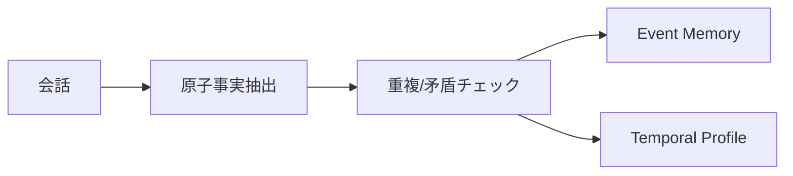

# AtomMem（原子事実によるLLMエージェント記憶システム）

> **TL;DR**: 会話をそのまま貯めるのでも短い要約に圧縮するのでもなく、代名詞・相対時間表現を解消した自己完結型の「原子事実」に変換して保存し、重複・矛盾・更新を区別しながらイベント単位で束ねるLLMエージェント向けメモリシステム。

会話ログの保存とサマリ圧縮という二択には、それぞれ欠陥がある。ログをそのまま残せば情報は失われないが、代名詞や「先週」のような相対的な時間表現は数週間後には意味を失う。逆に要約に潰せば、どの条件で・誰の意見として・事実か仮説かという文脈情報が消える。note.comのhima2b4は、AtomMemがこの二択の間に「原子事実（Atomic Fact）」という第三の保存単位を置いたと紹介する。原著論文はYanyu Yaoらによる"AtomMem: Building Simple and Effective Memory System for LLM Agents via Atomic Facts"（arXiv:2606.19847）。

原子事実は、代名詞を解き曖昧な参照を具体化し、相対的な時間表現を可能な範囲で固定した自己完結文である。たとえば「先週の金曜、最初の心理学の試験でAを取った」という発話は「Emmaは2023年5月17日より前の金曜日に、最初の心理学試験でA評価を得た」のように、誰が・いつ・何をしたかが単独で読んでも意味が通る形に整えられる。

保存前には、新しい事実を既存の記憶と突き合わせる処理が入る。同じ内容ならそのまま重ねて保存せず、一部だけ新しければ差分だけを残し、過去の内容と矛盾する場合は無造作に上書きせず更新対象として扱う。人の考えや状況は変わるため、以前の理解が「間違いだった」のか「時点・対象・条件が違っただけ」なのかを区別する設計になっている。

原子事実を細かく貯めるだけでは断片が増えるため、関連する原子事実を「Event Memory」として束ね、好みや習慣のように長く続くが変化もする情報は「Temporal Profile」として過去の状態を残しながら現在の状態を更新する形で扱う。検索も単純な類似度検索では終わらず、①問いに直接近い原子事実、②その事実が属するイベントの補助情報、③キーワード・同一イベント・会話内の時間的近さを手がかりに記憶グラフをたどる、という3種の関連性を組み合わせる。

論文の実験では、イベント束ねやグラフ探索を使わず原子事実だけを検索する簡略版AtomMem-Flatでも、生の会話履歴を検索するベースラインを大きく上回ったと報告されている。検索を複雑にする前に、何を記憶として保存しているかを整えるだけでも結果は大きく変わるという含意である。

## 観察ログ（未検証）

- 2026-07-18: 論文の実験結果として、複数の会話断片をまたいで答えるMulti-Hop課題でF1スコアが20.97から37.03に上がったと紹介されている（note.comのhima2b4による報告。論文本文の実験条件は未確認）

## 問い

- AtomMemの「原子事実→重複/矛盾チェック→Event Memory/Temporal Profile」というパイプラインは、[[concepts/managed-agents-dreams]] の非破壊な重複削除・矛盾解消パイプラインと設計思想レベルでどこまで一致するか
- 継続的な統合更新は [[papers/2026-peng-llm-memory-faulty]] が指摘するメモリ劣化を招きうるが、AtomMemの「更新は履歴として残す」設計はこの劣化を防げるか、それとも別の形で断片が肥大するか
- 自分のwiki運用（sources/を不変に保ち、wiki/ページを合成する二層構造）は、AtomMemの「原子事実は不変・イベント/プロフィールは可変」という切り分けと同じ発想か

## 関連

- [[papers/2026-peng-llm-memory-faulty]] — LLMエージェントメモリの継続更新による劣化を指摘する研究。AtomMemの「更新を履歴として残す」設計は、この劣化問題への一つの対処法として読める
- [[concepts/managed-agents-dreams]] — Claude Managed Agentsの非破壊メモリ再構成パイプライン（重複削除・矛盾解消・インサイト統合）。AtomMemの保存前チェックと同じ問題意識を別実装で扱う
- [[concepts/agent-memory-layer]] — 「何を保持する価値があるか」を選別する共有メモリ層の設計思想。AtomMemの原子事実抽出はこの選別を会話単位で自動化する一実装と位置づけられる
