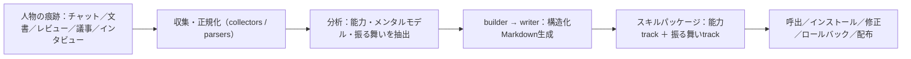

# COLLEAGUE.SKILL: 専門家知識蒸留によるAIスキル自動生成

> **TL;DR**: 人物・役割の雑多な作業痕跡（trace）を、検査・修正・ロールバック可能な「スキルパッケージ」へ自動蒸留するシステム。人物の"なりすまし"ではなく、能力（判断則・メンタルモデル）と振る舞い（対話スタイル・修正履歴）を別トラックに分けた、境界づきの編集可能な成果物として扱う点が核。

LLMエージェントの役割が「単発の指示実行」から「仕事や対話の進め方という再利用可能な文脈を運ぶ」方向へ移るなか、人物・役割に紐づく実用知——同僚のレビュー判断、専門家の意思決定則、公人のメンタルモデル、私的な対話パターン——をエージェントに保持させたい需要が生まれている。だがこの種の知は整然とした手順書ではなく、コードコメント・障害メモ・チャットの決定・インタビューといった**異種の痕跡に散在**している。本研究はこれを「人物接地（person-grounded）の痕跡→スキル蒸留」と定式化し、痕跡を検査・修正・バージョン管理・配布が可能な制約付き成果物へ変換する。狙いを"人物の完全再現"と明確に切り離し、生成物を「人そのもの」ではなく編集可能な技術成果物として扱う点で、behavioral cloning より狭く具体的な主張になっている。

成果物は **S=(A,M,L)** として定式化される。生成ファイル群 A、機械可読メタデータとインストール情報 M、ライフサイクル状態 L（バージョン・更新時刻・修正回数・ロールバック履歴）。満たすべきは5性質——**Portable**（通常のスキル機構でロード可）/ **Inspectable**（使用前にルール・例・制限・メタを読める）/ **Composable**（full・能力のみ・人格のみを別々に呼べる）/ **Correctable**（旧状態を保ちつつ更新）/ **Governable**（削除・共有判断・安全レビューを支えるメタ・出典境界・免責）。

## システム構成：二重トラックと成果物スキーマ

設計の肝は**二重表現**にある。**能力トラック**（`work.md`＝責務・ワークフロー・技術標準・レビュー基準・意思決定則・過去の教訓）と、**振る舞いトラック**（`persona.md`＝境界づけられた振る舞い制約・表現の好み・対話ルール・修正記録）を分離する。ペルソナ系システムの失敗の多くは「事実知識・手続き的判断・表層トーン」の3つを混同することから来る、という診断に基づく切り分けで、これにより能力と振る舞いを別々に検査・呼出できる。

writer はメタデータをスキーマ v3 に正規化し、次を出力する：`SKILL.md`（統合された呼出可能スキル、本体は Part A＝能力／Part B＝振る舞い）/ `work.md`・`persona.md`（編集可能なソース文書）/ `work_skill.md`・`persona_skill.md`（独立に呼べるサブスキル）/ `manifest.json`・`meta.json`（インストール・配布・ライフサイクル）。`SKILL.md` を必須エントリポイントとし詳細は呼出時に読み込む構造は、Agent Skills 標準と progressive disclosure に整合する（[[concepts/claude-skills]]・[[concepts/skill-building-best-practices]] と同じ前提）。

3つのプリセットが同一ワークフローのドメイン特化として用意される：**colleague**（主・最も制御しやすい・企業内の設計書/レビューコメント/障害メモが素材）/ **celebrity**（公人・公開された一次証拠と出典境界に依存）/ **relationship**（私的・より強い同意/プライバシー/ローカル制御を要求）。各プリセットは出典境界・保存先・コマンド別名・プロンプト束・任意のリサーチ/安全ツールを定義するだけで、成果物の契約自体は共通。新プリセット追加は新プログラムでなく設定とプロンプト設計の変更で済む。

## ワークフロー：生成・修正・進化

**生成**は別名＋任意プロフィール＋ソース素材から始まる。コレクタは Feishu・DingTalk・Slack・WeChat の SQLite エクスポート、メール、PDF、スクリーンショット、Markdown、直接貼付に対応。2トラック（能力抽出＋振る舞い抽出）で構造化Markdownを生成し、契約に沿ってパッケージ化する。

**修正**は自然言語フィードバックを受ける。「彼はそうは言わない」「彼女はここで押し返す」のような入力に対し、専門知の修正なら Markdown パッチ（同じレベル2見出しは置換、無ければ追記）、振る舞いの修正なら正規化レコード `{scene, wrong, correct}` を生成。writer は現バージョンを退避→パッチ適用→ライフサイクル版を増分→派生成果物を再生成する。バージョン管理は一覧・バックアップ・ロールバック・古いアーカイブ整理が可能。

公人プリセットは公開ソース蒸留の拡張で、一次資料（本人の著作・長尺インタビュー・記録された決定）を短い要約やコンテンツファームより優先し、字幕DL・文字起こし・整形・リサーチノート統合・品質チェック（メンタルモデル網羅・限界・表現パターン・内的緊張・出典URL・著作権安全）を備える。証拠が薄い箇所は汎用ペルソナ文で埋めず、確信度を下げて記録する。relationship プリセットは削除・修正・ローカル所有・非公開デフォルトを一級の成果物要件に引き上げ、ガバナンス面を前面に出す。

## 検証済み事実

- 2026-05-29: arXiv 2605.31264 公開（cs.AI、Tianyi Zhou・Dongrui Liu・Leitao Yuan・Jing Shao・Xia Hu、所属 Shanghai Artificial Intelligence Laboratory）。GitHub: `titanwings/colleague-skill`。
- 実装スペック（論文記載）：スキーマ v3。出力成果物は `SKILL.md` / `work.md` / `persona.md` / `work_skill.md` / `persona_skill.md` / `manifest.json` / `meta.json`。振る舞い修正レコード形式は `{scene, wrong, correct}`。対応ホストは Claude Code・OpenClaw・Codex・Hermes。プリセットは colleague / celebrity / relationship の3種。
- 公開規模（2026-05-28時点のギャラリー公開カウンタ）：215スキル・55メタスキル・165貢献者、累積ギャラリースター10万超（桁オーダー、非同期同期のため遅延あり）。執筆時点でリポジトリ約18.5k GitHub stars。著者はこれを「公開・流通の表面の証拠」であって採用品質やタスク効果の証拠ではないと明記。
- スコープの明示：本論は **artifact-level の主張のみ**。生成スキルが人物を忠実に再現する/下流の仕事を改善する、とは主張しない。レビュー一致・有用性保持・過依存・回帰・出典提示などの評価は人間/タスク研究が別途必要、と著者が明記。

## 観察ログ（未検証）

- 2026-06-20: Hugging Face Papers 月間ビュー（2026-06）経由で発見。HF掲載はバズ指標の代理で、このwikiの週次注目論文収集が狙う「キュレーション済み社会シグナルに乗る」方針に合致するソース。
- 効果の実証は本論の範囲外で、「専門家の判断が実際に移植できるか」は未測定の開問。著者自身、修正がエディタのバイアスを刻み込み、争いある痕跡を"決着済み"に見せうるリスクを限界として指摘している。

## 問い

- このwiki自身の作業痕跡（`wiki/log.jsonl`・`tier_log.jsonl`・`.claude/handovers/`・LESSONS.md）を素材に、自分の判断則を能力トラックとして蒸留できるか。COLLEAGUE.SKILL のセルフ適用余地。
- LESSONS.md は「能力（粒度判定の基準）」と「振る舞い（文体・確認の作法）」を混在させていないか。二重トラック分離を wiki-ingest に当てると何が整理されるか。
- 振る舞い修正レコード `{scene, wrong, correct}` は、このwikiの feedback メモリ（**Why** / **How to apply**）と同型に見える。両者を相互変換できるか。
- 「能力のみ呼出」は、文体クローンの危険を避けつつ判断だけ借りる運用。既存スキル（[[concepts/self-refining-skills]] の LESSONS.md 方式）と組み合わせる余地は。

## 関連

- [[concepts/agent-skill-management-system]] — スキルの発見/ライフサイクル/ガバナンス/合成/評価。本論の Related Work も「スキルが基盤レイヤー化し、冗長・マーケット偏り・状態変更の安全リスクが出る」と同じ問題圏を引く
- [[concepts/claude-skills]] — スキル＝永続的職務定義の梱包形式。本論が前提とする Agent Skills 標準（`SKILL.md`＋progressive disclosure）の具体
- [[business/skill-library-strategy]] — 「判断の言語化が私有資産になる」というテーゼ。本論の専門家知識蒸留＋controlled distribution はその技術的実装
- [[concepts/self-refining-skills]] — スキルに自己改善ループを組む設計。本論の自然言語フィードバック更新・修正履歴・ロールバックと直接対比できる
- [[tools/book-to-skill]] — 書籍を素材にスキルへ変換する隣接OSS。本論は「人物の痕跡」を素材にする点で対をなす
- [[papers/2026-li-skillsbench]] — Skillが下流タスクで実際に効くかを対試験で測る評価側の研究。本論（生成側・artifact-levelの主張に留める）と入口/出口で対をなす
- [[papers/2026-hao-skill-mining]] — GUI軌跡からスキルを自動採掘する研究。本論が人物の痕跡を素材にするのに対し操作軌跡を素材にし、生成物が転移して効くかを厳しく検証する
