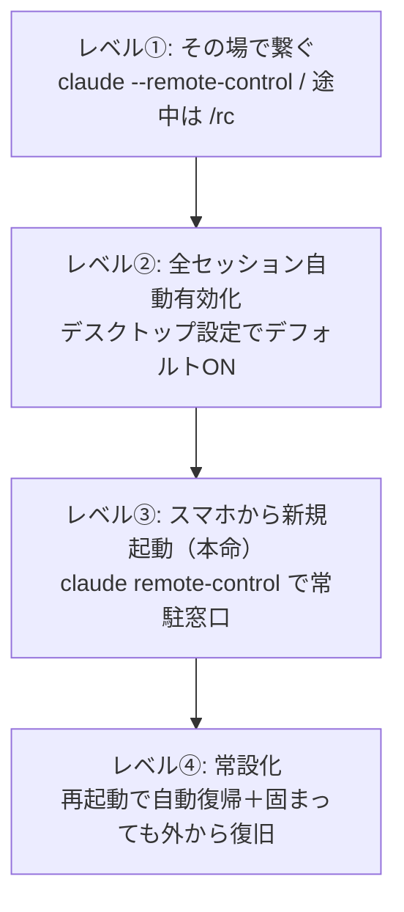

# Claude Code リモートコントロール

> **TL;DR**: PC上で動くClaude Codeにスマホ・ブラウザから接続して操作するResearch Preview機能。「その場で繋ぐ→全セッション自動有効化→スマホから新規セッション起動→常設化」の4レベルで運用を育てると、PCの前に座る前提がまるごと外れる。

処理はすべてPC側で走り、スマホやブラウザはそのセッションを「覗く窓」になる。家のPCで途中まで進めた作業を電車内で続けたり、出先で思いついた作業をその場で自分のPCに投げたりできる。鍵になるのは似た名前の2系統のコマンドを使い分けることと、運用を4段階で深めることにある。

## 前提条件

リモートコントロールはまだResearch Preview段階で、今後仕様が変わりうると記事の著者 @showheyohtaki は注記している。利用条件は次の4つ。

- Claudeの有料サブスク（Pro / Max / Team / Enterprise）。APIキーだけでは使えない
- Claude Code が v2.1.51 以降
- 使いたいプロジェクトのフォルダで一度ふつうに `claude` を起動し、フォルダの信頼確認を通しておく
- Team / Enterprise契約では管理者が機能をオンにしておく

## 2系統のコマンド（最重要の区別）

ハイフンの有無で中身がまったく別物になる。ここを取り違えるとレベル③の常駐運用にたどり着けない。

| 形 | コマンド | 役割 |
|---|---|---|
| フラグ | `claude --remote-control`（短縮 `--rc`） | いま目の前でやっている対話に外からの操作を「後付け」する。レベル①②がこちら |
| サブコマンド | `claude remote-control` | 起動口そのものを立て、そこから新しいセッションを開いていく。ターミナルに対話画面は出ず、接続を待ち受ける「ホスト（常駐の窓口）」になる。レベル③がこちら |

その場の会話にリモート操作を足すのか、繰り返し使える入口を作るのか、という違いになる。スマホ起点の運用に育てるなら後者を選ぶ。

## 4レベルの運用

### レベル①: その場で繋ぐ

`claude --remote-control` で起動すると接続用のURLとQRコードが出るので、スマホのClaudeアプリかブラウザで開くと目の前のセッションがそのまま繋がる。すでに会話を始めていても、途中で `/remote-control`（短縮 `/rc`）と打てば、それまでの会話履歴ごとスマホに引き継げる。接続中は画面下に「/rc active」と表示され、接続リンクもそこから出せる。弱点は明快で、コマンドを打ち忘れて家を出ると繋ぐ口が開いていない。

### レベル②: 全セッションで自動有効化

デスクトップアプリの「設定 → Claude Code → デフォルトでリモートコントロールを有効にする」をONにするだけで、毎回のセッションが自動でリモート対応になる。打ち忘れが根本から消える。ただしPCの前でセッションを立ち上げていないと始まらず、対話プロセス1つにつきリモートセッション1本の対応なので、スマホ側から並行で別作業を増やすことはできない。

### レベル③: スマホから新規セッションを立ち上げる（本命）

作業したいフォルダに移動して `claude remote-control` を実行すると、ターミナルにURLが出てそのまま窓口として待ち受け状態になる。スマホのClaudeアプリで「Code」を選び、立てておいたホストを選んで「＋新規セッション」を押すと、PCの前にいなくても何度でも新しいセッションを開ける。会話が重くなったら終了して新しいセッションを開き直せばよい。`--name` でセッション一覧の表示名を変えられ、`--capacity` で同時に開ける数を増減できる。同時セッション数の初期上限は32で、終わったセッションから順に閉じていけば足りる。

### レベル④: 常設化する（応用）

レベル③で目的は達成できているが、PCを再起動しても自動でレベル③の環境を立ち上げる常駐化と、AIが固まっても外から一発で復旧する保険まで組むと、離れた拠点に置いたPCを現地に戻らず遠隔運用できる。記事の著者は自分が運営する飲食店などにもPCを置き、接続が途切れても立て直せる「放っておいても回る」状態にしていると述べている。

## 観察ログ（未検証）

- 2026-06-11: @showheyohtaki が記事「9割の人が使いこなせていない、Claude Codeの『リモートコントロール』活用術」で4レベルの運用法を公開。レベル③まで設定している人は周囲でも驚くほど少なかったと主張（単一ソース）。
- 2026-06-11: 著者は自分のPCに「10部門約20人の仮想社員」を雇い、その環境にリモートコントロールでいつでも繋げるようにしていると述べる。複数セッションを役割分担で常駐させる運用は [[concepts/claude-code-orchestration]] の発想に重なる。
- 2026-06-11: v2.1.51以降・同時セッション上限32・有料サブスク必須などの数値は著者の記事内の記述であり、Anthropic公式の発表として確認したものではない。Research Previewのため変更されうる。
- 記事後半は著者（デイトラ創業者・AI経営顧問）の公式LINEへの誘導を含むマーケティング文。手法部分のみを知識として抽出した。

## 問い

- フラグ版 `--remote-control` とサブコマンド版 `remote-control` は、内部的にも別のホストプロセスとして実装されているのか。同一PCで両方を同時に立てたとき競合しないか。
- レベル④の常設化（再起動時の自動起動・自動復旧）は launchd / systemd で組むのが素直か。この vault の launchd auto-sync 運用とリソース競合しないか。
- リモートで開いた新規セッションは、PC側の CLAUDE.md・スキル・権限設定をそのまま継承するのか。出先からの操作で破壊的コマンドの確認をどう担保するか。

## 関連

- [[tools/claude-code]] — 親ツール。`/remote-control` はスラッシュコマンド一覧にも掲載されている
- [[tools/crabbox]] — ローカル差分をリモートのリース済みマシンへ送って実行するエージェント向けリモート実行コントロールプレーン。こちらは計算をクラウドへ逃がす方向で、リモートコントロールは自分のPCを遠隔操作する方向
- [[concepts/claude-code-orchestration]] — 複数セッション・サブエージェント・worktreeの並列運用フレーム。著者の「仮想社員20人」運用が重なる
- [[concepts/loop-engineering]] — @steipete のオーケストレーションループのように、出先から自律ループを起動・操舵する入口としてリモートコントロールが効く
- [[tools/claude-computer-use]] — ClaudeがリアルUIを操作する機能。こちらはClaudeが画面を操作する側、リモートコントロールは人間が遠隔からClaudeを操作する側
