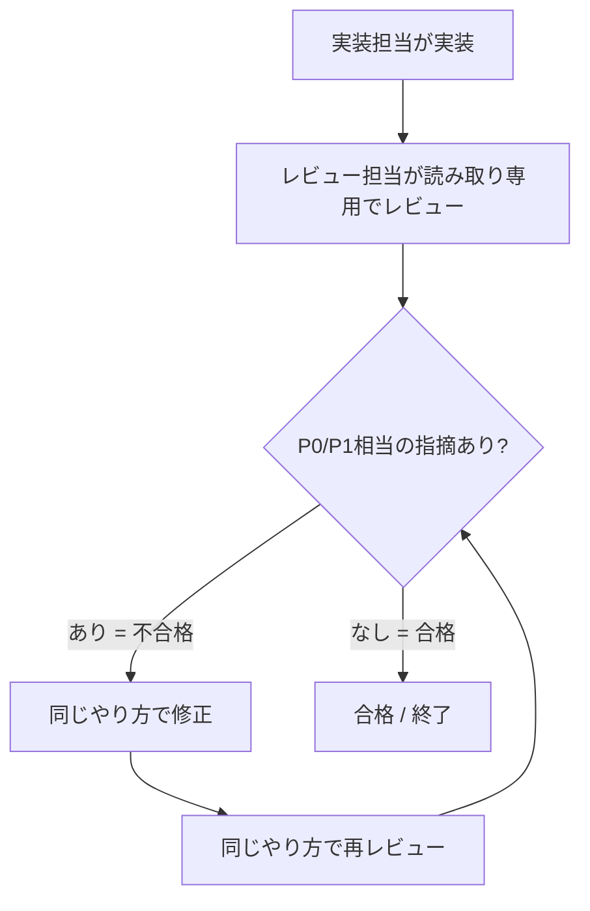

# codex-review スキル

> **TL;DR**: 実装担当とレビュー担当を分け、レビュー役のサブエージェントが「重要な問題が消えるまで」読み取り専用レビュー→不合格→修正→再レビューを自動で反復する、Codex内で完結するコードレビューゲートSkill。

AIコーディングで実装速度が上がるほど、人間が全実装を目視レビューする前提が崩れる。これを埋めるのがレビューの自動ゲート化で、実装担当とは別のレビュー担当（サブエージェント）を立て、合格が出るまで修正と再レビューを反復させる。基本構造は「実装担当とレビュー担当を分ける → レビュー担当は読み取り専用で見る → 重要な指摘があれば不合格 → 修正 → 同じやり方で再レビュー → 合格まで反復」という固定ループ。仕様の設計後や中〜大規模な実装後に発火させる運用が想定されている。

このスキルが前世代から刷新した点は3つ。

1. **GPT-5.5に最適化** — 細かい手順テンプレートを並べるのをやめ、レビュー担当が必ず守るルールを強くした。GPT-5.5は手順を詰め込むより簡潔に求める結果を書くほうがうまく動く、というアウトカム重視の指針（[[models/gpt-5-5]]）に合わせた設計変更。
2. **重要な問題にフォーカス** — レビュー担当に「P0/P1相当（最優先・準最優先）の問題だけを拾い、軽微な書き方の指摘は扱わない」と明示。Codexは頭の良さで細かい指摘をしがちなため、不要な修正の反復を止めてループをスムーズにする狙い。
3. **レビューゲートの精度改善** — 「レビューが途中で止まったのに合格になる」抜け道を塞いだ。レビュー担当が起動できなかった・返ってきたレポートが壊れて読めなかったケースは合格にしない。大きな変更を複数のレビュー担当で分担したときは、全員が合格を返し未レビュー・不成立がない場合だけ全体を合格にする。

発火の運用は、Codexが最初に必ず読む AGENTS.md（[[concepts/agents-md-canonical]]）に「〜のときにCodexレビューを実行する」と書く、または実装計画フォーマットの必須手順に組み込む、といった形で「利用者が意図したタイミングで自動起動」させるのが推奨されている。

## 観察ログ（未検証）

- 2026-06-18: @makaneko_AI による自作Skillの解説記事。基礎は約半年前にClaude Codeで実装・Codexをレビュー役に呼ぶ構成で作り、改良し続けてきたと述べる。当時はClaude Codeが実装に強くCodexは「頭がいいだけ」という認識だったが、その後Codexのほうが実装も強く頭もいい（Fable 5を除く）状況が続いたため、Codex単体でループが回る構成に刷新したという経緯（著者の環境認識）。
- 2026-06-18: 「GPT-5.5系はエージェント型コーディング・実務作業に強く、複数ステップで曖昧さのあるタスクでも自律的に進められる」という位置づけは著者が公式ガイドを引いて述べたもの（一次確認余地あり）。
- 2026-06-18: P0/P1フォーカスで「不必要に細かい修正の反復がなくなりスムーズになった」という効果は著者の使用実感（定量データなし）。

## 問い

- 自分のCI/wiki運用に「合格まで反復」ゲートを組み込めるか。[[concepts/eval-loop]] の出荷前ゲートと同じ構造をコードレビューに適用したものと見なせる
- [[tools/autoreview-skill]]（OpenClaw製・複数エンジンのレビューパネル）との違いは何か。単一エンジンでループを回す本スキルと、検証済み指摘だけを返すパネル型のどちらが手元の運用に合うか
- 「複数レビュー担当が全員合格でなければ全体不合格」という多重レビューの合議は、[[concepts/llm-council]] の匿名ピアレビューと比べて見逃しをどれだけ減らせるか

## 関連

- [[tools/autoreview-skill]] — Codexをデフォルトエンジンにするレビュー自動化スキル。検証済み指摘のみ返すパネル型で、本スキルのループ型と対照
- [[concepts/eval-loop]] — 「閾値未満を出荷前に止め合格分のみ通す」品質ゲートの一般形。本スキルはコードレビューへの具体実装
- [[concepts/loop-engineering]] — 人間がループの外に出てエージェントを反復させる工学。レビュー→修正の自動反復はその一例
- [[models/gpt-5-5]] — アウトカム重視プロンプト推奨。本スキルが手順テンプレートを削ぎルールを強くした根拠
- [[tools/openai-codex]] — 本スキルが動作する実行基盤
- [[concepts/agents-md-canonical]] — AGENTS.mdを正本に発火条件を埋め込む運用の土台
