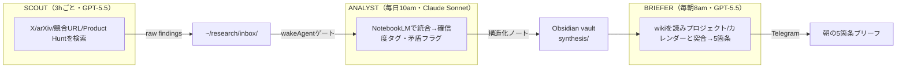

# Hermes Agent 3エージェント・リサーチ部門

> **TL;DR**: [[tools/hermes-agent]] で探索・統合・報告を Scout / Analyst / Briefer の3つの独立プロファイルに分け、共有Obsidian vaultで疎結合連携させる「毎朝賢くなるリサーチ部門」の構築ガイド（月$19-27）。

単一エージェントに探索・分析・報告を兼ねさせるとコンテキストが汚染される。何を探すか・何を分析するか・何を報告するかが混ざり、優先順位がぼやけ、責任を1つ足すごとに質が落ちる。これを役割分離で解く構成で、各プロファイルが独自のSOUL.md・モデル・メモリ・スキルを持ち、既定では何も共有しない。意図的に共有するのは1つのディレクトリ（Obsidian vault）だけ——Scoutが生findingsを置き、Analystが統合ノートを書き、Brieferが毎朝読む。3役を1本の直線パイプラインにすることで、責務が増えるほど質が落ちる単一エージェントと逆に、成果が複利で積み上がる。

## 3つの役割

| 役割 | モデル | 仕事 | ツール |
|---|---|---|---|
| **Scout（探索）** | GPT-5.5（安価・大量検索） | スケジュールでソースを巡回し生findingsをinboxに投下。分析・統合・意見は一切しない | web検索・X検索（xurlスキル or Grok）・RSS・arXiv API |
| **Analyst（統合）** | Claude Sonnet 4（強い推論） | inboxの生findingsをNotebookLMに通して統合し、Obsidian wikiに構造化ノート＋確信度タグ＋矛盾フラグを書く | NotebookLM MCP・[[concepts/llm-wiki]] スキル・web検索（検証）・ファイル操作 |
| **Briefer（報告）** | GPT-5.5（簡潔・低トークン） | 毎朝wikiの直近24時間分を読み、自分のプロジェクト・今週の目標と突き合わせて優先順位付き5箇条をTelegramに届ける | Obsidianスキル（読取）・セッションrecall・ファイル操作 |

確信度タグは `verified / likely / unverified / conflicting` の4段階で、矛盾は専用フォルダにフラグされる。X検索はGPT-5.5がネイティブにできないため、xurlスキル（X API・任意モデルで動くが開発者アプリ認証が必要）かGrokへの切替（ネイティブX検索）の二択になる。

## ファイルベース調整（Kanban不要）

3役は Scout→Analyst→Briefer の直線パイプラインなので、Kanbanのようなディスパッチ機構は過剰。inboxフォルダ＋wakeAgentゲートのほうが単純・安価（ディスパッチャのオーバーヘッドゼロ）・デバッグ容易（inboxを見るだけ）になる。役割を増やす（Code Reviewer・Content Writer等）段階で初めてKanbanの価値が出る。wakeAgentゲートは「inboxが空ならスリープ＝トークン0、新ファイルがあれば起動」という、変化検知でLLM起動を絞る仕組み（[[tools/hermes-agent-overnight]] と同じ原理）。

## NotebookLM接続とfallback

Analystの「深さ」はNotebookLMが担う。自分の推論だけで統合する（コンテキスト窓に制限される）のでなく、全ソースを取り込んで横断合成させる。接続には jacob-bd 製 `notebooklm-mcp-cli`（35 MCPツール）を使う。ただし**consumer版NotebookLMには公式APIが2026年6月時点で存在せず**（Enterprise版にはある）、このCLIはPlaywrightベースのブラウザ自動化ラッパーで動くため、Googleが内部エンドポイントを変えると壊れうる。著者はこれを「正直な限界」として明記し、AnalystのSOUL.mdに「NotebookLM接続が失敗したら `/goal` で直接合成する」fallbackを書くことを推奨する。

## 3段階セットアップ

| ティア | 構成 |
|---|---|
| **BASIC** | Scout + Briefer のみ。Analyst・NotebookLM・Obsidianなし。inbox→朝ブリーフの最小ループ |
| **STANDARD** | 3役すべて + Obsidian wiki。NotebookLMなし（Analystは `/goal` で合成） |
| **ADVANCED** | 3役 + Obsidian + NotebookLM接続 + 競合分析cron（競合URL差分・Product Huntスキャン・週次deep synthesis） |

Hermes Desktop app（v0.16.0）のProfile Builder（Identity→Model→Skills→MCPs→Reviewの5ステップ）で3プロファイルを15分で作れる。Telegramは1ボットで3役すべてが同じチャットに配信する。

## 観察ログ（未検証）

- 2026-06-17: コスト月$19-27（モデル選択次第）、セットアップは1晩、典型使用で約1.3Mトークン/月（3プロファイル合計）という著者(@IBuzovskyi)の数字
- 2026-06-17: 成長曲線 — Day1は汎用的で寒い／Week2でScoutが50-100ソース・Analystが30-40 wikiエントリ／Month1で200+エントリ・矛盾追跡・「頼んでいないインサイト」が出始める（複利の核）と主張
- 2026-06-17: 比較対象としてパートタイムのリサーチアシスタントは月$1,500-3,000とする
- 2026-06-17: 全技術詳細はHermes Agent v0.16.0公式ドキュメントに照合済みと明記
- 2026-06-17: 限界として、Scoutは有料/非公開コンテンツを取りこぼす・Analystの確信度分類は誤りうる（Hermesは独立にファクトチェックしない）・「自動操縦でなくリサーチ部門。決断は人間」と釘を刺す
- 2026-06-17: X bookmark 678（2026-06-18 時点）

## 問い

- このwikiのlaunchd+`claude -p`自動ingestはAnalystの役割に相当する。自分の構成にScout（収集）とBriefer（朝の要約配信）に当たる仕組みはあるか／作るべきか
- wakeAgentゲート（変化なし＝トークン0）は本リポのauto-syncや週次生成に応用できるか。[[tools/hermes-agent-overnight]] の`no_agent`/wakeAgentと同じ設計を流用できるか
- ファイルベース調整 vs Kanban の分岐点は「役割数」。自分のwiki自動化は何役で、どちらが適切か
- NotebookLM接続のブラウザ自動化依存（公式APIなし）は [[tools/notebooklm-py]] でも同じ脆弱性か。fallback設計はどうあるべきか

## 関連

- [[tools/hermes-agent]] — Hermes Agent本体（3層メモリ・GEPA・Curator・マルチプロファイル）。本構成はそのプロファイル分離機能の具体的活用例
- [[tools/hermes-agent-overnight]] — 夜間9時間自動化ワークフロー。wakeAgentゲート・段階的セットアップの原理を共有
- [[concepts/multi-agent-patterns]] — Scout→Analyst→BrieferはPipelineパターンの実装例
- [[concepts/llm-wiki]] — Analystが書き込みBrieferが読む共有知識ベースの基盤パターン（Hermes同梱のLLM Wikiスキル）
- [[tools/notebooklm]] — Analystの統合エンジン。consumer版は公式APIがなくブラウザ自動化依存
- [[concepts/obsidian-personal-os]] — Obsidianを複数エージェントの共有メモリ層に据える設計と地続き
