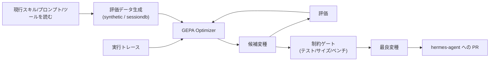

# Hermes Agent Self-Evolution

> **TL;DR**: [[tools/hermes-agent]] のスキル・ツール記述・システムプロンプト・コードを、実行トレースを読んで「なぜ失敗したか」を理解させながら自動進化させる NousResearch 製の独立リポジトリ。GPU 学習は不要で、1回の最適化は API 呼び出しのみ・約 $2〜10。

エージェントの改善を「人間が手で書き直す」から「実行ログを根拠に自動で書き換える」へ移すための最適化パイプライン。中核は **DSPy + GEPA（Genetic-Pareto Prompt Evolution）** で、テキスト（スキル・プロンプト・ツール記述）を変異させ、結果を評価し、最良の変種だけを選抜する反省的な進化的探索を回す。GPU 訓練を一切伴わずすべて API 経由で動くため、重みの再学習なしに「測定可能に良くなった版」を生成できる点が特徴。GEPA は ICLR 2026 Oral 採択、MIT ライセンス。

## GEPA が「なぜ失敗したか」を読む

通常のプロンプト最適化は「失敗した／成功した」のスコアだけを見るが、GEPA は **実行トレースを読んで失敗の原因（why）まで遡り**、そこを狙った変異を提案する。これにより総当たり的な探索より少ない試行で改善に到達する。評価データは2系統から作れる：完全な合成データ（synthetic）と、Claude Code・Copilot・Hermes の**実セッション履歴**（sessiondb）。後者を使えば、実際に自分が遭遇した失敗パターンを教師信号にして最適化できる。

これは [[concepts/self-refining-skills]]（LESSONS.md 方式の自己改善ループ）を、人手の振り返りでなく進化的探索で機械化したものに相当する。また「エージェントは自分のタスク結果を過大評価しがち」という [[concepts/self-evaluation-gap]] の問題を、当人の自己批評ではなく外部の最適化器で補う設計でもある（[[tools/hermes-agent]] 本体の GEPA 解説と同じ思想）。

## 最適化対象の5フェーズ

| Phase | 対象 | エンジン | 状態 |
|---|---|---|---|
| **Phase 1** | スキルファイル（SKILL.md） | DSPy + GEPA | ✅ 実装済み |
| **Phase 2** | ツール記述 | DSPy + GEPA | 🔲 計画 |
| **Phase 3** | システムプロンプトの各セクション | DSPy + GEPA | 🔲 計画 |
| **Phase 4** | ツール実装コード | Darwinian Evolver | 🔲 計画 |
| **Phase 5** | 継続的改善ループ | 自動パイプライン | 🔲 計画 |

現時点で動くのは Phase 1（スキルファイルの進化）のみ。Phase 4 のコード進化は **Darwinian Evolver**（Git ベースの「個体」としてコードを進化させる別エンジン、AGPL v3・外部 CLI としてのみ利用）を使う想定で、テキスト最適化（MIT の DSPy+GEPA）とライセンス境界を分けている。

## ガードレール（全変種が通過必須）

進化した変種は人間に届く前に5つの関門をすべて通る。自動進化が品質や目的を壊さないための安全柵にあたる（[[concepts/eval-loop]] の出荷前品質ゲートの一実装）。

1. **全テストスイート** — `pytest tests/ -q` が100%パス
2. **サイズ制限** — スキルは ≤15KB、ツール記述は ≤500文字
3. **キャッシュ互換性** — 会話途中での変更を入れない（プロンプトキャッシュを壊さない）
4. **意味の保存** — 元の目的からドリフトしてはならない
5. **PRレビュー** — 全変更は人間レビューを経由し、直接コミットしない

## 検証済み事実

- 2026-06-18: NousResearch が `NousResearch/hermes-agent-self-evolution` を公開。MIT ライセンス、© 2026 Nous Research
- GPU 訓練不要。テキストの変異・結果評価・最良変種の選抜をすべて API 呼び出しで実施し、1回の最適化コストは約 $2〜10
- 利用例: `python -m evolution.skills.evolve_skill --skill github-code-review --iterations 10 --eval-source synthetic`（`--eval-source sessiondb` で実セッション履歴を使用）
- GEPA は ICLR 2026 Oral、MIT。Darwinian Evolver は AGPL v3（外部 CLI としてのみ利用）
- 詳細なアーキテクチャ・評価データ戦略・ベンチ統合・段階的タイムラインは同リポの PLAN.md に記載

## 問い

- 「sessiondb（実セッション履歴）を教師信号にスキルを最適化する」発想は、このwikiの wiki-ingest スキルや LESSONS.md 自己改善ループにそのまま移植できるか
- ガードレールの「意味の保存（元の目的からドリフトさせない）」を、どう機械的に判定しているのか（diff の意味的同一性チェック方法）
- Phase 1 のスキル進化は、人手で LESSONS.md に追記する現行方式と比べて改善幅・コストでどちらが優位か

## 関連

- [[tools/hermes-agent]] — 進化対象となる本体エージェント基盤。この自己進化は別リポとして切り出されている
- [[tools/dspy]] — GEPA を含むプロンプト最適化フレームワーク。本リポの中核エンジン
- [[concepts/self-refining-skills]] — LESSONS.md 方式の自己改善ループ。これを進化的探索で機械化したのが本リポ
- [[concepts/self-evaluation-gap]] — 自己評価バイアス。当人でなく外部最適化器で補う設計の動機
- [[concepts/eval-loop]] — 出荷前の品質ゲート。ガードレール5項目がその実装にあたる
- [[concepts/recursive-self-improvement]] — AIがAIを改善するループの一形態
- [[tools/hermes-agent-overnight]] — 夜間自動化ワークフロー（同じ Hermes 系の運用設計）
- [[tools/hermes-agent-research-department]] — プロファイル分離による3エージェント構築ガイド
