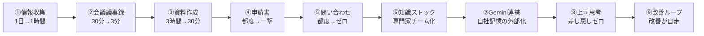

# NotebookLM 業務時短ワークフロー9選

> **TL;DR**: NotebookLMで9つの業務ワークフローを自動化——前半5つで会議・資料・情報収集などの個別業務を即短縮し、後半4つで知識ストック・Gemini連携・上司思考分析・改善ループを組み合わせて残業を「構造的に減り続ける」状態に変える。

NotebookLMの核心的な強みは「自分が入れた情報のみを使い、全回答に引用元がつく」という信頼性にある。ChatGPT等の汎用LLMと違い、ソースに含まれない情報で勝手に補完しない。この特性がビジネス用途（上司への報告・社内申請・コンプライアンス確認）において特に効く。「AIが本当に合ってる？」を確認し直す手間が省けるため、出力をそのまま業務に使いやすい。

## 前半①〜⑤：業務をその場で潰す

**① 情報収集（1日→1時間）**: 「集める工程」と「分析する工程」を分離するのが鍵。NotebookLMの「ソースを探す」機能でWebから関連ソースを一括収集した後、引用元リンク付きの競合分析・トレンド予測・自社差別化提案を一括生成する。

**② 会議議事録（30分→3分）**: 録音ファイル（MP3/WAV/M4A対応）をアップして決定事項・担当者+期限タスク・未解決課題を抽出。「推測で補わない」条件を付けることでAIの捏造を抑制し、そのまま関係者共有できる議事録になる。話者識別ON（PLAUD NOTEなど）で意見の構造分析や本音の読み取りも可能。

**③ 資料作成（3時間→30分）**: いきなりスライドを作らせない。「構成案→メモに保存→ソースに変換→スライド生成」の順序が重要。スピーカーノート付きの資料が出力されるため、プレゼン台本も同時完成する。

**④ 社内申請書（都度→一撃）**: 申請書フォーマットと「過去に承認された申請書」の両方をソースにストックしておく。承認済み申請書に含まれる「会社で通る書き方」をAIに学習させ、申請したい内容1〜2行の入力から社内フォーマット準拠の申請書を生成する。

**⑤ 問い合わせ対応（都度→ゼロ）**: 就業規則・規定・マニュアルをソースに入れ、共有リンクを発行して社内に配布するだけで社内FAQボットが完成。「ソースに記載がなければ正直に分からないと答える」条件を設定することで誤情報を防ぐ。プログラミング不要。

## 後半⑥〜⑨：効果を仕組みに変える

**⑥ 知識ストック（専門家チーム化）**: テーマごとにノートブックを分けて知識を蓄積（1ノート1テーマが鉄則）。「自社の状況」を渡してから相談することで、一般論でなく自社規模・予算・体制を踏まえた打ち手が引用付きで返ってくる。

**⑦ Gemini連携（記憶の外部化）**: GeminiからNotebookLMのノートを直接呼び出す機能（2026年アップデート）。Geminiの接続欄「＋」から10秒で設定可能。GeminiのDeep Researchで競合調査→自社ノートと連携して「自社の次の一手」を出す流れが典型的な使い方。Gemのシステムプロンプトに紐づければ「一言の指示から一撃で成果物が出る」専属アシスタント状態になる。

**⑧ 上司思考インストール（差し戻しゼロ）**: 1on1記録・指摘メール・過去の承認稟議書を分析して上司の「重視する判断基準・NGパターン・一発通過する提案の特徴」を言語化する。その基準に最適化して提案を組み立て直すことで差し戻しを構造的に排除する。

**⑨ 業務改善ループ（改善が自走）**: 日報・業務ログを同一フォーマットで蓄積し、「感情ではなくデータを根拠に」最も時間を奪っている業務TOP3を特定する。時短→浮いた時間で次のターゲットを特定→また時短、という改善が自走するループが完成する。

## 観察ログ（未検証）

- 2026-06-11: @ai_jitan は「月100時間あった残業がゼロになった」と報告。会議の後処理30分→3分・資料作成3時間→30分・情報収集1日→1時間という数字を実体験として提示（個人の経験値であり再現性は未検証）
- 2026-06-11: 「時短が単発で終わる」理由として、目の前の業務を1つ速くしても仕事の構造が変わらなければ残業が復活すると指摘。第9章の改善ループが「仕組みの時短」と「単発の時短」の差異を決めると論じている

## 問い

- ⑦のGemini連携（NotebookLM→Gemini統合）は日本のGoogle Workspaceアカウントでも同様に利用可能か
- 上司の1on1録音を分析する⑧のアプローチは倫理的・法的にどの範囲まで問題ないか（同意の有無・目的外利用の定義）
- [[tools/notebooklm-py]]のPython CLIと組み合わせてソース投入を自動化すると、この9ワークフローの全体をさらに自動化できるか

## 関連

- [[tools/notebooklm]] — NotebookLM全般の活用ガイド（カスタムプロンプト・隠し機能10選）
- [[tools/notebooklm-studio-prompts]] — Studio 9機能のカスタム指示プロンプト集（本ページが「どの業務に当てるか」、あちらが「各機能をどう指示するか」）
- [[tools/notebooklm-py]] — NotebookLM非公式Python API/CLI（バッチDL等Web UI非公開機能）
- [[concepts/obsidian-personal-os]] — Obsidian+Claude Code+N8Nの3層アーキテクチャによるパーソナルOS設計
- [[companies/google]] — NotebookLMを含むGoogle OneのAIサブスクバンドル
