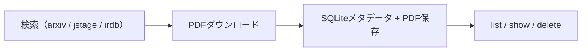

# papers-cli

arXiv・J-STAGE・IRDB（機関リポジトリ）から学術論文を検索・ダウンロード・管理する.NET製CLIツール（作者: supermomonga）。検索→PDF取得→ローカルでのメタデータ管理までを1本のコマンドで完結させる。

## 特徴

- **単一ソース検索＋ページング** — arXiv / J-STAGE / IRDB を `--source` で切り替え。`--category` `--author` `--from` `--to` `--sort-key` `--limit` `--page` で絞り込む。
- **PDFダウンロード＋SQLiteメタデータ管理** — `source:id` 形式（`arxiv:2301.00001`）やURLで指定。複数同時・`--format pdf,source`・`--force` 再取得に対応。
- **リッチなターミナルUI** — Spectre.Console による表・パネル・進捗バー表示。
- **`--json` 出力** — スクリプト連携用。`search --json | download --stdin` で検索結果をそのままダウンロードにパイプできる。
- **XDG Base Directory準拠** — 設定・DB・PDF保存先を環境変数で制御。

## 対応ソース

| ソース | 対象 | API |
|---|---|---|
| `arxiv` | arXivプレプリント | arXiv API（Atom Feed） |
| `jstage` | J-STAGE論文 | J-STAGE WebAPI |
| `irdb` | 機関リポジトリ | CiNii Research（IRDB） |

## ストレージ

| 種別 | パス |
|---|---|
| 設定ファイル | `$XDG_CONFIG_HOME/papers-cli/config.toml` |
| データベース | `$XDG_DATA_HOME/papers-cli/papers.db` |
| PDF保存先 | `~/papers/{source}/`（設定可能） |

## 問い

- `search --json | download --stdin` のパイプを起点に、arXiv論文を自動取得 → [[tools/notebooklm-py]] でNotebookLMに流す → 要約を `wiki/papers/` に落とす経路を組めるか。
- J-STAGE・IRDB対応は日本語論文の収集に効く。本wikiの `papers/` カテゴリを日本語研究で厚くする供給ラインになるか。

## 関連

- [[tools/notebooklm-py]] — 論文・ソースのバッチ取得という近い用途。papers-cliでPDFを集め、notebooklm-pyで分析に流すパイプラインが組める
- [[concepts/research-methodology]] — 「スレッド要約でなく論文本文を読む」という情報源の質の規範を、PDF取得の自動化で下支えする
