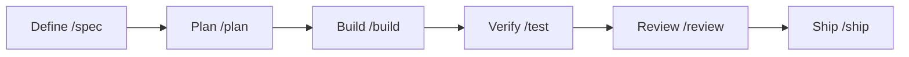

# Agent Skills（Addy Osmani）

> **TL;DR**: Addy Osmani（Google Chromeのエンジニアリングリーダー）製、開発ライフサイクル6フェーズ（Define→Plan→Build→Verify→Review→Ship）の全域を24スキル・8スラッシュコマンド・4専門ペルソナで覆うproduction-gradeエンジニアリングスキルパック。Googleのエンジニアリング文化を直接焼き込んでいる。

READMEは本パックを「シニアエンジニアがソフトウェアを作るときのワークフロー・品質ゲート・ベストプラクティスをスキル化し、エージェントが全フェーズで一貫して従うようにするもの」と位置づける。設計の出典として『Software Engineering at Google』とGoogleのeng-practicesガイド（[[concepts/google-code-review]]）を明言しており、API設計に Hyrum's Law、テストに Beyoncé Rule とテストピラミッド（80/15/5）、レビューに変更サイズ約100行と速度規範、簡素化に Chesterton's Fence、gitに trunk-based development、CI/CDに Shift Left と feature flags が各スキルの手順へ直接埋め込まれている。

構造面では全スキルが同じ解剖学（Overview / When to Use / Process / Rationalizations / Red Flags / Verification）に従い、エージェントが工程を飛ばすときの言い訳と反論を対にした**アンチ合理化テーブル**を必ず持つ。検証は非交渉（"'Seems right' is never sufficient"）で、SKILL.md を入口に参照資料を必要時のみ読ませる progressive disclosure でトークンを抑える。この規律付けの発想は [[tools/superpowers]] の赤旗テーブル・verification-before-completion と同型で、README は docs/comparison.md で Superpowers・Matt Pocock skills との違いと使い分けを自ら整理している。

スラッシュコマンドは /spec /plan /build /test /review /webperf /code-simplify /ship の8つで、作業内容に応じたスキル自動発火も併用する。**/build auto** は計画承認1回で全タスクを自律実行するモードで、タスク間に立つ人間を外すが検証は外さない（各タスクのテスト駆動・個別コミット・失敗や危険ステップでの停止は残る）。ペルソナは code-reviewer（Staff Engineer基準の5軸レビュー）・test-engineer・security-auditor・web-performance-auditor の4つで、「personas don't invoke personas」というオーケストレーション規則を references/ に持つ。

配布は vercel-labs/skills CLI（70+エージェント対応）・Claude Codeマーケットプレイス・Cursor/Gemini CLI/Copilot/Codex等のツール別セットアップ。per-skillインストールではrepo直下の references/ チェックリストが付いてこない portability gap があることをREADME自身が明記している（Issue #361）。

## 問い

- 24スキルのフルパック常時装備は [[papers/2026-li-skillsbench]] の「curatedなcompact少数精鋭が勝つ」結果と緊張しないか——誤発火とトークン費用の実測が要る
- Superpowers導入済みのこのvaultで併用価値があるのは差分（/webperf・4ペルソナ・アンチ合理化テーブル）だけか、それとも思想ごと選ぶべきか

## 関連

- [[tools/superpowers]] — 公式比較文書で名指し比較される開発方法論スキルライブラリ（obra製）
- [[tools/matt-pocock-skills]] — 同じく比較対象のエンジニアリングスキルコレクション
- [[concepts/google-code-review]] — 本パックがスキルへ焼き込んだと明言するGoogleレビュー指針
- [[tools/agent-skills-by-role]] — SENIOR ENGINEER枠で本リポを含む役割別6選
