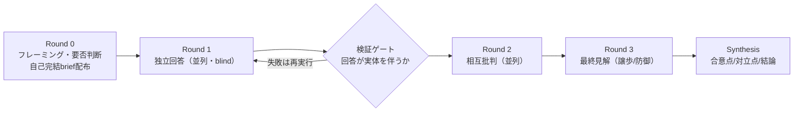

# adversarial-panel

> **TL;DR**: 複数のAIモデルに独立回答→相互批判→統合をさせ、一発生成の「自信満々な間違い」を出荷前に検出するClaude Codeスキル。GANの敵対的構造を訓練時（勾配）でなく推論時（自然言語の批判）に移植した設計（makinux/adversarial-panel・@wayama_ryousuke作）。

作者の @wayama_ryousuke は、LLMの答えが最も危ういのは「間違っているのに自信満々なとき」であり、単一モデルの単一パスにはこれを検出する仕組みが構造的にないと述べる。自己批判（self-critique）をさせても、生成時の盲点と批判時の盲点は同じ重みから来るため相関し、モデルは自分の出力を高く評価する self-preference bias を持つ——「自分で書いて自分でレビューする」は監査として最初から利益相反だ、という診断が出発点になっている。着想元のGANから引き継ぐのは生成器と識別器を競わせる構造そのものではなく、「作るより見抜く方が簡単」という非対称性で、独立した敵対者に攻撃させて生き残ったものだけを通す方が同じ計算量で高い品質保証になるという原理だと著者は説明する。

## 効く理由：2つの設計特性

多モデルを並べること自体に価値はなく、次の2つを意図的に作り込むことが本体だと著者は述べる。

- **誤りの非相関（Decorrelation）** — レビュアーが生成者の見落としを拾えるのは失敗モードが異なるときだけ。同一モデルのパネルは盲点を共有するため「全員一致」が見かけほどの証拠にならない。モデルファミリーを跨ぐことが本体。
- **検証優位（Verification advantage）** — 与えられた答えの反証は、答えを作るより易しい。批判者には「怪しいと思う」ではなく「入力Xで落ちる」という再現可能な反証を狙わせる。

## アーキテクチャとプロトコル

構成要素はファシリテータ（Claude Code本体・進行/検証/統合担当）と2〜4体のパネリスト（回答と相互批判担当）の2種類のみ。パネリストの調達は異質性を最大化する順に、①別モデルファミリー（Codex等の外部CLIをBash経由で・非相関が最強）→②別のClaudeモデル（Agentツールのmodelパラメータ）→③同一モデル＋方法論の強制分岐（第一原理／基準率／反証専任／再実行検証——口調でなく方法を分ける）。デフォルトは2パネリスト×3ラウンドで、コストはパネリスト数×ラウンド数に比例する。

- **Round 0**: パネルの要否をトリアージし、重要かつ係争的または検証可能な問いにだけフルパネルを起動する。ただしこの関門を運用するのは盲点を持つ当のモデル自身なので「自信満々に間違えるタスクほど関門が開かない」——このトリアージの罠への防衛として、ユーザーが明示的に求めたら確信度に関係なく実行し、重要な問いでは確信でなく賭け金の大きさで判断する。briefは会話文脈なしで完結させ、主要な主張には確信度と検査可能な反証条件を付けさせる（「反対の証拠が出たら」のような汎用文は較正の演技として欠落扱い）
- **Round 1**: 並列・blindが絶対条件（他者の回答を見たパネリストはアンカーして独立性が壊れる）。直後の検証ゲートでエラーダンプ等を弾き、2度失敗したパネリストは異質性の階層を1段下げて続行・開示する
- **Round 2**: 具体的な主張を引用して攻撃（事実誤認・弱い証拠・論理の飛躍・見落とされた代替案・暗黙の前提）。同意の水増し・要約・賞賛は禁止
- **Round 3**: 批判への譲歩/防御と較正済み確信度の提示。理由のない全面転向は追従（シコファンシー）のフラグとして根拠を問い直す
- **Synthesis**: 合意点（異種パネルの収束は強い証拠・同族パネルは弱い証拠と明示）／対立点（証拠の強さで裁定する。両論併記は中立でなく偽りのバランス）／結論（確信度・覆る条件・少数意見・採否の監査証跡）の3部構成

## 失敗モードと対策

著者はアンチパターン集を「理論上の懸念ではなく実際に踏んだ地雷のカタログ」だと述べる。

| 失敗モード | 内容 | 対策 |
|---|---|---|
| 亡霊パネリスト | エラーダンプが回答として議事録に混入し、以降が空気を相手に議論する | Round 1直後の検証ゲート・外部CLIのフォアグラウンド実行強制 |
| 追従的収束 | 新しい論拠なしに全員が同意（GANのモード崩壊に相当） | 「少なくとも1つの中心的主張に反対せよ」を批判プロンプトに追加 |
| ファシリテータの簒奪 | 進行役が自分の意見をパネルの口から語らせ合議の権威でロンダリング | ファシリテータの見解はラベル付きで分離 |
| 確信度の演技 | 反証条件を伴わない数値確信度 | 反証条件のない確信度は欠落として扱う |
| 多様性の錯覚 | 同一モデルのペルソナ違いを独立レビュアーと見なす | 同族パネルの収束は弱い証拠に格下げ |

環境が貧しいときの縮退（サブエージェント機構なし→順次実行の分離セクション、単一ファミリーのみ→方法論分岐に降格、外部CLIが2度失敗→除外して続行・開示）も定義されており、どの階層で実際に走ったかを意図でなく実測で報告することが監査可能性の要とされる。向くのはアーキテクチャ選定・障害の根本原因仮説・技術予測・リサーチ結論の検証など、重要で争いがあるか検証可能な問い。

## 観察ログ（未検証）

- 2026-07-09: 著者は次段階を「推論時から訓練時への再統合」と予測——批判をRL報酬信号に変換（RLAIF路線）して敵対の成果が重みに蓄積されれば、本スキルは過渡期のプロトタイプになる（答え合わせしたい予測）

## 問い

- 自分のwikiでは独立審判（別モデルによる再採点）を誤検知支配で撤去した経緯がある。adversarial-panelの「検証可能な主張は再現で反証する」「反証条件のない批判は欠落扱い」という設計は、その誤検知問題をどこまで回避できるか
- 方法論の強制分岐（第3階層）は本当に誤りを非相関にするか。同族パネルの証拠力格下げは実測でどの程度効くか

## 関連

- [[concepts/llm-council]] — 同じ「複数AIで盲点を炙る」Karpathyパターン。Councilは匿名ピアレビュー＋議長統合で権威バイアスを消すのに対し、こちらは異種モデルの非相関と反証の再現を独立性の源にする
- [[concepts/ai-dev-two-commands]] — Claude Code×Codex批判的対話レビューの組織実装。異種モデル間クロスレビューの実運用例
- [[concepts/multi-agent-patterns]] — Generator-Verifier等の上位パターン集。adversarial-panelはVerifierを複数・異族化し敵対プロトコルを固定した特殊形
