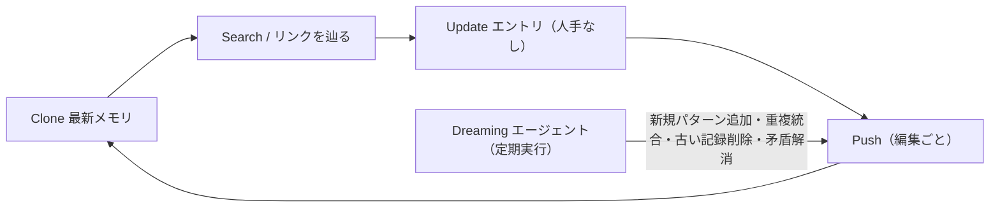

# Agent Memory Repo（Cognition）

> **TL;DR**: エージェントの記憶を「git リポジトリ上の Markdown フォルダ」として持たせる Cognition 発のオープン標準。毎セッション clone→検索→更新→push し、別エージェント Dreaming が定期的に重複統合・陳腐化削除・矛盾解消を行う。

Cognition（Devin の開発元）は2026-10-05、Devin がセッションをまたいで「ユーザーの働き方」のメモリグラフを作る機能 **Dreaming** を発表し、その記憶フォーマットを OSS 標準 Agent Memory Repo として公開した。Cognition の説明では、夜間に Devin が自分のメモリを改善し、古い記録を消して潜在的な情報を見つけ出す。記憶の置き場を独自DBでなく git リポジトリにしたことで、履歴・権限・衝突検出を git にそのまま任せられる点が設計の芯と考えられる（推論）。

## メモリループと Dreaming

公式ページによれば、全セッションは同じ4手順を踏む: 最新メモリを **Clone** → タスクに必要なものを **Search**（またはリンクを辿る）→ 学んだことを人手を介さず **Update** → 編集ごとに **Push**。

**Dreaming** は定期実行される専用エージェントで、仕事は2つ。セッション横断のパターンを見つけて新エントリとして足すこと（Add new memory）と、重複のマージ・古いエントリの削除・ソース確認による矛盾解消（Clean up memory）である。Anthropic の [[concepts/managed-agents-dreams]] と名前も役割もほぼ重なるが、Managed Agents 側が API ジョブとして新ストアを非破壊で書き出すのに対し、こちらは git の履歴で巻き戻せる前提で同じリポジトリを直接書き換える形と読める（推論）。

## フォーマット

- **リポジトリ構成は自由**。Markdown ノートのほか SQL クエリ・スクリプトなど任意のファイルを置ける
- **`MEMORY.md` が入口**。毎セッション冒頭に読み込まれるので、全セッションに要る情報とリンクだけに絞る
- **1エントリ＝1行の箇条**。末尾に `[key: value; key: value]` 形式のメタデータを付けられ、推奨キーは `source`（学んだセッションへのリンク）と `added`（保存日 YYYY-MM-DD）
- **相互リンクは `[[path]]`**。パスはメモリルート起点で `.md` は省略。「情報は1か所に置き、他からはリンクする」「移動・改名時はリンクも直す」が規約

この構造は本vault（MEMORY.md を索引にした Claude Code の auto-memory や [[concepts/llm-wiki]]）とほぼ同型で、二重角括弧のページ間リンク・1行1事実・出典メタデータという選択が独立に収斂している点が興味深い（wiki 側の観察）。

## ユースケースと合成可能性

公式ページは4用途を挙げる: **個人メモリ**（誰と働くか・プロジェクトの関係を覚える）、**エージェントスウォーム**（並列エージェントが同じリポジトリへ push し、衝突は git が検出）、**チームメモリ**（コードリポジトリを持たないチームでも、あるメンバーのサポート調査の教訓が全員のエージェントに渡る）、**マルチプレイヤー**。

記憶がフォルダなので合成できる。Alice のセッションに Bob が参加すると、Bob が共有を選んだ場合だけ `memory-bob/` が同じマシンに clone され、エージェントは両方の `MEMORY.md` を読む。リポジトリは分かれたままで、エージェントは誰の発言かを追跡して Alice の好みは `memory-alice/` へ、Bob の好みは `memory-bob/` へ書き分け、行き先が不明なら尋ねる。所有単位をユーザーに置く点は [[concepts/agent-memory-layer]] の「ユーザー所有の単一メモリ層」と同じ方向で、それを複数人で合成可能にした版と言える（推論）。

## 公式の例

- **スウォームの掲示板**: 中央値80msだが1%が2.4秒かかる遅延を、DB・ランタイム・キャッシュ・ロードバランサ担当の4エージェントで調査。`swarms/slow-checkout/` に README（目的とルール）・findings.md・questions.md・エージェント別ノート・共通ベンチ `bench.sh` を置き、互いの質問と回答で「10秒ごとの2GB価格キャッシュ再構築→400msのGC停止→接続プール（20本）枯渇」という原因にたどり着いた。修正後の遅い1%は2.4秒→310ms（Cognition の例示）。同じ行を2エージェントが編集すると git が2番目の push を拒否し、そのエージェントが両版を読んでから書き直す
- **保存済みSQLの再利用**: 「autocomplete はコード上 ghost_text と呼ばれる」というエントリから計測クエリへリンクを辿り、ユーザーが機能名も計測方法も説明し直さずにリリース影響（keep rate 31%→24%）を答えられた

## 利用方法と制約

Devin CLI では `devin plugins install AgentMemoryRepo/agentmemoryrepo` でスキルとして入る。公式の試用手順はリモートを設定しないローカルリポジトリで好みを1つ覚えさせ、新セッションで想起できるかを確かめる形で、**自動起動と定期 Dreaming はこの試用には含まれない**と明記されている。標準は GitHub（AgentMemoryRepo/agentmemoryrepo）で公開され、外部からの提案を受け付けている。

## 問い

- 本vaultの auto-memory（MEMORY.md＋1ファイル1事実）を Agent Memory Repo 形式に寄せると、Claude Code 以外のエージェント（Codex・Devin）と記憶を共有できるか
- Dreaming の「ソース確認による矛盾解消」は、[[papers/2026-peng-llm-memory-faulty]] が示す継続更新によるメモリ劣化を本当に抑えるか。人手なしの Update が誤記憶を広げる経路はないか
- スウォーム用の掲示板フォルダ（findings/questions）は、自分の並列 subagent 運用にそのまま使えるか

## 関連

- [[concepts/managed-agents-dreams]] — Anthropic 版の Dreaming。API ジョブとして入力非破壊で新ストアを生成する
- [[concepts/agent-memory-layer]] — ユーザー所有の単一メモリ層という設計思想。本標準はそれを git フォルダで合成可能にした実装例
- [[concepts/skills-over-memory]] — MEMORY.md を短く保ち決定を変える行だけ残す規律。本標準の「MEMORY.md は全セッションに要るものだけ」と同じ
- [[concepts/llm-wiki]] — 二重角括弧リンクと1か所1情報の Markdown 知識ベース。構造がほぼ同型
- [[papers/2026-peng-llm-memory-faulty]] — 継続的なメモリ更新による劣化。Dreaming のクリーンアップが対処する課題
