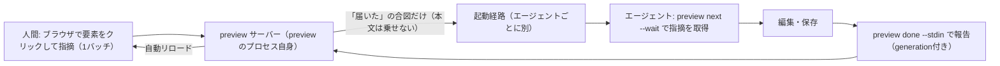

# Artifact Share preview — ブラウザの指摘で Claude Code・Codex・Cursor にファイルを直させるローカルループ

> **TL;DR**: AIエージェントが作ったHTML/Markdownをブラウザで開き、要素をクリックして書いた指摘をClaude Code・Codex・Cursorが自分で取りに来て直し、ブラウザが自動リロードで結果を見せるローカル機能。CLIとデータ契約は3エージェントで共通化できたが「会話を邪魔せずにエージェントを起こす合図」だけは3つ別々に作るしかなかった、というのが作者cojiの結論。



Artifact Shareは、cojiが2026年5月ごろから自分で使うためにソース公開で作り続けているサービスで、AIエージェントが作ったHTMLやMarkdownをURLで共有する。そのCLIに追加されたローカルコマンドが `preview` で、サインインもアップロードも要らず、実装は公開されている。cojiが作ってみて核になったと述べる設計判断は2つある。会話セッションを邪魔せずにエージェントを起こす合図は3つのエージェントで別々に作るしかなかったこと、そして常駐デーモンは要らず1ファイル1プロセスで足りたことである。以下はcojiの設計メモに沿った整理で、機構の説明はすべてcojiの記述に基づく。

## 1周の形

`preview <file>` を実行すると、そのプロセス自体がローカルサーバーになりブラウザが開く。以後、人間は画面上で指摘を書き、まとめて1バッチで送信する。エージェント側の1周は「指摘を取りに行く（`next`）→ 編集・保存 → 結果を報告する（`done`）」の2コマンドで閉じる。

```
# 人間側: プレビューを開く(ブラウザが開き、以後は画面上で指摘する)
npx @artifactshare/cli preview ./report.html

# エージェント側: 1周はこの2コマンド
npx @artifactshare/cli preview next --wait 90   # 指摘が届くまで待って受け取る
npx @artifactshare/cli preview done --stdin     # 直した結果を報告する
```

公開URLの発行はviewerの「共有する」を押したときだけで、ローカルの指摘履歴は共有に含まれない、とcojiは明記している。

## エージェントを起こす3つの合図（共通化できなかった部分）

cojiが一番苦労したと述べるのがここで、こだわりは「待っている間も会話セッションを邪魔しないこと」にある。「指摘が届くまで待つ」コマンドをフォアグラウンドで実行させれば確実に動くが、待っている間ターンが塞がり、エージェントに他の作業を頼めなくなる。理想は普段どおり会話しながら、指摘が届いた瞬間にエージェントが自分で動き出すこと。ところが、そのために使える仕組みがエージェントごとに違った。cojiが3つで実際に動かして確かめた結果の整理が次の表である（ソースからの転記）。

| エージェント | 使えた仕組み |
| --- | --- |
| Claude Code | バックグラウンドタスク完了時の自動ターン再開 |
| Codex | 実行中セッションへのメッセージのキュー投入 |
| Cursor | ACPで常駐させた専用セッションへの固定プロンプト送信 |
| (共通の保険) | 「届くまで待つ」コマンドをフォアグラウンドで実行。ターンは塞がる |

### Claude Code: バックグラウンドタスクの完了を使う

使うのは、Bashコマンドをバックグラウンドで実行できる[[tools/claude-code]]の標準機能である。Claude Codeはバックグラウンドタスクが完了すると新しいターンを自動で開くので、「指摘が届くまで待つ」コマンド（`preview next --wait 3600`）をバックグラウンドに仕込んでおく。指摘が届いた瞬間にコマンドが終了し、Claude Codeが起きてファイルを直しにいく。修正後は次の待機を仕込み直してループが続く。hookからサブエージェントを非同期起動する[[concepts/claude-code-hooks-async]]と同じ「メインの会話を塞がずに後で起こす」狙いを、hookでなくバックグラウンドBashの完了通知で実現した形と考えられる。

### Codex: 実行中セッションのキューに直接差し込む

[[tools/openai-codex]]にはバックグラウンド完了でターンを再開する仕組みがなく、Claude Codeの手は使えない（cojiはopenai/codexのissue #32188を参照している）。代わりに使うのは、Codex CLIが持つ「実行中セッションへのメッセージのキュー投入」で、previewサーバーが起動時にCodexのセッションIDを検出しておき、指摘が届いたらそのセッションへ「届いた」というメッセージを積む。エージェントが指摘を取りに来るまでバッチは消費されず、セッションが終わっていても `codex resume` で再開すれば受け取れる。

### Cursor: 管理下のACPセッションへ固定プロンプトを送る

[[tools/cursor]]にも自動再開の仕組みはなく、IDEチャットは外部から起こす手段自体がない。cojiが使ったのはACP（Agent Client Protocol、エディタとエージェントをつなぐ共通プロトコルで、外部から会話の作成・復元・プロンプト送信ができる）である。previewに同梱した専用ランチャーが、ACP経由の専用セッションを1ワークスペースに1つ常駐させる。指摘が届くと、ランチャーは「バッチが届いた」という固定プロンプトだけをそのセッションへ送る。本文はエージェントが自分で取りに行き、使用中なら通知は保留され、バッチは保存されたまま残る。

### 3つに共通させた判断: 通知は合図だけ

通知には指摘の本文もアンカーも乗せず、「届いた」という合図だけを運ぶ。中身はエージェントが毎回取りに行く形にしたので、通知経路が漏れても指摘は流出しない、とcojiは述べる。同じように外部イベント待ちのCLIを作る場合は実装をそのまま参考にできる、というのが著者の見立てである。

## 常駐デーモンを持たない

当初は常駐デーモンで複数セッションを束ねる構成も検討したが、cojiはやめた。`preview <file>` のコマンド自身がサーバーになり、Ctrl-Cで終わる。同じファイルへの2回目の `preview` は既存セッションへ再接続する。それだけの作りである。理由は、用途を「1ファイルを何度も直す反復ループ」に絞ったこと。すると複数セッションの横断発見・多重起動のロック・死んだプロセスの回収といった、デーモンが背負う寿命管理が丸ごと要らなくなる。

## 指摘の場所を覚えておく: anchorの3種類

指摘の位置は3種類のanchorとして保存する形に落ち着いた（ソースからの転記）。

```
type PreviewAnchor =
  | { kind: 'artifact' }
  | {
      kind: 'text'
      state: 'attached' | 'orphaned'
      quotedText: string
      prefixText: string
      suffixText: string
      cssPath: string | null
    }
  | {
      kind: 'element'
      state: 'attached' | 'orphaned'
      selector: string
      label: string // 例: button "送信"
      contextText: string // クリック時点の周辺テキスト
    }
```

cojiがこだわったのは `element` をCSSセレクタ単独にしないことである。エージェントの編集でセレクタの指す先がずれても、ラベルと周辺テキストを突き合わせれば位置を再解決できる。再解決に失敗したら `orphaned` に落とし、誤った場所には紐づけない。座標（boundingBox）は編集でずれる値なので保存せず、表示のたびに計算する。

## 指摘は状態を持つ

指摘の状態は5つに整理され、draft側の遷移は人間だけ、requested以降の前進はエージェントだけ、と主体を固定している。5状態の名前は埋め込みの状態遷移図にあり、キャッシュ本文で読めるのはdraftとrequestedのみである（残りは未取得）。遷移はバッチ単位で、エージェントは1バッチを1回の編集でまとめて直すので1件ずつは刻まない。reopenのたびに `generation` という番号が増え、エージェントの報告はこの番号と紐づく。古い番号の報告は無視されるので、重複報告しても二重適用されない。

## cojiの見立て

作ってみてわかったのは、CLIとデータ契約は共通にできても、エージェントを起こす合図だけは共通化できないことだった、とcojiは結ぶ。同じ体験のためにエージェントの数だけ起動経路を作ることになり、この部分が今後標準化される見込みも正直薄そうだと感じている。外部からメッセージをセッションへ届けるClaude CodeのChannelsのような仕組みも出てきているが、まだ使えなかったし、使えたとしても各社独自の路線になりそうで、当面はエージェントが増えるたびに起動経路を1本ずつ足していくことになる、というのが著者の予測である。X上の告知ポストで@techtalkjpは一人称で「3方式を図で整理しました」と述べ、対象読者を「エージェントから使うCLIに『外部イベントを待って動く』を入れたい人」と定めたうえで、「標準化はしばらく来なさそう」と繰り返している。

このvaultの文脈では、同じ「AI生成HTMLの置き場所と共有」を自前AWS上で解く[[tools/html-share]]の隣に置ける。html-shareがスマホからの承認・コメント返しを主眼にするのに対し、Artifact Share previewはローカルでの指摘→修正の反復ループが主眼で、共有URLは副次的な出口になっている。Claude Designの「コメント→Sendで自動修正」（[[design/claude-design-workflow]]）と同じ形を、特定ベンダーのUIでなくローカルCLIと複数エージェントで実装した例とも読める。

## 観察ログ（未検証）

- 2026-09-02: cojiが「16箇所の指摘をCodexとブラウザの往復だけでさばいた」実例を埋め込みカードで示している（カード先の記事は未取得）
- 2026-09-02 予測（coji）: エージェントを起こす経路の標準化は当面来ず、Channelsのような仕組みも各社独自路線になる

## 問い

- このvaultの `wiki/outputs/` に出すHTMLを `preview` で開き、ブラウザ上の指摘をClaude Codeに直させる運用は成立するか。バックグラウンドBash待機を合図にする手は、time-basedなlaunchd ingestをイベント駆動へ寄せる（[[concepts/claude-code-loop-types]]の「時間でなくイベントに反応させる」）際にも流用できるか
- 「通知は合図だけ、本文は取りに行く」は、SlackやメールからClaude Codeを起こす他の外部イベント経路にも当てはめるべき設計則か
- 5状態の名前と遷移、およびCodexのキュー投入・CursorのACPランチャーの具体実装を公開リポジトリで確認する

## 関連

- [[tools/html-share]] — 同じ「AI生成HTMLをURLで共有する」ツールの自前AWS版（minorun365製）。あちらはスマホからの承認・コメント返し、こちらはローカルの指摘→修正ループが主眼
- [[concepts/claude-code-hooks-async]] — Claude Codeで「メインの会話を塞がずに後で起こす」もう1つの手（hookからの非同期サブエージェント起動）
- [[design/claude-design-workflow]] — Claude Designの「コメント→Sendで修正指示」。同じ形をローカル・複数エージェントで実装したのがpreview
- [[tools/claude-code]] / [[tools/openai-codex]] / [[tools/cursor]] — 起動経路を別々に作った3エージェント
- [[concepts/claude-code-loop-types]] — Claude Code公式のループ4類型。「届いたら動く」はイベント駆動（Proactive）の最小実装にあたると考えられる
