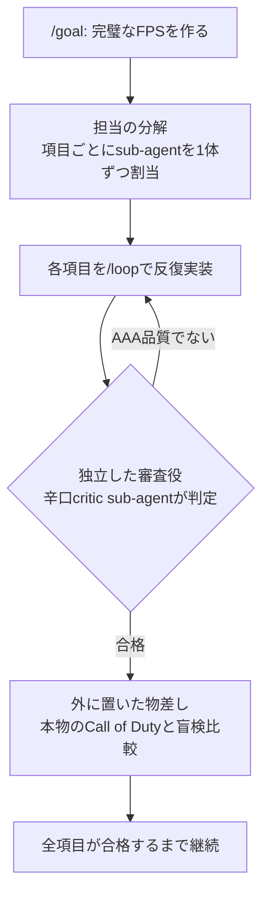

# Claude Code /goal コマンド

**`/goal`** は [[tools/claude-code]] のセッションスコープ自律ワークフロー機能。完了条件を設定すると、Claude が条件を満たすまで自動でターンを繰り返す。

## 概要

`/goal` の後に満たしたい条件を記述する：

```text
/goal all tests in test/auth pass and the lint step is clean
```

設定後は即座にターンが開始され、各ターン終了後に小さく高速なモデル（デフォルト: Haiku）が条件を評価する。条件が満たされるとゴールは自動でクリアされる。

## 他の自律ワークフローとの比較

| アプローチ | 次のターン開始タイミング | 停止条件 |
|-----------|----------------------|---------|
| `/goal` | 前のターン終了後 | モデルが条件充足を確認 |
| `/loop` | 時間間隔経過後 | 手動停止 or Claude判断 |
| Stop hook | 前のターン終了後 | 独自スクリプト/プロンプト |

- `/goal` と Stop hook は相互補完：`/goal` はセッション限定のショートカット、Stop hook は全セッション適用
- **自動モード**（auto-mode）との組み合わせが強力：自動モードはツール呼び出しごとのプロンプトを削除、`/goal` はターンごとのプロンプトを削除

## 効果的な条件の書き方

条件は最大 4,000 文字。評価器は Claude の出力から判断するため、Claude が実証できる形で書く：

- **1つの測定可能な終了状態**：テスト結果、ビルド終了コード、空のキュー
- **述べられたチェック**：「`npm test` が 0 で終了する」「`git status` がクリーン」
- **重要な制約**：変更してはならないものを明示

ターン・時間の上限も設定可能：

```text
/goal all tests pass or stop after 20 turns
```

## 主要コマンド

```text
/goal <条件>          # ゴール設定（既存は上書き）
/goal                 # ステータス確認（ターン数・トークン消費・理由）
/goal clear           # 手動クリア（stop/off/reset/cancel も可）
```

## 非対話的実行

`-p` フラグと組み合わせて非対話的モードで動作する：

```bash
claude -p "/goal CHANGELOG.md has an entry for every PR merged this week"
```

ループが完了条件を満たすまで単一の呼び出しで継続実行される。Ctrl+C で中断可能。

## 評価の仕組み

セッションスコープの**プロンプトベース Stop hook** のラッパー。ターン終了ごとに条件と会話履歴を評価モデルへ送信：

- **Yes** → ゴールクリア、トランスクリプトに記録
- **No** → 理由を次ターンのガイダンスとして Claude へ渡す

評価トークンはメインターンと比べて無視できる程度。

## セッション復元

`--resume` / `--continue` でセッション再開時、アクティブなゴールが復元される。ターン数・タイマー・トークン支出ベースラインはリセットされる。

## 合格条件の書き方（@ren_aivestの3ステップ）

「いい感じにして」は合格条件にならない——合否の判定が人間の感想になってしまうからだ。@ren_aivestは、判定がYES/NOで機械的に出る条件ほどClaudeが迷わず回り続けられるとして、次の3手順を提案する。

1. **終わった状態を1行で書く**——「〜を作る」「〜が回るようになる」まで。やり方は書かない
2. **機械が合否を判定できる検証を条件に含める**——全テスト通過／ビルド成功／E2Eテストが通る、のいずれか
3. **足りなければ`--resume`で条件を継ぎ足す**——一発で完璧な条件を書こうとせず、回しながら足す

雛形：`/goal <作りたいもの・終わった状態を1行>。全テスト通過とビルド成功。`

開発以外の業務でも②（数える・照合するなど機械が数えられる条件）さえ守れば書ける。@ren_aivestが挙げる例：

```text
/goal 今月の請求書と入金記録の突合表を作る。全件一致し、不一致は理由つきの一覧になっていること。
/goal 競合10社の比較表を作る。10社全てに出典URLがつき、リンク切れがゼロであること。
```

### 実例: 「ワンショット」に見えたデモの中身は/goalだった

2026-07-26、@mattshumer_（フォロワー37万人超）が「Claude Opus 5が最新Call of Duty級FPSをワンショットで作った」というデモを投稿し316万インプレッション・ブックマーク3,528件まで伸びた。だが投稿主が引用ツリーで公開した実際の指示文の冒頭は `/goal` で始まっており、中身はワンショット（一往復の指示）の対極だった。@ren_aivestはこの指示文を4つの部品に分解する。



- **担当の分解** — 項目ごとにsub-agentを1体ずつ割り当てる（fan out sub-agents）
- **独立した審査役** — 作る側とは別のAIを「辛口の批評家」として立て、自己採点をさせない
- **外に置いた物差し** — 本物のCall of Dutyと、どちらが作った側か伏せた状態で並べる盲検比較
- **反復の明示** — 各項目を`/loop`で、審査役が唸るまで回す

@ren_aivestはこの分解に加え、実務利用では合格条件に必ず「達成、または上限」（ターン数・時間の上限）を明記すべきと指摘する。この指示文の停止条件が「完璧になるまで止まるな」しかなく、デモとしては許容できても実務では暴走コストになるためだ（原文引用は投稿主本人が引用ツリーで公開したものに基づく）。

## 関連

- [[tools/claude-code]] — Claude Code 本体
- [[concepts/agentic-coding]] — AIエージェントの自律実行スタイル
- [[concepts/claude-code-dynamic-workflows]] — `/goal`（ハード完了要件）・`/loop` と組み合わせてworkflowを強化する
- [[concepts/loop-engineering]] — /goal がループエンジニアリング Stage 4 の具体実装として位置づけられる
- [[concepts/goal-loop-routine]] — goal/loop/routine の動詞の使い分け。/goal は「条件を満たすまで走って止まる」動詞
- [[models/claude-fable-5]] — `/goal` にゴールだけ与えて放置し、全6コース54レッスンの教材サイト「言語の庭」が自走で完成した実証事例（水島宏太）
- [[concepts/frontier-model-extraction]] — フロンティアモデルの持久力を抽出する型4として `/goal`＋動的ワークフローを使う（貼られた証拠＋ハード上限の2安全ルール）
- [[concepts/claude-code-loop-types]] — `/goal` を Goal-based ループとして位置づける公式4類型（トリガー×停止条件×プリミティブ）
- [[tools/claude-code-ultracode]] — `/goal`と1行で同居させる総力戦モード。実例の指示文は両者の組み合わせだった
