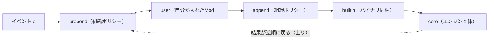

# Claude Mods / Function Hooks｜Claude Code 本体に TypeScript 関数を差し込む拡張機構

> **TL;DR**: 従来の Hooks が「外部プロセスを起動して JSON をやり取りする」仕組みだったのに対し、Claude Mods は TypeScript の関数（Function Hooks）を Claude Code のエンジンプロセスへ直接ロードし、Koa 風のミドルウェア `($, e, next)` として画面描画・状態・ツール登録まで書き換えられるようにした拡張機構。`/diff` や AGENTS.md 対応といった標準機能自体も Mod で実装されている、と nogu が解説している。

nogu によると、従来の [[tools/claude-code]] の hooks はイベントのたびに外部プロセスを起動して標準入力にイベントの JSON を渡し、標準出力や exit code で許可・拒否・加工結果を受け取る仕組みだった。プロセスをまたぐため、やり取りできるのはテキストの入出力と可否判定までに限られる。Function Hooks はこの境界をなくし、関数として同じメモリ空間で呼ばれるので、エンジンの操作窓口 `$` を通じて画面描画・状態管理・ツール登録まで直接触れる。両者の違いは「プロセスをまたぐかどうか」に集約される、というのが nogu の整理である。

Mod は外付けの拡張ではなく、Claude Code 自身の `/diff` コマンドやテレメトリ機能、Claude Code 2.1.277 で追加された AGENTS.md サポート（`agents-md` Mod）も同じ仕組みで作られている。nogu はここから「Claude Mods は Claude Code の標準機能自体を拡張できる」「かなり将来性の高い機能」と評価している。

## 使い始め方

nogu の記事時点では early access で、`~/.claude/settings.json` の `env` に `CLAUDE_CODE_ENABLE_FUNCTION_HOOKS: "1"` を設定して有効化する。Mod は `.claude-plugin/plugin.json`（メタ情報）＋ `hooks/hooks.json`（`{"modules": ["./register.ts"]}` でエントリポイントを宣言）＋ `hooks/register.ts(x)` という構成で、[[tools/claude-code-plugins]] と同じプラグイン形式に乗る。`claude --plugin-dir ./my-mod` でインストールせずにそのセッションだけ試せ、保存するとホットリロードされるので Claude 自身に Mod を書かせながら試せる。型は `/plugin-types` で生成される `.claude/types/claude-code.d.ts` が正で、`claude plugin validate .` で登録を検証する。

## `register(on)` と `($, e, next)`

`register` の中で `on(イベント名, マッチャー?, ハンドラ)` を呼んで処理をつなぐ。マッチャーは絞り込み条件で、`{ tool: "Bash" }` なら Bash の `tool.call` だけを拾う。ハンドラの3引数は nogu の表で次のように説明されている。

| 引数 | 役割 |
| --- | --- |
| `$` | エンジンとの唯一の接続窓口。画面描画・モデル・ストレージ・タイマー・ツール登録など、外の世界に触れる手段はすべて `$` 経由。 `$` のメソッドは、それ自体がイベントでもある |
| `e` | そのイベントの入力データ。フラットな値で、idは固定（pinned）、それ以外のペイロードは自由に書き換えてよい |
| `next` | 次の処理へ進む関数 |

Mod は隔離環境で動き、`$` を使わない限り外の世界に何もできない。これが安全性の要だと nogu は述べる。`next` は Express/Koa のミドルウェアそのもので、呼ぶタイミング次第で3通りに使い分けられる。

- **早期リターン**: `next(e)` を呼ばずに `{ deny: "no" }` などを返すと、後続のフックにも core にも届かない（`rm -rf /` の遮断など）
- **後処理**: `const r = await next(e)` で内側を先に走らせ、計測やログ（`$.ui.log`）を足してから `r` を返す（Koa のオニオンモデル）
- **結果の書き換え**: 返ってきた `r.text` を加工して返す（`Read` の出力に混じった `sk-...` を `[REDACTED]` にする例）

ハンドラが例外を投げるか10秒を超えると、そのハンドラだけがスキップされる。`.catch` を宣言しておけば猶予予算の中で `next` と同等の権限で代わりに答えられ、`next.called` で既に内側を呼んだかを判定できる。

## 5層チェーンと「位置がそのまま権威」

1つのイベントは prepend（組織ポリシー）→ user（自分が入れた Mod）→ append（組織ポリシー）→ builtin（バイナリ同梱）→ core（エンジン本体）の5層を1本の fold として貫通し、`e` は下りで各層に加工されうる、結果は上りで各層に加工されうる。順序は関数の入れ子 `A(B(C(core(⊥))))` と同じで、外側のフックほど下りで最初に `e` を見て、上りで最後に結果を見る。nogu はこれを「位置がそのまま権威」と表現する。

組織は両端（prepend と append）を押さえ、個人の Mod は挟まれる。user の Mod が許可しても外側の append が後から拒否でき、prepend が先に拒否すれば user の Mod にはイベントが届かない。managed 端末や Team/Enterprise プランでは公式の `sec-default` Mod が自動的に最外殻の prepend に座り、個人のプラグインは組織の従来 hooks・プロンプトのシステムセクション・組織の設定・組織提供ツールの説明文に触れられなくなる。`prependPlugins` を設定した組織は prepend 枠を自分で管理し、`sec-default` を含めるかも選べる。何も足さない状態は `on("*", ($, e, next) => next.to(e, "builtin"))` の1行と同じ意味で、nogu は「ここに自分のハンドラを足していくのが Mod を書くこと」とまとめている。

その他のルールとして nogu が挙げる要点は次のとおり。

- `$` は `$.noun.verb(...)`、イベント名も `on("event")` とリテラルで書く。ローダーが静的に列挙するため、動的に組み立てた名前は認識されない
- ハンドラは自分が引き起こしたディスパッチ（自分の `$` 呼び出し・`next`・起動したサブエージェント）を見ない。兄弟や他プラグインからは見える
- プラグインはプロセスと同じ到達範囲を持つ信頼済みコードとして扱われ、組織は `plugin.register` にフックして各プラグインが宣言する `uses` を審査・拒否できる
- 従来の settings フックはすべて `classic.<Event>` として1:1でラップされ、JSON の入出力もそのまま引き継がれる
- `engine.create` にフックすれば `$` 自体に新しい名詞を足せる（公式 `telemetry` Mod が `$.telemetry` を足しているのと同じ仕組み）

`$` には tool / command / prompt / ui / fs / store / http / process / mcp / agent / turn / session / model / settings / config / env / clock / audio / plugin の名詞が並び、`$.tool.register`（モデルに新しいツールを与える）、`$.ui.open`（描画ペインを開く）、`$.session.usage`（コンテキスト使用率・レート制限・コスト）、`$.model.classify`（用意したラベルから1つ選ばせる）などがある。イベントも `tool.call` `check`（permission 判定）`prompt.submit` `step`（モデルへの1リクエスト）`compact` `agent.spawn` `ui.render` `config.set` `skill.prompt` などに及ぶ。完全な一覧は nogu の記事の Appendix にある。

## 実例

- **diff**（公式）: `/diff` の実体。セッション中の未コミット変更をトランスクリプト横のパネルにファイル・hunk ごとに表示し、比較基準（HEAD・セッション開始時のスナップショット・デフォルトブランチとの merge-base）を切り替えられる。画面の一部を Mod が描いている点が従来 hooks との差だと nogu は強調する
- **agents-md**（公式）: `CLAUDE.md` と同じ形で `AGENTS.md` を読み込む。`instructionFiles` オプションで `claude-md` / `claude-md-or-agents-md`（デフォルト：CLAUDE.md が無ければ AGENTS.md にフォールバック）/ `claude-md-and-agents-md` / `managed-only` を選び、`pluginConfigs` の `agents-md@builtin` に書く。README によると `session.start` でモードをログに出し、`tool.call`（Read）でディレクトリ内の `AGENTS.md` を動的に添付している
- **sec-default**（公式）: 新しいポリシーは足さず、組織の hooks・プロンプト・管理設定・ツールポリシーをユーザーのプラグインから「触れさせない」ことだけを担う
- **terminal-browser**（コミュニティ製・zenbu-labs）: Kitty graphics protocol で分割ペイン内に実際のブラウザを表示し、`/browser` で起動する。`$.browser.open()` を他のプラグイン向け API として提供する
- **cc-arcade**（コミュニティ製・sezaakgun）: プロンプト欄の上で Snake・Tetris・Doom を遊べる、7イベントだけで作られた Mod。`turn.complete` と `tool.call` は `next(e)` を先に呼んで本来の処理を邪魔せず結果だけ観測する。毎秒10回（Doom は20回）の描画は `ui.render` のハンドラに載せず別の実行コンテキスト（`Client` モジュール）に切り出し、`surface.every(100, ...)` の独自クロックで回して `surface.post` で親に結果を返す。メインのフックチェーンを重くしない「メインとワーカーの分離」だと nogu は解説する

nogu はこれらを「標準機能と同じ土俵」とまとめる。公式の標準機能もコミュニティ製 Mod も、同じ `register` とイベントへのフックで作られている。

指示の置き場所を整理した [[concepts/claude-code-instruction-methods]] では、決定論的に強制できるのは hook と permission だった。Function Hooks はその hook の層を、可否判定だけでなく結果の書き換え・UI・ツール追加まで広げたものと考えられる。また [[concepts/agents-md-canonical]] が扱う「AGENTS.md を正本にする」運用は、Claude Code 側では `agents-md` Mod の `instructionFiles` で読み方を選べるようになった。

## 問い

- このvaultの hooks（SessionStart や PostToolUse で動かしている外部スクリプト）のうち、Function Hooks に移すと何が良くなるか。`classic.*` として1:1でラップされるなら、移さなくても壊れないのか
- AGENTS.md と CLAUDE.md をシンボリックリンクで同一にしている現状は、`agents-md` の `claude-md-and-agents-md` モードで二重読み込みにならないか
- 「位置がそのまま権威」の5層は、[[concepts/claude-code-context-hierarchy]] の Enterprise → Global → Project の4層とどう対応するか

## 関連

- [[tools/claude-code]] — Mods が拡張する本体
- [[tools/claude-code-plugins]] — Mods が乗るプラグイン形式と公式マーケットプレイス
- [[concepts/claude-code-hooks-async]] — 外部プロセス型の従来 hooks（asyncRewake）の使い方。Function Hooks はプロセスをまたがない発展形
- [[concepts/claude-code-instruction-methods]] — hooks を「決定論的強制」の層に置く指示手段の整理
- [[concepts/agents-md-canonical]] — AGENTS.md を正本にする運用。Claude Code 側の AGENTS.md 対応は `agents-md` Mod で実装されている
