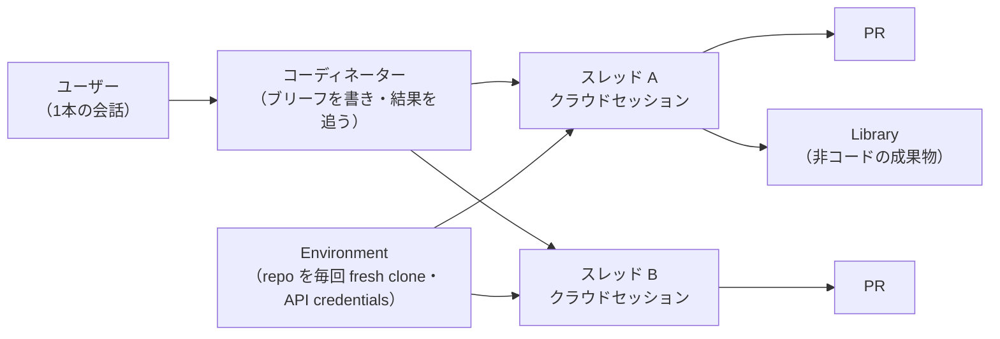

# Claude Projects（コーディネーター＋並列スレッド型）

> **TL;DR**: 1本の会話で仕事を渡すとコーディネーターエージェントがスレッドに分割し、各スレッドがクラウドの Claude Code セッションとして並列に走って PR を出す新しい Claude Projects。@dani_avila7 は、実作業を渡す前に Context・Goal・Memory・Environment・Connectors を整えるのが要だと述べる。

ナレッジファイルと指示を会話に持たせる従来のチャット版 Projects（[[concepts/claude-projects-setup]]・[[concepts/claude-projects-blueprint]]）とは別物で、こちらは作業の実行単位がエージェントのスレッドになっている。@dani_avila7 の説明では、コーディネーターが各スレッドのブリーフを書いて返ってきた結果を管理するので、設定が揃っていればスレッドは本来持っているべき情報を人に聞きに止まらずに進められる。スレッドは Claude Desktop の左サイドバーの Projects から扱い、1日あたり全プロジェクト合計200スレッドの新規作成上限があるという。

## 作成時の Context

プロジェクト作成時に名前とゴールを与え、Context に GitHub リポジトリ・ファイル・フォルダ・Google Drive フォルダを加える。Claude はタスクに応じてどのソースを開くか自分で決める。@dani_avila7 は、数百のスプレッドシートや PDF を入れたフォルダは避け、整ったコンテキストだけを与えて「中身はすべて関連する」と Claude が信頼できる状態にするよう勧める（チャット版の「知識ベースを物置にしない」と同じ原則）。リポジトリはほぼ全タスクが触る1〜2本だけを加え、残りは Project instructions に名前を書いておけば、スレッドが必要に応じて作業中に clone する。リポジトリ接続でエラーが出たら GitHub 連携を再接続する。スレッドには各リポジトリへの Claude GitHub App と、古い接続には無い新しい権限が要るため。

初回作成時は Claude が自発的に初期セットアップを走らせ、リポジトリを変更せずに探索したうえで、追加すべきリポジトリ・作るべきルーティン・始められるスレッドを提案する。執筆時点では、この初期セットアップの最初の25ドル分のトークンを Anthropic が負担していると @dani_avila7 は書いている。

## Settings

- **General / Goal**: Goal 欄は最大8,000字。@dani_avila7 はイントロと指標・課題・機能（サブ節4つ）・セキュリティと品質・構成と運用・中立性とガバナンス・ロードマップ・対象ユーザーに分けて全体像を書いた。
- **Models**: コーディネーター（プロジェクト会話の Claude）とスレッド（作業するエージェント）のモデルと effort を別々に選ぶ。既定は全部 Opus で、スレッドが high・コーディネーターが low。@dani_avila7 は「全スレッド high がプランを最も速く溶かす」として Opus 5.5 の両方 Medium で運用し、単純なプロジェクトならコーディネーター Opus 5.5・スレッド Sonnet 5 を勧める。個別タスクだけ会話内で別モデルを頼むこともできる。effort の考え方は [[concepts/effort-level-selection]] と同じ軸で読める（推論）。
- **Auto-continue**: 利用上限のリセット時に自動再開する設定をオンにする。
- **Memory / Project instructions**: 上限16,000字で、コーディネーターと全スレッドに渡る「プロジェクトの CLAUDE.md」。各リポジトリの CLAUDE.md はスレッドが clone 時に読むので繰り返さない。書く節の例は、プロジェクトの文脈・ソース一覧（1行ずつ所在と中身）・正本（各ソースの指針がどこにあり、衝突時にどれが勝つか）・ソース間の関係・不変条件・着手前に読むもの。複数の指示ファイルに正本を1つ決める考え方は [[concepts/agents-md-canonical]] と同型と考えられる（推論）。
- **Auto Memory**: Claude が作業中に自分で書くファイル群で、MEMORY.md が索引となり全クラウドスレッドが起動時に読む。プロジェクトが変わると過去の状態を書いたファイルが推論のノイズになるので、定期的に読んで掃除する（掃除自体をスレッドに任せることもできる）。
- **Environment**: スレッドが走るクラウド環境。各スレッドは追加したリポジトリを毎回 fresh clone し、デフォルトブランチから新ブランチを切る。環境は Projects 専用でなく、他の Claude Code クラウドセッション・ルーティン・[[tools/claude-tag]] と共通なので、Projects 用と分かる名前を付けておく。
  - **Network**: 既定の Trusted（パッケージレジストリ・GitHub・クラウド SDK など Anthropic の許可リストのみ）を推奨し、社内 API などが要るときは Custom で個別に足す。
  - **環境変数と API credentials の違い**: 環境変数はセッション内の Claude・実行コマンド・環境の利用者全員が読める素の値で、リージョン・プロジェクトID・フラグ・サービスURLなどの設定用。API credentials は秘密用で、キーと適用ホストを環境に登録すると Anthropic のエージェントプロキシがセッションを出た後のリクエストにキーを付けるので、キーは Claude にも実行コマンドにも環境変数にも届かない（Pro / Max プランで利用可）。人とエージェントに鍵を配らずに外部サービスへ届かせる設計として [[concepts/idp-shared-cli-mcp]] と並べて読める（推論）。
  - **Setup script**: 環境起動時のパッケージ導入などを任せる。初回セッションで走り、5分未満で終われば結果のファイルシステムが約1週間キャッシュされ後続セッションで再利用される。キャッシュされるのはファイルだけで、データベースのような常駐プロセスはセッションごとに起動が要る。
- **Connectors**: claude.ai アカウント側で一度つないだ MCP サーバー（[[tools/claude-mcp]]）が全スレッドで使える。未接続の MCP を呼ぶたびにトークンとノイズを失うので、始める前に全部つなぎ切る。コーディネーター会話自体はコネクタを持たず、Linear チケットを読むような作業はスレッドに回る。
- **Plugins**: クラウドスレッドにプラグインを入れる唯一の経路。リポジトリの `.claude/settings.json` で有効化したプラグインはクラウドでは読み込まれない。
- **Usage**: スレッド別・モデル別のトークン使用、コーディネーターの消費、キャッシュの効き、高コストなセッションを見られる。

## 使い方

コーディネーターとの1本の会話に、できれば完結した仕事単位（例: Linear チケットを渡して「取り組み、疑問があれば聞いて」）を渡す。Overview ペインはスレッドを Ready for review（PR がレビュー待ち）・Waiting on you（返答や承認待ち、または失敗）・Working・Landing（承認済み・マージ待ち）・Idle・Resolved（手動・最後の手順後に Claude が・1週間放置で自動）の状態で束ねる。1スレッドに複数 PR も持てるが、@dani_avila7 は同じタスクでも PR ごとに新スレッドを開き、PR とスレッドを1対1にすると、マージされた変更ごとの判断理由を後で辿りやすいと勧める。Library タブには追加したファイルとスレッドの生成物（レポート・分析など非コードの成果）が入り、Routines タブには定期実行の仕事が並ぶ。コーディネーターに「毎週依存関係レポートを」と頼むと、プロジェクト内でスレッドとして走るルーティンが作られる（[[concepts/goal-loop-routine]]）。

## 提供状況

@ClaudeDevs（公式）は 2026-10-09、Claude Code Projects の waitlist に登録していた Pro と Max の全ユーザーを利用可能にしたと発表し、初めて使う人向けに4分のウォークスルー動画を添えた。告知の名称は「Claude Code Projects」で、本ページのコーディネーター＋スレッド型 Projects と同じ製品を指すと考えられる（推論。告知文にはスレッドなど機能の記述がない）。この告知から、少なくとも Pro と Max では waitlist 制で段階的に提供されていたことがわかる。

同日に @Voxyz_ai は、Anthropic が Claude Code Projects の「完全ガイド」を公開したと紹介し、Opus 5.5 にそのガイドを読ませて最近のセッションを振り返らせ、毎回セッション冒頭で説明し直している背景を（Projects の設定へ）移す使い方を勧めた。投稿はガイド本体へのリンクや中身を含まず、移し先が Goal・Project instructions・Memory のどれかも書いていない（括弧内は推論）。ガイドが本ページの元になった @dani_avila7 の解説と同じ内容かは未確認。過去セッションから繰り返し説明している文脈を抽出して常設の指示へ昇格させる発想は、[[concepts/ai-session-handover]] の引き継ぎを都度でなく恒久化する方向と考えられる（推論）。

## 問い

- 自分のリポジトリ群で、Project instructions の「正本と衝突時の優先」節を書くと、各リポの CLAUDE.md とどこで食い違うか
- API credentials のプロキシ注入は、ローカル Claude Code で .env にキーを置く運用と比べてどこまで漏えい面を減らすか。ローカルに同等の仕組みを持てるか
- waitlist 解放後の Pro / Max で、1日200スレッドの上限や初期セットアップの25ドル負担は変わったか。公式のウォークスルー動画で確かめる
- 自分の直近セッションを Opus 5.5 に振り返らせたとき、毎回説明し直している背景はどれくらいあり、Project instructions の16,000字に収まるか。公式ガイドの所在も確かめる
- 「PR 1本 = スレッド1本」は、判断理由の追跡を PR description に頼る運用とどちらが後で読みやすいか

## 関連

- [[concepts/claude-projects-setup]] — チャット版 Projects（ナレッジファイル＋standing brief）。同名だが実行モデルが異なる
- [[concepts/claude-projects-blueprint]] — チャット版 Projects の設計図
- [[tools/claude-code]] — スレッドの実体であるクラウドセッションの基盤
- [[concepts/goal-loop-routine]] — ルーティンを含む goal / loop / routine の使い分け
- [[concepts/effort-level-selection]] — コーディネーター／スレッドの effort 選びの判断軸
- [[tools/claude-mcp]] — Connectors の中身
- [[concepts/ai-session-handover]] — 都度の引き継ぎ。過去セッションで繰り返し説明した背景を Project instructions へ恒久化する使い方（@Voxyz_ai）の対になる手法
