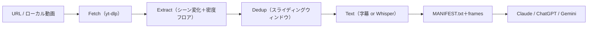

# claude-real-video

Claude Code に動画を「見せられる」ようにする OSS ツール（作者 HUANGCHIHHUNGLeo）。動画の URL かファイルを渡すと、変化のあった場面のフレームだけを選び、文字起こしを付けて、どの LLM でも読める形式に整えてくれる。処理は全部ローカルで動き、スキルとして組み込めば Claude Code が自分で動画を見て答えられるようになる、と紹介者の @commte は言う。

要は「動画 → 機械可読テキスト」の前処理器だ。全フレームを送るのでなく差分のあったフレームだけを抽出することでトークンを抑え、ネイティブに動画を扱えないモデルにも「見た内容」を渡せる中間形式に変換する。

## なぜ単純なフレームサンプリングでないか

作者 HUANGCHIHHUNGLeo は「多くの『LLM に動画を見せる』スクリプト（Gemini 自身のパイプラインを含む）は固定間隔——例えば毎秒1枚——でフレームを取る。これは静的なスクリーンキャストを過剰サンプリングし、速いカット割りのリールを取りこぼす」と説明する。crv は代わりに**シーン変化検出＋密度フロア**（最低 `--fps-floor` 秒に1枚）でフレームを選び、直近 `--dedup-window` 枚との**ピクセル実差分**（知覚ハッシュでなくダウンスケール RGB 比較——ハッシュは平坦色や等輝度の色相変化で盲目になるため）で重複を落とす。A-B-A のカットバックで既にモデルが見たショットは再送しない。この「必要なフレームだけを最小限渡す」考え方は、GUI でなく DSL を渡す[[concepts/intermediate-notation-pattern]]の動画版にあたる。

## 仕組み（6ステップ）

1. **Fetch** — URL は yt-dlp（任意で cookie）、ローカルはコピー
2. **Extract** — 1回の `ffmpeg select` パスでシーン変化＋密度フロアを取得（速いカットも遅いスクリーンキャストも両対応）
3. **Dedup** — スライディングウィンドウでピクセル実差分による重複除去。`--report` で全 keep/drop 判断を diff% 付きで HTML 可視化
4. **Text** — サイドカー字幕（`.srt`/`.vtt`）や埋め込み字幕があればそれを使い、無ければ Whisper で文字起こし
5. **Audio**（任意 `--keep-audio`）— 元サウンドトラック全体を保存し、聴けるモデル（Gemini/GPT-4o）に音楽やトーンも渡す
6. **Manifest** — `MANIFEST.txt` に全体を要約

結果、モデルは動画を「見る（キーフレーム）」「読む（transcript）」——`--keep-audio` があれば「聴く（サウンドトラック）」——ことができる。

## 主要オプション（README 転記）

| flag | default | 意味 |
| --- | --- | --- |
| `--scene` | `0.30` | シーン変化感度（低いほどフレーム多） |
| `--fps-floor` | `1.0` | 最低 N 秒に1フレーム |
| `--max-frames` | `150` | 総フレーム数の上限 |
| `--dedup-window` | `4` | 直近 N 枚と比較（`1`＝連続のみ） |
| `--why` | – | 視聴目的を `MANIFEST.txt` に書き込み、汎用要約でなくその観点で分析させる |
| `--kb` | – | 結果を日付付き md ノートとして自分のノートフォルダ（Obsidian vault 等）に保存 |
| `--adaptive` | off | 固定閾値でなく周辺との相対で拾い、緩やかな変化も捕捉 |

0.3.0 で追加された `--why`／`--kb` は、結果を `crv-out` で死なせず知識ベースに合流させる発想で、このリポの `sources/` 運用と近い。

## crv Pro（有料版）

作者は無料版を「AI に画面に何が映っているかを伝える」もの、Pro を「どう撮られたか・なぜ効くかを伝える」ものと差別化する。Pro が足すのはカメラムーブ分類（static/pan/tilt/zoom/handheld）・編集リズム（ショットリスト、cuts per minute）・知覚タイムライン（ジェスチャー/表情/声のピッチ/感情/非音声イベントをタイムスタンプ付きで）・`--breakdown` レポート（フック分析・ペーシング曲線・カメラ言語）。ワンタイムのファウンダー価格と告知している。

## 観察ログ（未検証）

- 2026-07-09: 作者主張——58秒クリップで固定1fps＝58フレームのところ、実差のある **26フレーム**だけ残し3枚のコンタクトシートに圧縮（README 冒頭の数字、単一ソース）。
- 2026-07-09: crv Pro のカメラムーブ分類は「実フッテージの ground-truth に対して検証済み」と作者は述べる（検証手順は非開示）。

## 問い

- 変化フレーム抽出＋文字起こしのローカル前処理は、このリポの YouTube Bridge（`notebooklm_youtube_bridge.py`）と何が違い、動画ソースの ingest にはどちらが向くか。
- 「どの LLM でも読める中間形式に整える」発想は、GUI でなく DSL を渡す[[concepts/intermediate-notation-pattern]]の動画版と言えるか。

## 関連

- [[tools/claude-computer-use]] — Claude がデモ録画をリプレイし UI を操作する隣接機能。「動画を機械可読にして扱う」点で重なる
- [[tools/claude-code]] — スキルとして組み込む先の本体
- [[concepts/intermediate-notation-pattern]] — 動画を LLM 可読な中間形式へ整える点で「中間記法を渡す」思想と接続
- [[concepts/claude-skills]] — スキルとして配布・組み込みできる形態
- [[tools/video-use]] — 逆方向の OSS：Claude Code に動画を「編集させる」（素材フォルダ→final.mp4）
