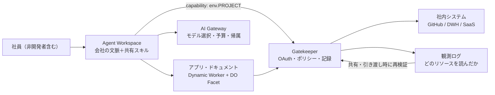

# Cloudflare OS

> **TL;DR**: 全社員にエージェント作業空間を配り、「エージェントが何を観測したか」を記録して共有時に相手の権限を再検証するオープンソースの社内AIプラットフォーム（Cloudflare公式・2026-08-05にOSS公開）。

Cloudflareがこの製品を作った理由として挙げるのは、フィードバックループの有無である。コードは動くか動かないかが判定できるため、エージェントは過去2年でその判定に支えられて開発者向けの成果を出した。それ以外の職種に同じレバレッジを持ち込むのは難しく、エージェントが会社の文脈（用語・手順・システム・基準）を理解し、人が仕事に使っているシステムへ到達できる必要がある——同社はそこを埋めるものとしてCloudflare OSを位置づける。製品は**エージェント作業空間**・**セキュリティ／ガバナンス基盤**・**個人が改造できるアプリの基盤**の3部からなる。

同社は2026年5月に第1版を社内全員へ配り、エンジニア以外を含む数千人が日々ドキュメントやスライドの作成・反復作業の自動化・データ可視化用の小さなアプリ作りに使っていると述べる。第1版は個人が私的なワークスペースでエージェントと作業する形が中心で、アプリは社内システムに繋がった生きたソフトウェアでなく静的だった。さらに決定論的でよいジョブまでスキルを再実行してトークンを消費していた。そして協働を始めた段階でより根本的な問題が露出したという——**[[tools/claude-mcp]]（MCP）へのアクセス権は「エージェントがどのツールを呼べるか」は決めるが、「エージェントが実際にどのリソースを観測したか」は教えてくれない**。ワークスペース・アプリ・出力を共有し始めると、本来見せてはいけない情報が共有経路で漏れうる。同社はこの問題を解くために基盤を作り直し、セキュリティを各利用者の実装責任でなくプラットフォーム側の責務にしたと説明する。

## エージェント作業空間

ブラウザ上の会話から始まる点は他のAIツールと同じで、違いは各会話が組織のキュレーションした文脈とスキルに接地していることだと同社は言う。ワークスペースはエージェントセッション・永続状態・成果物とファイル・リソースアクセス・コードを書いて実行できる隔離ランタイムを束ねたもの。**誰かが良いやり方を見つけたら、他の全員がそれを使える**（同じ手順・用語・ベストプラクティスを毎回モデルに説明し直さなくてよい）という共有スキル／文脈ライブラリが最初から載る。この「私有スキルライブラリが企業の資産になる」構図は [[business/skill-library-strategy]] の主張と一致する。

できることとして4つが挙げられている。

1. **調査と質問** — データセット全体をコンテキストウィンドウへ流し込む代わりに、エージェントがコードを書いて検索・絞り込み・結合・分析する
2. **ドキュメント／スライド／スプレッドシートの作成** — 出力は静的ファイルに固定されず、生きたデータに接続したまま更新でき、Google Drive等の慣れた形式へ書き出せる
3. **チーム向けの協働アプリ** — ドキュメントで足りない場合、独自のUI・ロジック・状態を持つアプリをエージェントが構築する
4. **決定論的ワークフロー** — 手順が既知の仕事は予測可能な部分をコードで回し、判断が要る箇所にだけモデルを使う。オンデマンド・スケジュール・接続システムのイベントで起動できる

既存のMCPサーバーは MCP Server Portals 経由で接続できる。

## Gatekeeper と観測ログ（セキュリティ基盤）

同社は、社内システムのAPIキーを人やエージェントに配る運用を「広範で長期の権限を渡すことになり、制約・安全な共有・監査のいずれも難しい」と否定する。MCPサーバーが資格情報を保持してツールだけを露出する方式は前進だが、それだけでは**どのリソースを観測したかが分からず、エージェントは複数システムの情報を組み合わせて制約の緩い場所へ持ち出せてしまう**。同社は「認可はデータが次にどこへ行けるかまで考慮しなければならない」と述べる。これは [[concepts/ai-agent-governance]] が整理した「MCP認可はゲートウェイの認可にすぎず、業務上の操作可否は別レイヤー」という論点の、データフロー側からの延長にあたる。

実装は3層になっている。

- **既定は何も持たない** — 誰がCloudflare OSに入れるかは Cloudflare Access が制御し、内側ではすべてのエージェント・アプリがアクセス権ゼロから始まる。エージェントが特定リソースへのアクセスを要求し、人が許可または拒否する。許可されると生成コードには `env.PROJECT` のような型付きバインディングとして渡る。これは「特定のポリシー下で特定リソースを使う権限」を表す capability であり、資格情報自体はエージェントと生成コードから完全に隔離される。サーバコードは外向きネットワークを無効化した Dynamic Worker で、クライアントコードはブラウザのサンドボックス化フレームで動き、明示的に与えた capability 以外でインターネットへ出られない
- **Gatekeeper がリソースと操作を統治する** — Gatekeeper はCloudflare OSと外部サービスの間に立つサービス固有のWorkerで、そのAPI・リソース・可能な操作を理解している。GitHubアカウント全体を渡す代わりに、単一リポジトリに限る／issueは読めるがソースコードは読めない／特定フィールドをマスクする／レート制限をかける／プルリクエストのマージ前に承認を要求する、といった粒度で絞れる。エージェント側からは小さなTypeScript APIだけが見え、OAuth・資格情報保持・ポリシー強制・読んだものの記録・外部から見える副作用の仲介はGatekeeperが担う
- **ポリシーが観測に追従する** — 初回の読み取りを制御するだけでは足りない。データウェアハウスの機微なテーブルを読んでダッシュボードを作った場合、そのダッシュボードの共有がテーブルの共有になってはいけない。Cloudflare OSはエージェントが観測したリソースをすべて記録し、その観測記録をエージェントと成果物に紐づけ続ける。他の人がワークスペースを開く・エージェントと対話する・成果物を見るときに、Gatekeeperがその人の観測済みリソースへのアクセス権を検証する。同じ観測ログは外向きリクエストの可否判断にも使われ、機微データの読み取りが「他ソースへの書き込み・新しい共同編集者の招待・別エージェントへの引き渡し・外部リクエスト」を封じることができる

## アプリは1つずつがWorker

多くの生産性スイートが固定のアプリ群（ドキュメント・表計算・プレゼン）を与えるのに対し、Cloudflare OSでは**各「ファイル」がそれ自体アプリケーション**になり、一人・一プロジェクト・一チームのためにエージェントが書く。プロトタイプではなくクライアントコード・サーバコード・API・永続状態を備えたフルスタックアプリで、既定は非公開、ドキュメントのように共有できる。

サーバは必要に応じて [Dynamic Worker](https://developers.cloudflare.com/dynamic-workers/) としてロードされ、Durable Object Facet として実体化する（同社はどちらもこのプロジェクトのために作った機能だと述べる）。facet によりアプリはCloudflare OSランタイムとは別の自前SQLiteデータベースを持つ。Dynamic Workers は軽量なV8 isolateなので、専用サーバやコンテナを常駐させずにアプリごとの隔離ランタイムを用意できる（V8 isolate基盤の詳細は [[companies/cloudflare]]）。

ブラウザのクライアントとサーバの通信には、Cloudflareのオープンソースのobject-capability RPCである Cap'n Web を使う。クライアントからサーバメソッドを通常のJavaScript関数のように呼べるが、特筆すべきは**同じメソッドをエージェントも呼べる**点だと同社は言う。すなわち「自分でその仕事をする道具を作れるなら、自分が居ないときにエージェントがその道具で仕事をできる」。

共有は2通りある。アプリ自体を共有すると同じ状態を使ったリアルタイム協働になり、**blueprint**を共有すると相手は自分のコピーを作れる。blueprint から作ったアプリは元のコードを含むが、SQLiteのデータ・会話履歴・資格情報・接続リソースは含まず、独立した状態とリソースで始まる。チームに配ったアプリは、機能要望を出して作者にアサインする代わりに、各自がAIで改造できる。

## モデルとコストの制御

任意のモデルを使え、すべての推論呼び出しは Cloudflare AI Gateway を通る。どのモデルを使えるようにするか、どの仕事をどのモデルに割り当てるかを一箇所で決められる。同社は「毎朝の未読メール要約に最も高価なフロンティアモデルを使いたくはないはずだ」と述べ、高価なモデルを最も難しい仕事にだけ充てる制御を強調する。リクエストは人・チーム・ワークスペース単位で帰属され、管理者は推論支出の内訳を見て予算とレート制限を設定し、上限到達時の挙動を決められる。

## OSSとしての配布

コアの `cloudflare/cloudflare-os` と、Cloudflare社内の運用に基づく実例デプロイ `cloudflare/cloudflare-os-starter` の2リポジトリが公開されている。デプロイ側リポジトリはコアをパッチせずに取り込み、設定・カスタムUI・社内連携・分析・デプロイパイプラインの置き場になる。自社のCloudflareアカウントに配置し、自社のAccessポリシー・AI Gateway設定・データ・連携先で動かせる。同社は「我々の社内デプロイはCloudflareのシステム・用語・ポリシー・仕事のやり方を反映している。あなたのものはあなたの組織を反映すべきだ」と書く。導入支援としてPresidioとHappy Cogを戦略パートナーに挙げ、共有スキルと組織知のキュレーション・カスタムUI・Gatekeeper／MCP Server Portals経由の社内システム接続・セキュリティとコスト制御の設定を担うとしている。今後の予定として、Cloudflareダッシュボードでのフルマネージド提供・開発ワークフロー向けコンテナ・Slack等チャットツールへのワークスペース展開を挙げる。

## 観察ログ（未検証）

- 2026-08-08: Cloudflareは第1版を2026年5月に全社配布し「あらゆる職能の数千人が毎日使っている」と述べる（自社公表・外部検証なし）

## 問い

- Gatekeeperはサービスごとに書くWorkerであり、MCPサーバーを立てるより手間が重い。この追加コストを正当化する境界はどこか（観測ログによる下流制御が要る機微データの有無か）
- 「エージェントが観測したリソースを記録し共有時に再検証する」モデルは、このvaultの公開サイト生成にも適用しうるか。`sources:` は観測ログの原始形と言えるか
- 「各ファイルがアプリ」というモデルは個人の知識ベースでは過剰か。ドキュメントとアプリの境界をどこに置くと運用が破綻しないか

## 関連

- [[companies/cloudflare]] — 提供元。Workers / Durable Objects / Dynamic Workers / AI Gateway というCloudflare OSの土台
- [[concepts/ai-agent-governance]] — MCP認可の限界と外部ポリシーによる実行制御。Gatekeeperと観測ログはその「データが次にどこへ行くか」まで拡張した実装
- [[business/skill-library-strategy]] — 共有スキル／文脈ライブラリが企業の私有資産になるという戦略論。Cloudflare OSはそれを製品として実装した形
- [[concepts/company-brain]] — 会社の知識をprovenance・permissions付きの単一state層に統合する設計思想。観測ログはpermissions層を実行時に追跡する具体策
- [[concepts/agent-adoption-walls]] — 企業のエージェント導入で詰まる7つの壁。ガバナンス・可視化・トークン資本の透明性にプラットフォーム側から答える位置づけ
- [[concepts/idp-shared-cli-mcp]] — Cloudflare Accessで人間とAIを同一身元に載せる設計。Cloudflare OSの入口の認証と同じ系譜
