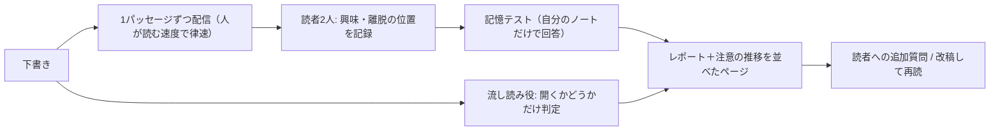

# First Reader｜公開前に「読者」に読ませるAgent Skill

> **TL;DR**: 下書きを1パッセージずつ架空の読者2人に読ませ、どこで興味を持ち・どこで離脱し・翌日何を覚えていたかを報告させるAgent Skill。文章そのものでなく読書体験を測り、本文は一切書き換えない。

AIスロップ検出系のスキルは禁止語・文長・エムダッシュといったテキストの属性を測る。READMEはそれでは「実在の人間が読み続けるか」は分からないと述べ、代わりに読書中に起きたことを測る方針を取る。中心の出力は文章の採点ではなく、読者ごとの「ここで興味を持った／ここで止めた／翌日これを覚えていた」という経過報告と、パッセージごとに注意がどう動いたかを示す帯（attention strip）である。3人目の読者は流し読みだけをして「そもそも開いたかどうか」を2文で答える。[[tools/no-ai-slop]] のようなテキスト側の検査と、測っている対象が正面から違う。

配布元は Shubham Saboo の `awesome-llm-apps` リポジトリの `agent_skills/first-reader`。中身は Markdown と標準ライブラリだけの Python で、オフラインで動き外部へ何も送らないとREADMEは明記する。

## シミュレーションを正直に保つ3つのルール

READMEはこの手のシミュレーションが嘘になりやすい箇所を3点に絞り、いずれも機構で塞いだと説明する。

1. **先を見せない** —— 下書きは1パッセージずつ配信され、人が読めるより速くは進まない。パッセージ4でやめた読者はパッセージ5を見ていない。
2. **読み返させない** —— 記憶テストは読者自身のノートだけから答える。本文をもう一度参照した「記憶」は使わない。
3. **書き直させない** —— 読者が報告するのは自分に起きたことと「読み続けるには何が違っていなければならなかったか」だけで、原稿の決定は全部書き手に残る。

書き手側から見ると、これは読者を評価者でなく計測器として扱う設計だと考えられる。修正案を出させないぶん、[[concepts/eval-loop]] の judge のようなスコアは返らず、返るのは離脱位置と記憶の残りという素の観測になる。

## 使い方と読者のキャスティング

エージェントに下書きを指して、誰に向けた文章かを最初の一文で伝える（READMEの例は「これをレビューして、うちのブログに載せるバックエンドエンジニア向けのローンチ記事」）。読者はこの一文からキャストされるため、職種名より人物描写のほうが機能するとREADMEは述べる（例として挙がるのは「評価ハーネスを3つ作ったことがあり、やめる理由を探しているスタッフエンジニア」）。下書きと同じフォルダの `.first-reader/audience.json` に保存すれば、そのフォルダの実行は常に同じ読者になる。

実行後は会話を続けられる。

- **特定の読者に追加質問する** —— 「Sにパッセージ4の先へ進ませるには何が要ったか聞いて」。Sは自分のノートから自分の言葉で答え、何が足りなかったかは言うが、書いてはくれない。
- **改稿して再読させる** —— エディタで直して「again」と言うと同じ読者が読み直し、ページには前回の注意の帯が新しい帯の上に並ぶ。
- **流し読みだけ走らせる** —— 「quick read」で流し読み役のみ。開くかどうかとその理由が2文で返る。

## 配布と検証

インストールは skills CLI（`npx skills add <リポジトリURL>`）か、ディレクトリをエージェントのスキル置き場へコピーする。検証用に `agent_skills/evals/first-reader/test_first_reader.py` が同梱され、流し読みビュー・配信（本文をディスクに書かない／読む速度を守る／読者ごとに1トークン）・記憶クイズ・信頼シグナル・読者への追加質問・ページ生成の各部を一時ファイルの下書きで検査する。振る舞い仕様は同フォルダの `evals.json`（新規セッションで実行して期待どおりか確かめるプロンプト集）と `trigger-cases.json`（スキルが発火すべき場合・すべきでない場合）に分かれている。

スキル本体は `SKILL.md`、`references/`（personas・report・room・interview）、`scripts/`（skim・feed・recall・signals・ask・room と HTMLテンプレート）という構成で、読者の人格定義と出力フォーマットが参照ファイル側に切り出されている。

## 実践者の受け止め

@laiso はこのスキルを「cognitive-rhythm-writing 並に興味深い校正支援SKILL」と紹介している。cognitive-rhythm-writing は読者の頭の切り替えで文章の拍を作る日本語の文章規範（[[concepts/writing-norms-adoption]] 参照）で、書き手に「どう書くか」を指示する側の道具にあたる。@laiso の説明では、流し見役のサブエージェントと、好意的な読者・批判的な読者がそれぞれ逐次読み込みで読書をシミュレートし、途中で離脱したり「読んでいて分からない」とコメントを残したりするが、本文には触らない。READMEが「読者2人」とだけ書く部分を、@laiso は好意的・批判的という役割の対として受け取っている。規範で書き方を整える道具と、読まれ方を観測する道具を同じ「校正支援」の棚に並べる見方は、書く前の規範と書いた後の計測を組み合わせて使う発想につながると考えられる。

## 観察ログ（未検証）

- 2026-09-19: 同フォルダの ledger に、実在のエッセイ1本を5回連続で読ませたテスト記録があるとREADMEは述べる。同じ下書きで離脱位置がどれだけ再現したかの中身は未収集

## 問い

- 自分の note 記事・wikiページで走らせ、読者の離脱位置が実際の読了データや反応とどこまで一致するか。一致しないとしても「どこで止まるか」の予測として使えるか
- [[tools/buy-or-bounce]] は購買ペルソナの独白でコンバージョン障壁を出す。読者体験の計測という構造は同じで、違うのは測る対象（購買判断か読み続けるか）だけに見える。どちらか一方の設計に寄せられるか
- 日本語の原稿で「人が読める速度」の律速や記憶テストが同じように効くか。パッセージの切り方は日本語でも妥当か

## 関連

- [[tools/no-ai-slop]] — AIスロップのパターンをテキスト側で検出・除去するスキル。First Readerはそのテキスト計測では読者が読み続けるか分からないという立場から、読書体験の側を測る
- [[tools/buy-or-bounce]] — 5種のバイヤーペルソナにセクションごとの独白をさせて離脱箇所を可視化するスキル。読者役を並行させて「関心が死ぬ瞬間」を出す構造が同型で、対象がLP・広告の購買判断になっている版
- [[concepts/eval-loop]] — 生成物を基準で採点して閾値未満を止める品質ゲート。First Readerはスコアも修正案も返さず観測だけを返す点で、ゲートの手前に置く計測器にあたる
- [[concepts/writing-norms-adoption]] — japanese-tech-writing／cognitive-rhythm-writing の採否判断。@laiso が First Reader と並べて評価した「書き方の規範」側の道具
