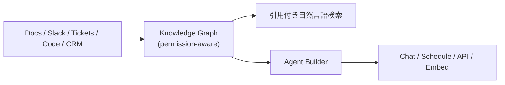

# Glean

> **TL;DR**: 全社データ（文書・メッセージ・チケット・コード等）を権限継承付きの単一インデックスと知識グラフに統合し、引用付き自然言語検索とノーコードAgent Builderを提供するエンタープライズWork AIプラットフォーム。パートナー企業phDataが解説する。

phDataは、エンタープライズAI導入が測定可能な成果を出せない主因はモデルの性能ではなく、知識が複数のツール・チーム・好みのアプリに分散していることだと指摘する。部門ごとに別のAIツールを導入すると、洞察を閉じ込めるサイロが増え勢いが止まる。この解決策として、検索・作成・実行を1箇所に集約し、プラットフォーム境界でなく会社の文脈と権限で統制された単一のWork AIプラットフォームを敷くべきだとphDataは説く。

## Knowledge Graphの仕組み

Gleanの核はKnowledge Graphで、人・文書・ツール・プロジェクトといった異種の企業データを繋ぐ構造化された機械可読の抽象化層としてphDataは説明する。基本索引と違い、このグラフはトリプレット構造（主語・述語・目的語）で表現される項目間の意味的リンクに基づいており、複雑な多段推論を可能にし、組織のサイロを横断して見落とされがちな洞察を一貫して露出させる。これにより曖昧性・エンティティ混同・厳密で決定論的な事実想起の困難といったLLMの一般的な弱点を緩和すると位置づけられる。

権限面では、Gleanは元のアプリで持っているアクセス権をそのまま複製し、クエリ実行時にアクセスルールを強制する。ユーザーは自分がもともと閲覧権限を持つ結果しか見えない仕組みだとphDataは述べる。

## Agent Builderと実行系への接続

Glean Agent Builderはノーコードでエージェントを作成・統制するための機能で、プロンプトまたはビジュアルビルダーでエンタープライズデータソースを紐づけたエージェントを構築できる。エージェントはチャット形式でのアクセス、定期実行のスケジューリング、他システムからのAPI呼び出し、Webサイトへの埋め込みのいずれでも動作させられる。phDataは実例として、特定BI技術のドキュメントとSlackでの議論を横断して答えるsubject-matter expertエージェントと、セキュリティポリシーに基づいて回答するセキュリティ質問応答エージェントの2つを挙げている。

## Personal GraphとEnterprise Knowledge Graphの結合

Gleanはエンタープライズ知識グラフを個人ごとのPersonal Graphと融合させることで、個々の働き方・目標・協業者・コミュニケーションスタイルに応じたパーソナライズされた提案を行うとphDataは説明する。プロンプトエンジニアリング不要で各従業員の拡張として機能する設計を、同社は「enterprise superintelligence」という言葉で表現している。

## 観察ログ(未検証)

- エンタープライズAIパイロットのうち測定可能な効果を出せているのはわずか5%(phData自身の観察、単一ソース)

## 問い

- Gleanの権限継承付きKnowledge Graphは、[[concepts/company-brain]]がSentraの議論から抽出した「permissions」の境界線を製品としてどこまで満たすか
- [[concepts/llm-wiki-vs-company-brain]]の4つの質問モデルに当てはめると、Gleanはどの「No」に対する回答として選ばれる製品か

## 関連

- [[concepts/company-brain]] — Gleanが実装する「company brain」という言葉の理論的背景
- [[concepts/llm-wiki-vs-company-brain]] — 個人向けKarpathy式との対比で、Gleanのような企業向け製品がどこで必要になるかを判定する枠組み
- [[concepts/knowledge-graph-llm]] — GleanがKnowledge Graphで解こうとしている課題群（回答のゆらぎ・説明不能・社内知識の欠如）の概念側の整理
- [[tools/xirp]] — 同じ社内文脈を扱うが、入口が全社横断検索でなくコーディングセッションへの事前注入になっているSpotifyの製品
