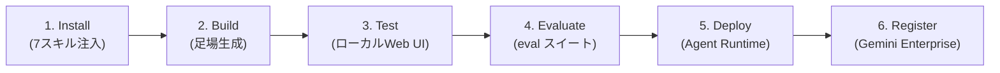

# Google Agents CLI（ADK）

> **TL;DR**: Google の Agents CLI は、ADK（Agent Development Kit）製エージェントの雛形生成・ローカルテスト・評価・デプロイ・社内公開までを、エディタを離れず自然言語プロンプトだけで回すための CLI。コーディングエージェントに ADK 専門のスキルを注入して全工程を担わせる。

これまでの「エージェント開発」は、コードを書くエディタ、足場を組むターミナル、動作確認するブラウザ、デプロイするクラウドコンソール、評価を回す別フレームワークへと道具が分散し、工程ごとに文脈が切れていた。Agents CLI はこの分散を、利用中のコーディングエージェント（Claude Code・Cursor・Codex・Antigravity 等）の側に ADK 専門知識を**スキルとして注入**することで畳む。一度のセットアップで7つのスキル——ADK のコードパターン、プロジェクト足場、LLM-as-judge 採点を含む評価設計、Agent Runtime / Cloud Run 向けデプロイ設定、Cloud Trace による可観測性——が全コーディングエージェントへ同時にインストールされ、各エージェントが担当工程を自然言語の指示から直接実行できるようになる。

工程の柱は**デプロイ前の評価**で、多くのチュートリアルが飛ばす最重要ステップとされる。RAG エージェントの例では、コーディングエージェントが取得正答・コンテキスト不足時の拒否・マルチホップ推論・引用精度の4分類で eval シナリオを自動生成し、1プロンプトでスイート全体を実行する。最後に Gemini Enterprise へ登録すると、作ったエージェントが組織内で発見・アクセス可能になり、IAM で権限を制御しつつ「動くが作者しか知らない」状態で死蔵される問題を回避する。RAG パイプラインを各チームが自前で組まずに同じナレッジ助手を共有できる点が狙いとされる。

## 観察ログ（未検証）

- 2026-06-27: @akshay_pachaar が Google Cloud との協業記事として、ADK の `agentic_rag` テンプレートから RAG エージェントを足場生成 → Vector Search を datastore に設定 → テンプレートに不足していた引用対応を後付け → 合成Q&A 12件（Python 基礎）を投入してスモークテスト、という一連を実演した（単一デモの記録）。
- 2026-06-27: Karpathy が Sequoia Ascent 2026 で「agentic engineering」を、本番級のエージェント開発と vibe coding を分ける規律と定義し、中核スキルを spec 設計・eval ループ・セキュリティ監督の3つとした、と著者が紹介（二次伝聞）。
- 2026-06-27: 著者引用の数字「エージェントを運用するチームの89%が可観測性を持つが、eval を持つのは52%だけ」（Karpathy 言及・単一ソース未検証）。
- 2026-06-27: デモの eval 結果は引用精度が全20ケースで1.00。一方ハルシネーション評価が、指示文中の1行（「簡単な質問なら直接答えてよい」）がコーパス外の質問で一般知識を混ぜる原因と特定し、その行の削除で解決すると示した（著者のデモ固有の結果）。
- 2026-06-27: デモではエディタを離れず1ターミナルセッション・6個の自然言語プロンプトで空フォルダから本番デプロイまで到達したとされる。Agent Runtime へのデプロイは約2〜3分、Cloud Trace は既定で有効。

## 問い

- 自分の wiki ingest パイプラインに ADK 流の「デプロイ前 eval スイート自動生成」を持ち込めるか。引用精度・コンテキスト不足拒否・マルチホップの4分類は wiki 回答の品質ゲートにも転用できそう
- 「コーディングエージェントにスキルを注入して全工程を回す」モデルは [[concepts/claude-skills]] のスキル機構と同型に見える。ADK スキルと Claude Skills の粒度・配布・更新方法の違いは何か
- Gemini Enterprise への登録で得る「発見可能性」は、社内エージェントが死蔵されない鍵になるか。権限（IAM）と発見可能性の両立が実運用で効くかは未検証

## 関連

- [[tools/google-agent-skills]] — Google 製の Agent Skills 集（agentskills.io 仕様）。本ツールが注入する7スキルと同じ「コーディングエージェントへスキルを配る」系譜の姉妹
- [[concepts/eval-loop]] — デプロイ前に品質ゲートを置く思想。本ツールの中核工程「Evaluate」がこれを1プロンプトで自動化する具体実装
- [[concepts/agentic-engineering-workflow]] — Karpathy の「agentic engineering」を実践スタックに落とした論考。本ツールはその工程分散をCLIで一本化する位置づけ
