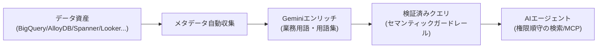

# Google Cloud Knowledge Catalog

> **TL;DR**: Google CloudのKnowledge Catalogは、BigQuery・AlloyDB・Spannerなど社内データ資産のメタデータを自動収集しGeminiでビジネス文脈に変換したうえで、権限順守のセマンティック検索とMCPツール経由でAIエージェントに安全に渡すデータガバナンス製品。

Google Cloudが公式に説明する、AIエージェントへのコンテキスト供給を前提に設計されたデータカタログ製品。[[concepts/agentic-data-analytics]]や[[concepts/openai-data-agent-context-layers]]がAnthropic・OpenAIの社内エンジニアリング事例として語ってきた「メタデータ収集→エンリッチ→検証済みクエリ→エージェント検索」というパターンを、Google Cloudはマネージドサービスとして製品化している。

## 主要機能

- **メタデータ集約**: BigQuery, AlloyDB, Spanner, Cloud SQL, Firestore（Preview）, Looker（Preview）から技術メタデータを自動収集する。Ab Initio・Anomalo・Atlan・Collibra・Datahubなどサードパーティカタログとも連携する
- **継続学習によるエンリッチ**: Smart Storage / Object Context APIが非構造化ファイル（PDF・design doc・wiki等）を自動タグ付け・埋め込みし、Geminiがスキーマ・ログ・BIモデルからビジネスエンティティを抽出する。「検証済みクエリ（verified queries）」は事前検証済みのゴールデンクエリで、ハルシネーションやJoinミスを防ぐセマンティックガードレールとして機能する
- **エージェント向けセキュアリトリーバル**: サブ秒レイテンシのセマンティック検索をエージェントに提供し、メタデータのアクセス権限を尊重した検索結果のみを返す。コンテキストの評価フレームワークで関連性・品質を継続的に測定する
- **自動化ガバナンス**: ポリシーベースの品質チェック・異常検知・自動キャプチャされたリネージをGeminiで統合しビジネス文脈化する。BigQuery・Google Cloud Managed Service for Apache Sparkなど分散データソース横断で強制する
- **ビジネスセマンティクスの定義**: スキーマ・クエリログ・Lookerモデルから業務ロジックを合成し、単一の用語集（グロッサリー）に統合する

## 検証済み事実

- 2026-07-13: 課金はData Compute Unit（DCU）単位の従量課金。標準処理は月100 DCU-hourまで無料、以降 $0.060/DCU-hour。プレミアム処理（データ探索ワークベンチ・リネージ・品質・プロファイリング）は $0.089/DCU-hour
- 2026-07-13: メタデータストレージは月平均1MiBまで無料、以降 $2/GiB/月。API呼び出しは月100万回まで無料、以降 $10/10万コールごと
- 2026-07-13: パートナー企業としてAb Initio, Accenture, Anomalo, Atlan, Confluent, Collibra, Datahub, HCL, Informatica, NVIDIA, Starburst, Tableauが挙げられている

## 問い

- AnthropicやOpenAIが社内でスクラッチ構築した「メタデータ→エンリッチ→検証済みクエリ」パイプラインと、Knowledge Catalogのマネージド版は実運用でどちらが精度・保守コストの面で優位か
- 「検証済みクエリ」は[[concepts/agentic-data-analytics]]の「セマンティック層（定義は人間が所有）」とどう違うか。Geminiがどこまで自動生成し人間がどこを承認するのか、製品ドキュメントで確認したい

## 関連

- [[concepts/agentic-data-analytics]] — Anthropicが社内で構築した同型のパイプライン（4層スタック・21%→95%精度）。Knowledge Catalogはこれに近いパターンをマネージド製品化した形
- [[concepts/openai-data-agent-context-layers]] — OpenAIの6層コンテキスト設計。同じ「エージェントにどうデータ文脈を渡すか」という問題への別解
- [[companies/google]] — 提供元
- [[models/timesfm-3]] — 同じBigQuery生態系に入る時系列基盤モデル。AI.FORECAST関数経由の統合が予告されており、カタログが整えたデータの先で予測を担う位置
