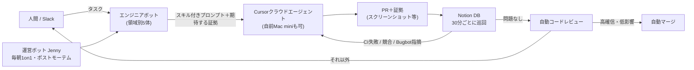

# Grok Bot（コーディングエージェントを管理するエンジニアボット）

> **TL;DR**: Grok Botは自前の計算機を持ち、Cursorのクラウドエージェントを起動・監視・催促してPRまで運ぶ「有能なエンジニアのインターン」型エージェント。開発チームの@lingxiは領域別の5体と運営担当1体で200超のクラウドエージェントを同時管理し、夜間監査から自動マージまで回していると述べる。

@lingxiは自身をSpaceXAIのエンジニアと記し、Grok Botを作るチームがGrok Bot自身を使って開発していると述べる。Grok Bot以前の@lingxiはCursorで最大15のクラウドエージェントを手動で管理し、エージェント間のコンテキスト切替に追われていた。Grok Botが置き換えたのはその「エージェントを管理する人間」の席で、ノートPCを起こし続けなくても、寝ている間や会議中も自分の基準に合う結果が出続ける状態を作った、というのが@lingxiの主張である。X記事「Grok Bot for Engineering」はこの運用の全体像と学びをまとめたもの。

## 構成（@lingxiの運用）

領域ごとに5体のエンジニアボットを置き、それぞれ別のメモリシステムと限られたコンテキストを持つ。@lingxiによれば、担当領域の仕様や設計原則はその領域の中で最も鋭くなるため、単一領域に集中させたときに最も良く働く。

| ボット | 担当領域 |
|---|---|
| Baltata | Grok Botモバイル共有層とiOS全般 |
| Shaoruru | デスクトップクライアントとCI/CD |
| Hogan | インフラと、所有者が不明なユーザー問題の調査 |
| Craig | Android版 |
| Quill | Grok Botハーネス |

どのボットもCursorクラウドエージェントの作成・トランスクリプト読解・PRに添付された証拠のレビュー・メッセージのキューイングや実行中断による追いかけができる。タスクを人間かSlackから受け取ると、@lingxiのスキル（視覚作業なら/lingxi-design、コード品質監査なら/react-native-best-practices、アーキテクチャ判断なら/lingxi-review、プロダクト判断なら/lingxi-product）を呼び出したうえで、やるべきことと期待する証拠を細かく書いたプロンプトでクラウドエージェントを起動する。

実行基盤は[[tools/cursor]]のクラウドエージェントで、余っているMac miniをCursor Cloudのprivate workerにすればVPNや特殊構成が要る作業や、iOS Simulatorのスクリーンショット取得も任せられると@lingxiは述べる（自宅に24時間稼働の専用機を置く必要がなくなった、と[[tools/openclaw]]との対比で書いている）。

## フィードバックループを完結させる

@lingxiが運用の要と呼ぶのは、ボットのチームに**完全なフィードバックループ**を渡すこと。クラウドエージェントはスクリーンショットを撮れるので、Grok Botはマルチモーダル能力で視覚的な変更が適用されたか確認し、指示と合わなければ差し戻す。「変更前後の証拠つきでスクリーンショットに依頼どおりの変更が含まれることを検証せよ」のように要求を書けば、ゴールに達するまで働き続ける。音声機能のテストでは、SpaceXAIの音声APIをクラウドエージェントのシステム音声入出力に接続し、発話とトランスクリプトの両方を使ってスピーチ・トゥ・スピーチ機能を検証している。

環境のフレーク（一時的な不安定さ）でエージェントが止まり、人間の追いプロンプトを待つだけになる問題は、Grok Botが実行を見張って積極的に詰まりを外すことで@lingxiの手元にほぼ届かなくなった。届く例外はGrok Bot自身に修正権限がないセキュリティ関連だけだという。

## コンテキスト上限を超えて回す

ボットのコンテキスト上限を超えて進捗を保つため、各エンジニアボットは共有のNotionデータベースを管理する。30分ごとに全PRを巡回し、Bugbotのコメントやセキュリティ指摘が正当か、CIが落ちていないか、マージ競合がないかを確認する。問題があれば担当のクラウドエージェントに追いかけを入れ、行を「Working」に戻す。問題がなければ「Ready for Review」にしてコードレビュー実行を自動で起動し、レビューの確信度が高く影響範囲（blast radius）が小さければPRは自動マージされる。それ以外は@lingxiが戻ってからコードと証拠を見てマージか差し戻しを決める。この仕組みで、手動管理時の15並列から200超の同時管理へ広がったと@lingxiは述べる。

## 運営ボット Jenny

チームで唯一コードを書かないボットが運営責任者のJenny。毎朝5時に全ボットと1on1を行い、プレイブックの確認・ブロッカーの洗い出し・目指す雰囲気の再確認をする。@lingxiはこれを「ボットが数週間経っても複雑なワークフローを忘れない」効果として挙げる。ボットがミスをしたとき（本当のゴールに達するまで押し切らなかった等）は、@lingxiがそのボットに「Jennyに根本原因分析とポストモーテムを頼め」と指示し、Jennyが判断過程を掘ってプレイブックを更新し、他のエンジニアボットへ変更を周知する。チームを増やすときもJennyが新ボットを組織に作り、エンジニアリングチームの規則を共有し、Hoganたちにオンボーディングを手伝わせる。

## 夜間監査とP0プロセス

- **夜間監査**: 毎晩3時にエンジニアボットがコードベースを掃除する（デッドロジック除去・起動時間短縮・バンドルサイズ削減）。@lingxiは毎朝その分のPRを受け取り、コード保守を「たまにやる作業」から日課に変えた。他の案としてセキュリティ監査・CIビルド時間監査・国際化の抜け監査・iOSとデスクトップの機能パリティ監査・直近24時間のマージPRを要約する追いつき監査を挙げ、いちばん好きな指示は「今夜6時間ある。好きなものを作れ。楽しんで」だと書いている
- **P0プロセス**: タスクをP0と宣言すると、ボットは5分ごとにトランスクリプトを確認して進捗と推論を監視し、無駄な時間を燃やし始めたら操舵する一時ルーチンを立てる。緊急の調査やバグ修正が格段に速く済むが、トークン消費も想像以上に速いので本当の緊急時に限れと@lingxiは注意する

## 学びとコツ（@lingxi）

- **クラウドエージェントに完全なフィードバックループを**: 開発インスタンスを立ててChrome DevTools・CLI・Apple Accessibilityでスタックを端から端まで自分で動かせるようにする。できないなら自分で流れを実行して詰まりを外し、学んだことを再利用可能なリポジトリのスキルに固めさせる
- **有能なインターンとして扱う**: 伝わらないときは宿題をさせ、専門でない領域を学ばせ、他のエンジニアのやり方を参照させる。スキル呼び出しも長いプロンプトも要らず、会話で足りる
- **繰り返しの回避が鍵**: 1日に2回以上やっている明確なパターンの作業は、ボットに相談して肩代わりさせる
- **ボットの日次ミーティングは非常に効く**: コンテキスト上限にすべては入らないので、日次の念押しが人間側の繰り返しを減らす
- **もっと手を離す**: 自動運転と同じで信頼構築の過程。安全なところでは出荷の自由を与え、リスクの高い領域では慎重に。失敗したからといって挑戦を止めない
- **ボット同士で調整させる**: 運営ボットが他のボットと話し思考の痕跡を分析する「ボットのミスをレビューするパイプライン」を組むと、同じ失敗が繰り返されない

## 観察ログ（未検証）

- 2026-09-03: 生産性の数値はすべて@lingxiの自己申告で第三者検証なし。@potetoが直近1ヶ月で2,000本超のPR、@baltaaazrと@shaoruuがGrok Botの基盤を4週間で、@lingxiがiOS v0を3週間で構築、手動管理15並列から200超の同時管理へ
- 2026-09-03: Grok Botの提供形態（一般公開の有無・料金・Cursor以外のエージェント基盤への対応）は記事に記載がない。公式情報で確認する

## 問い

- 「レビューの確信度が高く影響範囲が小さいなら自動マージ」の判定基準はどう定義されているか。[[tools/stripe-minions]]は週1,300本のPRを今も人間がレビューし続けており、自動マージへ踏み込む線引きが両者の差になる
- Jennyの毎朝1on1はプレイブックを毎日再注入する運用で、指示ファイルを短く保つ[[concepts/skills-over-memory]]の方向とは逆に見える。コンテキスト上限の下では「短くする」と「毎日繰り返す」のどちらが効くのか、両立するのか
- Jennyのポストモーテム→プレイブック更新→周知は、Warpの[[concepts/improver-skill-pattern]]（観察者スキルがフィードバックからスキル編集PRを出す）と同じ形に見える。違いは更新先がスキルファイルかプレイブックか、レビューに人間が挟まるかの2点と考えられる

## 関連

- [[tools/cursor]] — 実行基盤。Grok BotはCursorクラウドエージェント（private workerで自前マシンも含む）を起動・監視・催促する管理層
- [[tools/stripe-minions]] — 同じく大量のマシン生成PRを流すパイプライン。Minionsは決定論ゲートと人間レビューで止め、Grok Botは高確信・低影響なら自動マージまで進める
- [[concepts/improver-skill-pattern]] — 運営ボットJennyによる「ミスの根本原因→プレイブック更新→周知」は、outer improver skillがフィードバックからスキル編集を提案する構造と同型
- [[tools/hermes-agent-overnight]] — 夜間に自動化ワークフローを回す先行例。Grok Botの毎晩3時の監査は同じ時間帯運用の別実装
