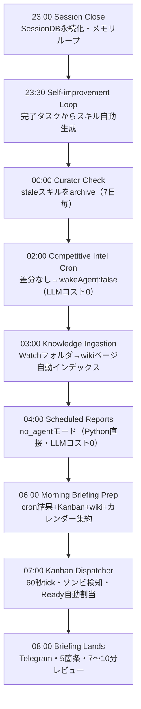

# Hermes Agent 夜間自動化ワークフロー

> **TL;DR**: Hermes Agentは夜間9時間のcronサイクルで自己進化・知識取り込み・Kanban処理を自律実行し、朝に5箇条のTelegramブリーフィングを届ける「眠っている間に育つエージェント」インフラ（月額$7〜30）。



大半のAIエージェントはユーザーが入力するまで待機する「reactive」設計だが、Hermesは3つの仕組みで夜間自律稼働を実現する。①常時起動のGatewayプロセス（systemd/launchd管理）、②60秒ティックのcronデーモン、③バックグラウンドフォークで走る自己改善ループ。これによりユーザーが寝ている間に「競合監視→知識更新→スキル改善→タスク処理」が複合的に進行し、Day 30のエージェントはDay 1より明確に出力品質が向上する。

## 24時間タイムライン

| 時刻 | イベント | 詳細 |
|------|----------|------|
| **23:00** | Session Close | 最後の会話が終了。SessionDBに会話状態を永続化。メモリループが1日の交換から耐久ファクトを抽出しMEMORY.md/USER.mdに書き込み（それぞれ〜800/〜500トークン上限） |
| **23:30** | Self-improvement Loop | 当日の完了タスクをバックグラウンドフォークでレビュー。有効パターンを `~/.hermes/skills/` にスキルとして保存。翌朝には新しい手順書がスキルライブラリに追加されている |
| **00:00** | Curator Check | 7日毎にCuratorが起動。`~/.hermes/skills/` をスキャンし、冗長・staleなスキルを `.archive/` に移動（復元可能）。Hub製スキルは対象外 |
| **02:00** | Competitive Intel Cron | Pythonスクリプトが競合サイトをスクレイプし先週のスナップショットとdiff。変化なし→ `{"wakeAgent": false}` でLLMトークンゼロ。変化あり→エージェントが起動してwikiに要約・Telegramアラートを下書き |
| **03:00** | Knowledge Ingestion | [[concepts/llm-wiki]] パターンに基づくwikiインジェストcronが起動。Watchフォルダに保存した記事を[[wiki/]]にインデックス化し既存エントリとクロスリファレンス。朝には知識ベースが更新されている |
| **04:00** | Scheduled Reports | 週次パフォーマンスレビュー・月次請求・稼働サマリー。`no_agent` モード（Python直接実行）でLLMコストゼロ。出力はTelegram/SlackのGateway RESTエンドポイント経由 |
| **06:00** | Morning Briefing Prep | cronが夜間cron結果・Kanban状態・新wiki項目・当日カレンダー・緊急フラグを集約。ブリーフィング草案をエージェントが作成（この工程だけ推論が必要） |
| **07:00** | Kanban Dispatcher | 60秒毎に稼働。ゾンビタスク検知・ハートビート追跡・リトライ上限管理。「Ready」状態のタスクを利用可能ワーカーに自動割当 |
| **08:00** | Briefing Lands | Telegramに5箇条のモーニングブリーフ到着。緊急事項・要決断事項・カレンダー・今月のトークン消費が含まれる |

## 朝の5つのレビュー（7〜10分）

| 優先順 | 確認先 | 時間 | 確認内容 |
|--------|--------|------|----------|
| 1 | Telegramブリーフ | 2分 | 緊急3件・要決断変更・カレンダー・トークン消費・wakeAgent発動の有無 |
| 2 | Kanban Board | 2分 | Blocked（要判断）優先→In Progress確認→Doneをアーカイブ |
| 3 | 新スキルレビュー | 1〜2分 | `hermes skills --new` で24時間以内生成スキルを確認。精度チェックと承認モード設定 |
| 4 | Wiki追記 | 1〜2分 | 新エントリ・矛盾フラグ・親ページ化の必要なトピックをスキャン |
| 5 | /usage確認 | 30秒 | 今日/今週/今月のトークン消費。異常なcronがあれば設定見直し |

`/morning` カスタムコマンドをSOUL.mdに定義すると5レビューが1コマンドに集約される。

## セキュリティ：5層の防御

自律夜間稼働のリスクはSOUL.md設計で制御する。

| 層 | 仕組み | 設定ポイント |
|---|---|---|
| **1. SOUL.md制限** | ハードルール定義。プロンプトインジェクション検査済み | 「本番デプロイは承認なし禁止」「rm -rfコマンド禁止」等を具体的に記述。「データに気をつけて」はスキップされる |
| **2. Approval Gates** | Smart modeで補助モデルがリスク分類。Telegram/Discordに承認ボタン | センシティブアクションをTelegramのApprove/Rejectで制御 |
| **3. Checkpoints** | ファイル変更前にディレクトリをスナップショット | `/rollback 3` で3つ前の状態に即時復元 |
| **4. Token Budget Cap** | config.yamlで上限設定。超えたらエージェント停止 | cronジョブ作成前に必ず設定。あとから設定しても取り返せない |
| **5. Docker/VPS分離** | コンテナまたは別VPSで稼働 | ローカルファイル・ブラウザ・認証情報はマウントされた範囲外に保護 |

## セットアップ順序（ミスを防ぐ手順）

**Day 0〜1週間の段階的展開が最重要**。10個のcronを初日に一気に作るのが高額エラーの最大原因。

```
Day 0: Hermes インストール → SOUL.md制限記述 → config.yamlでトークン上限設定 → Checkpoint有効化
Day 1: Telegram接続 → 手動タスクでテスト（cronなし）
Day 2: cron1本追加（モーニングブリーフのみ）
Day 3〜7: 1週間クリーン稼働を確認
Week 2: wakeAgentゲート付きの監視cronを追加
Week 3以降: 実績ベースで拡張
```

wakeAgentゲートの原則：**1時間に複数回実行するcronは必ずwakeAgent=falseゲートを設ける**。スクリプトが「変化あり」を判定したときだけLLMが起動する設計が月$7〜30のコストを実現する前提条件。

## 現実的なコストと成長曲線

**夜間トークン消費**（典型的セットアップ）:
- wakeAgentゲートcron 5本 → 変化なし=LLMコストゼロ
- 変化ありで起動 1〜2回 → 5K〜15Kトークン/回
- モーニングブリーフ生成 → 10K〜20Kトークン
- 合計: 30K〜60Kトークン/夜 ≒ Claude Sonnet換算で$0.20〜$0.40/夜

**インフラコスト**: Hetzner CX22（$7/月）または同等VPS（MacミニはAC障害リスクあり）

**成長曲線**:
- Day 1: 基本ブリーフ。スキルライブラリほぼ空
- Week 2: 8〜12の自動生成スキル。MEMORY.mdに1,500〜2,000文字の蓄積。ブリーフが自分のプロジェクトを参照し始める
- Month 1: 20〜30スキル。wikiに100〜200エントリ。Curatorが4回稼働し不要スキルを5〜10件pruning。ブリーフが気づいていなかったパターンを提示し始める

## トラブルシューティング

| 症状 | 確認コマンド | 典型的原因 |
|------|-------------|-----------|
| ブリーフが届かない | `hermes gateway status` | Gatewayがクラッシュ→systemd/launchd自動再起動の設定漏れ |
| cronが発火したが何も起きない | `hermes cron list` + `hermes logs --since 12h` | スクリプトタイムアウト(120秒)/wakeAgentゲートのfalse誤判定/APIキー期限切れ |
| 意図しない操作をされた | `/rollback` または `/rollback 3` | Checkpoint未設定→SOUL.md制限に追記して再発防止 |
| トークン消費が異常 | `/usage` + `hermes prompt-size` | SOUL.md肥大化/wakeAgent設定誤り/サブエージェント多段委任 |
| Kanbanタスクがずっと「Running」 | `hermes kanban reclaim <task_id>` | ゾンビワーカー → dispatcher一時停止して調査 |

## 問い

- `wakeAgent` ゲートのfalse誤判定率を下げるスクリプト設計の指針はあるか
- このwikiのlaunchd+claude -pによる自動ingestと、Hermes Agent夜間ingestは構造的に同じパターンか（差分は何か）
- Week 2以降の「ブリーフが自分プロジェクトを参照し始める」体験は、MEMORY.mdの容量上限（800トークン）に達した後どう劣化するか

## 関連

- [[tools/hermes-agent]] — Hermes Agent本体の全体アーキテクチャ（3層メモリ・GEPA・Curator・マルチプロファイル）
- [[concepts/llm-wiki]] — Knowledge Ingestionステップで採用されているKarpathyのwikiパターン
- [[concepts/self-refining-skills]] — Self-improvement Loopで生成されるスキルの設計概念
- [[concepts/loop-engineering]] — 夜間cronを「人間がループ外に出る」エンジニアリングとして捉える視点
- [[concepts/eval-loop]] — wakeAgentゲートは「スクリプトが採点→閾値超えのみLLM起動」のeval-loopパターン
- [[concepts/agent-skill-management-system]] — Curatorが担う「スキルのライフサイクル管理」の一般概念
- [[tools/hermes-agent-research-department]] — 同じwakeAgentゲート原理を3エージェント・リサーチ部門に適用した構成
- [[tools/grok-bot]] — 同じ夜間帯（毎晩3時）にコードベース監査を回す別実装（@lingxi）。Hermesはcron＋wakeAgentゲートでLLM起動を絞り、Grok Botはエンジニアボットが監査PRを生成して朝に届ける
