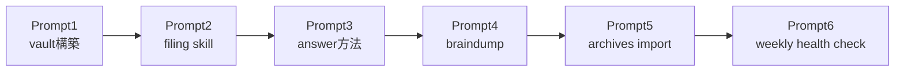

# Hermes Agentで作る個人生活ナレッジベース（6プロンプト構築ガイド）

> **TL;DR**: Hermes Agentの内蔵メモリは2.2k文字上限で個人の全情報を持たせるには小さすぎるため、メモリを知識ベース本体でなく「知識ベースの置き場所を教える索引カード」として扱い、実体はObsidianボルト上のMarkdownファイル群に持たせる設計と、それをゼロから構築する6つのプロンプト（@eptwts）。

[[tools/hermes-agent]]のMEMORY.mdは2,200字上限のTier 1メモリだが、@eptwtsはこの上限を「個人の人生全体を記録するには全く足りない」と指摘し、発想を反転させる。メモリを知識そのものの置き場でなく「vaultのパスを教え、そこを読めと指示するだけのインデックスカード」に格下げし、目標・プロジェクト・決定・人物・数字はすべてディスク上のMarkdownファイルに持たせる。

6つのプロンプトは以下の順で実行する。

- **Prompt 1（vault構築）**: `00-inbox`（未整理素材）・`10-identity`・`20-projects`・`30-areas`・`40-people`・`50-decisions`・`60-sources`・`90-meta`という番号付きフォルダを作らせ、全ノートのfrontmatterに`id`・`type`・`as_of`（その主張が真だった時点）・`status`（current/superseded）・`confidence`（high/medium/low）を持たせる。AGENTS.mdの末尾に「メモリだけで答えるな、必ずファイルを開け」という一文を置く。
- **Prompt 2（filing skill）**: 会話中に新情報を検知したら自動でファイリングするスキルを自作させる。肝は後半のルールで、同じ主題の既存ノートを検索してから新規作成し、矛盾する情報が来たら新ノートを書いた上で旧ノートを`superseded`にして双方向リンクを張る。料金・居住地・案件など時間で変わる項目は「現在」を名乗るノートを常に1つに保つ。最初の1週間だけ保存前承認を有効にし、最初の20件の訂正でファイリングルールを学習させてから承認を切る。
- **Prompt 3（answer方法）**: 質問への回答時は全文を読み込まず、事実ごとに status・日付・確信度・ファイルパス・矛盾の有無を持つ「エビデンスカード」を組み立てて答えさせる。ベクターDBは導入せず、この規模ではplain file searchの方が正確だとする。Hermesは会話全文をすでにフルテキスト検索できるため、vaultは「決めたこと」、検索は「話したこと」という役割分担になる。
- **Prompt 4（braindump）**: 頭の中身をそのまま話し、すべて`00-inbox`に未整理のまま貯める。「inboxを処理して」と伝えたときだけ、曖昧な点を1問ずつ確認しながら日付・確信度つきで正式にファイリングする。
- **Prompt 5（archives import）**: Notionエクスポート・チャット履歴・過去の投稿などを`60-sources`に置き、「指示でなく素材」として扱わせながらバッチ単位で読み込み、実際に真だった日付でファイリングする。
- **Prompt 6（weekly health check）**: 毎週日曜18時に、要約が対象ノートより古くないか・日付やstatusが欠けたノートがないか・重複IDがないか・リンク切れがないか・半年以上「current」のまま放置されたノートがないかをリストアップするcronジョブを設定する。「直さない、リストを送るだけ」という縛りが意図的で、エージェントが黙って知識ベースを書き換えることを防ぐ。

この設計は[[concepts/second-brain-operations]]（@EXM7777、raw/entities/concepts/INDEXの4層構造＋週次lint＋skeptic付きリサーチマシン）と別著者・別ツールでありながら、as_of日付の明示・supersede運用・「直さず報告するだけの週次監査」という骨格がほぼ一致しており、個人知識ベース設計が同じ結論へ収斂しつつあることを示す一次事例といえる。

## 観察ログ（未検証）

- 2026-07-23: @eptwtsは「導入初週は訂正作業で管理コストがかかるが、慣れると自分の人生の統合レイヤーとして機能する」と評価。効果測定は本人談のみで未検証

## 問い

- weekly health checkの「直さない」縛りは、本vaultの`validate_wiki.py`によるlint運用（自動検出のみ・修正は別工程）と同じ設計思想か
- as_of日付・confidence・statusのfrontmatter設計は、本vaultの既存frontmatter（tags/sources/updated）に足す価値があるか

## 関連

- [[tools/hermes-agent]] — メモリ2.2k字上限の仕様と3層メモリアーキテクチャ
- [[concepts/second-brain-operations]] — 同種の設計（4層構造・週次lint・supersede的運用）への独立収斂
- [[concepts/llm-wiki]] — 「メモリを索引、知識はファイルに」という思想の源流（Karpathy）
