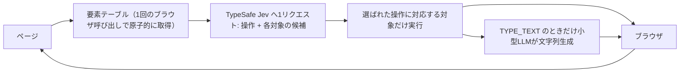

# Jev Ultrafast｜番号付き要素テーブルを1往復で決めるブラウザエージェント

> **TL;DR**: 観測のたびにページの操作可能な要素を番号付きテーブルに作り直し、「どの操作か」と「どの要素か」を1回のモデル呼び出しで同時に決めるブラウザエージェント。スクリーンショットを使わず、Google Flightsの検索を7.1秒で完了したと [[tools/browser-use]] 公式リポジトリが計測を公開している。

速さの出どころは推論の高速化ではなく、1決定あたりのネットワーク往復とブラウザ呼び出しを削ったことにあるとREADMEは説明する。エージェントが読むのは画面の画像ではなく、観測ごとに作り直される要素テーブル（`[1] button  Change ticket type · Round trip` のように番号・役割・名前・現在値が並ぶ）。操作は `CLICK` `TYPE_TEXT` `SELECT` `SCROLL_UP` `SCROLL_DOWN` `WAIT` `DONE` `BLOCKED` の8種で、その状態で実行できる操作と対象しか選択肢に出ない。

決定は TypeSafe の Jev へ1リクエストで投げられ、操作の予測と `click_target` / `type_text_target` / `select_target` の各対象予測が同時に返る。対象の問いは投機的で、操作が `CLICK` なら `click_target` しか実行されない。2つの決定を1往復で済ませるこの形を、READMEは TypeSafe の speculative fan-out パターンとして参照している。文字列の生成は `TYPE_TEXT` のときだけ小型LLMが担当する（デモの既定は OpenRouter 経由の `inception/mercury-2.5`、reasoning 無効）。

サイト固有のアクションスクリプトや、あらかじめ用意した入力文字列はポリシーに含まれない。Flightsの例はゴールだけを与え、結果は独立に検証する。スクリーンショットに番号ラベルを描く処理は録画用のレンダラー側にあり、ブラウザを動かしているのは構造化された状態だけだとREADMEは明記する。

## 速さを支える実装上の選択

READMEが「なぜ動きが速いか」として挙げる項目は、どれもモデルの外側にある。

- **1スナップショット＝1回のブラウザ呼び出し** —— 可視コントロールとその名前・値・テキストを原子的に読み、実DOMノードへの参照を保持する
- **既定ループではスクリーンショットを撮らない** —— 構造化状態のみを消費し、画面キャプチャはインスペクタと録画だけが使う
- **送るのは可視テキストだけ** —— 画面外の本文やフッターでモデルのコンテキストを埋めない
- **待つのは有用な状態が出るまで** —— コンボボックス入力後は候補表示を最大200msまで待ち、他の操作は2フレームまたは50ms。この読み取りは実行のログ記録より後に行う
- **隠しタブのレンダリングを保つ** —— フォーカスのエミュレーションで、Chromeの表示タブを切り替えずに背景のアニメーション抑制を回避する
- **中断したテキスト生成の使い回し** —— 生成済みの値が再試行に持ち越されるのは、テキストヘルパーへの入力が完全に同一のときだけ

実行前の検証も分かれている。クリックはドキュメント・フォームの値・対象・周辺の文脈を確認し、現在の座標を解決したうえで覆われたコントロールを拒否する。アニメーションが起きただけでは再予測しない。安全側の線引きとして、モデルの出力がセレクタ・座標・シェルコマンド・実行可能なJavaScriptになることはなく、テキストヘルパーの出力も小さなJSONとしてパースできなければ入力されない。

画面の見た目でなく番号付きの構造をモデルに操作させる点は [[concepts/intermediate-notation-pattern]] と同じ発想であり、そこでの「状態をテキストで持つと出力が軽く安定する」という主張が、ブラウザ操作の速度として現れた事例だと考えられる。

## 公開されている計測と、その範囲

READMEが公開する数字は次のとおり。動画は Zürich → London の片道検索を 7,073ms で終えた実行で、計測は最初のページ観測の後から始まり、モデル呼び出し・生成テキスト・ブラウザ処理・古くなった判断・読み込み待ちを含む。独立した後追い確認で、片道設定・Zürich・London・2026年9月20日・フライト一覧の表示が検証されている。

同一モデル・同一設定で新旧を交互に6回走らせた比較では、双方とも3/3成功。所要時間の中央値が 9.450秒 → 7.092秒（25%減）、ブラウザプロトコル呼び出しの中央値が 1,092回 → 101回。ただしREADME自身が「1タスクを3回、1つのブラウザプロファイルで繰り返しただけで、一般的な信頼性ベンチマークではない」と限定している。同じポリシーで Wikipedia の指定記事を 2.798秒、ローカルのホテル検索・絞り込みを 1.896秒で通したとも記載する。

限界も明示されている。`DONE` の判断は結果の独立検証を必要とし、DOMリーダーが扱うのは一般的なHTMLとARIAコントロールであってアクセシブル名の完全な仕様ではない。Shadow DOM・フレーム・canvas・ファイルアップロード・ポップアップタブ・入れ子のスクロール・任意のキーボードウィジェットはこのMVPの対象外。操作するタブは既存のChromeプロファイルを共有する。

## 使い方

`git clone` して `uv sync`、`.env` に `TYPESAFE_API_KEY` と `TEXT_MODEL_API_KEY` を入れ、`uv run jev` でローカルのインスペクタ（`http://127.0.0.1:8766`）が立つ。インスペクタには番号付き要素・操作の確率・対象の確率・実行されたアクションが並び、「Choose next」で実行前に停止できる。Chromeへの接続は同組織の Browser Harness 経由で、`uv sync` で一緒に入る。ライブラリとしては `Agent(url, goal)` をコンテキストマネージャで開き、`agent.run()` が返す状態（`elapsed_ms` / `status`）を回す形になる。

## 観察ログ（未検証）

- 2026-09-21: 中央値 9.450秒 → 7.092秒（25%減）、ブラウザプロトコル呼び出し 1,092 → 101 という比較は開発元の自己計測で、1タスク3回・単一プロファイルという範囲つき。他サイト・他タスクでの再現性は未確認

## 問い

- 番号付き要素テーブル＋操作/対象の同時予測という形は、ブラウザ以外（CLIツール・社内管理画面・Obsidianのようなローカルアプリ）へそのまま移せるか。移せるなら「AIに渡す記法」を先に設計する話に還元できる
- スクリーンショットを使わない設計は、視覚に意味があるページ（レイアウトで意味が決まる広告・ダッシュボード）でどこから崩れるか
- `DONE` の独立検証をどう組むかが実運用の分かれ目になる。ゴール達成の判定器を別に置く設計は [[concepts/eval-loop]] の出荷ゲートと同じ問題ではないか

## 関連

- [[tools/browser-use]] — 同じ browser-use による本体のブラウザ操作ライブラリ。Jev Ultrafast は「動的なインデックス付きアクション空間」に絞った別リポジトリで、Chrome接続は同組織の Browser Harness を使う
- [[concepts/intermediate-notation-pattern]] — GUIでなくテキスト記法をAIに操作させ、トークンと精度を同時に改善する設計パターン。番号付き要素テーブルはブラウザ操作版の中間記法にあたる
- [[tools/claude-computer-use]] — スクリーンショットとクリック座標でUIを操作するAnthropicの機能。Jev Ultrafast は既定ループから画像を外し構造化状態だけを使う逆の選択をしている
- [[models/jev]] — @CompleteSkepticがRLCDで訓練したと発表した新型フロンティアモデル。本ページの「TypeSafe's Jev」と同一と考えられる（未確認）
