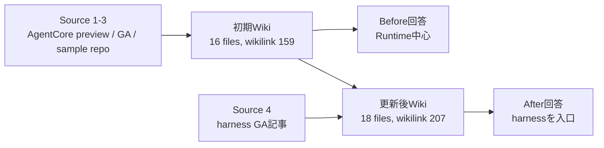

# Knowledge Acquisition Skill

> **TL;DR**: AWS Samples の LLM Wiki 実装。NTT DATA TECH が資料1本の追加で既存ページ7件が書き換わり同一質問への回答構造まで変わることを差分で実測した一方、同梱 Web UI の Knowledge Graph は生成側のリンク表記と解決側の slug 規約が噛み合わず `0 edges` になった。

`aws-samples/sample-knowledge-acquisition-skill` は、PDF・論文・Web・GitHub から取り込んだ資料を相互リンク付きの Markdown Wiki として蓄積し、新しい資料を足すと既存ページも更新していく Kiro CLI 向けスキルである。リポジトリの README 自身がこの方式を「LLM Wiki」と呼び、問い合わせのたびに知識を再発見する RAG と対比して "persistent, compounding knowledge base"（持続的に蓄積する知識ベース）と説明している。Cloudscape ベースのローカル Web UI を同梱し、AWS へデプロイせずに Wiki と Knowledge Graph をブラウザで確認できる。

このページの価値は、スキルの機能紹介ではなく **NTT DATA TECH が Amazon Bedrock AgentCore を題材に行った Before / After 検証** にある。[[concepts/llm-wiki]] の中核主張「新しい資料が既存の知識まで再編集する」を、実際のファイル差分と数値で押さえた例は多くない。

## 検証設計：条件を固定して差分だけを見る

NTT DATA TECH は「最初から情報をたくさん与えない」ことを設計の要にしている。初期 Wiki は AgentCore の preview 発表記事・GA アナウンス・サンプルリポジトリの3資料だけで作り、その後 AgentCore harness の GA 記事を1本だけ投入した。比較条件として次を固定している。

- Kiro CLI のモデルを `claude-sonnet-4.5` に固定する（検証中に `auto` が利用不可になったため）
- Wiki 生成・資料追加・質問回答をそれぞれ別セッションで実行し、会話履歴の持ち越しを断つ
- 質問回答時は Web 検索と新規資料取得を禁止し、Wiki 内の知識だけで答えさせる
- Before の Wiki をスナップショットとして保存し、`diff -ru` でファイル差分を実測する

計測語の定義も切り分けている。**wikilink occurrences** は `concepts/` `entities/` `comparisons/` `queries/` の内容ページに現れる `[[...]]` の出現回数で、重複を含み `index.md` は集計対象外である。Web UI が表示する Graph の値とは母集団が違うため、両者を直接比較できないと明記している。

## 資料1本の追加で既存ページ7件が書き換わった

| 指標 | Before | After | 差分 |
|---|---|---|---|
| Markdown files（`raw/` 除外） | 16 | 18 | +2 |
| Concepts | 9 | 10 | +1 |
| Comparisons | 1 | 2 | +1 |
| wikilink occurrences（内容ページのみ・重複含む） | 159 | 207 | +48 |
| Graph nodes | 16 | 18 | +2 |
| Graph edges | 0 | 0 | 0 |

新規作成は `concepts/agentcore-harness.md` と `comparisons/harness-vs-runtime.md` の2件。更新された既存ファイルは Gateway・Identity・Memory・Observability・Runtime の内容ページ5件に `index.md` / `log.md` を加えた7件だった。Runtime ページには「Harness vs Direct Runtime Use」の使い分け表と、harness で始めて設定だけでは足りなくなったら Runtime ベースのコードへ移る "graduation path" が追記され、Memory ページには harness 経由の3形態（Managed Memory / Bring Your Own Memory / Stateless Agent）が追記された。

重要なのは、Kiro が harness を「既存サービスを置き換えるもの」ではなく既存 primitive を束ねる設定駆動の抽象化として統合し、この時点で明確な supersede 対象を報告しなかった点である。新資料の投入が既存記述の破棄ではなく関係の追記として現れている。

## 回答の構造まで変わった

Before と一字一句同じ質問を新規セッションで投げたところ、回答の骨格が変化した。Before は Runtime を中心に各サービスを直接組み合わせる説明だったのに対し、After は harness を統合レイヤーとして入口に置き、高度な要件では Runtime 側へ寄せる構成になった。この After 構成には harness 側の Agent Skills も含まれており、これは検証で導入した Kiro のスキルではなく AgentCore harness の構成要素を指す。

ただし NTT DATA TECH は Before / After とも **各1回（N=1）** であることを繰り返し断り、「Source 4 を追加すれば必ず同じ構成になる」とは結論づけていない。

## Knowledge Graph が 0 edges になった原因

内容ページに wikilink が207回出現しているのに、Web UI の Knowledge Graph は Before / After とも `0 edges`、全ノードが Orphan 扱いだった。NTT DATA TECH は検証時 commit の `webapp/dev-server.mjs` を読んで原因を特定している。

- ページの索引はファイル名の basename を slug として作られる（`concepts/agentcore-gateway.md` → `agentcore-gateway`）
- `findWikilinks()` は `[[...]]` の中身をそのまま返し、途中で slug 化されない。変数名は `targetSlug` だが実体は生のリンク文字列である
- edge は `slugIndex` への完全一致で解決される

生成された Wiki のリンクは `[[AgentCore Gateway]]` のようなタイトル形式であり、`slugIndex["AgentCore Gateway"]` は存在しない。さらに `[[AgentCore Runtime|Runtime]]` のような alias 付きリンクは `AgentCore Runtime|Runtime` という1つの文字列として扱われるため、これも一致しない。orphan 判定は inbound edge の有無を見るので、解決済み edge が0なら全ノードが Orphan になるのも実装と整合する。

NTT DATA TECH はこれを「LLM が規約に違反した」とは断定せず、**生成時の wikilink 表記と resolver が期待する slug 形式の契約が定義・共有されていない**問題として整理している。検証時の `SKILL.md` は「最低2本の outbound wikilink を張れ」とは求めるが、target にファイル stem を書くのかページタイトルを書くのか、alias を許すのかまでは定めていなかった。

これは [[concepts/open-knowledge-format]] のリファレンス実装で観測された「SPEC 推奨の絶対パスリンクをビジュアライザが明示的にスキップして edge が0になる」現象と同型である。独立した2つの LLM Wiki 実装で、**リンクを書く側と解決する側の規約が未定義なせいでグラフが空になる**という同じ失敗が起きている。このwikiの `scripts/validate_wiki.py` は `LINK_PATTERN` が alias（`[[A|B]]`）を分割し、`SKIP_PAGES` で `index.md` を参照元・参照先の両方から除外しているため、この2つの落とし穴は現時点では踏んでいない。

なお、Detail 画面の本文に露出していた `` という HTML 文字列も Wiki の生成物ではなく Web UI の `DetailPage.tsx` が組み立てたものだった。NTT DATA TECH は「Markdown Wiki を正本、Web UI を可視化補助」として層を分けて評価するのが安全だと結論づけている。

## 生成物を原典と突き合わせる

LLM Wiki は原典の保存だけでなく複数の記述を統合して新しい説明へ再構成するため、NTT DATA TECH は代表3点を AWS 公式 Developer Guide / API Reference と事後照合している（照合に使った資料は Wiki には投入していない）。

- harness と Runtime の役割差 → 公式の「AgentCore harness vs. Runtime」と整合
- 設定で足りなくなったときコードへ export する機能 → `agentcore export harness` として公式に存在
- Memory の3形態 → API Reference の `HarnessMemoryConfiguration` が定義する union（`managedMemoryConfiguration` / `agentCoreMemoryConfiguration` / `disabled`）と対応

一方、生成 Wiki にあった「Prototyping / MVP なら Harness、Deep instrumentation なら Runtime」といったシナリオ別の表は **AWS 公式表の転載ではなく、スキルが Source 4 と既存 Wiki から再構成したもの**だと明示している。方向性は公式と整合するが、個々のラベルまで原典にあるわけではない。ここから「実運用では Git 差分レビューと重要事項の原典照合を前提にすべき」という運用結論を導いている。

## 指標そのものを撤回した：orphan = 0 の落とし穴

検証中に得た「orphan な内容ページ = 0」という値を、NTT DATA TECH は記事の主要指標から**除外**している。当時のチェッカーは参照元として `index.md` / `log.md` / `raw/` を含む全 Markdown を連結し、さらに `agentcore-runtime.md` のような拡張子付きファイル名がどこかに現れるだけでも「参照あり」と判定していた。`index.md` は全内容ページを wikilink で列挙しているので、この条件下の `orphan = 0` は `index.md` の網羅性とほぼ同義になり、内容ページ同士の相互参照性は測れていない。

同様に、補助チェックで得た `unresolved unique wikilink targets = 63種` も `raw/` や `index.md` を収集対象に含む簡易実装だったとして主要指標から外している。63種には `[[Amazon Bedrock]]` `[[IAM]]` `[[LangGraph]]` など意図的に独立ページを作っていない外部名も含まれていた。

自分で作った指標が何を測っているかを後から検算し、都合の良い数字（`orphan = 0`）を自ら取り下げているのがこの記事の最も参考になる点だと考えられる。孤立ページ数のような指標は、参照元の母集団を内容ページに限定しないと簡単に無意味になる。

## 観察ログ（未検証）

- 2026-08-19: 資料1本追加で wikilink 出現回数 159 → 207（約30%増）・Markdown files 16 → 18・既存ファイル7件更新。単一の検証環境・N=1 の実測値で、再現性は評価されていない
- 2026-08-19: 回答構造の Before / After 変化（Runtime中心 → harness入口）も各1回の観測。同一質問の繰り返しによるブレ幅は未測定

## 問い

- このwikiの ingest は「既存ページ7件が更新される」ような波及を実際に起こせているか。1ソースあたりの更新ファイル数を `log.jsonl` から集計すれば同種の指標が取れる
- 公開サイトとダッシュボードのリンク解決は、タイトル形式・alias・大文字小文字のどれで壊れうるか。`validate_wiki.py` が通っても表示側で edge が落ちる経路がないか確認する
- 自分が使っている指標（orphan 数・リンク数）も、参照元の母集団を数え直すと `index.md` の網羅性を測っているだけになっていないか

## 関連

- [[concepts/llm-wiki]] — 本スキルが実装している知識ベースの型そのもの。「既存ページまで更新される」主張の実測例として対応する
- [[concepts/open-knowledge-format]] — 同じくリンク表記とビジュアライザの解決規約の不一致で edge が0になる現象が観測されている
- [[concepts/llm-wiki-vs-company-brain]] — Git 差分レビューと人間の承認を前提にする運用は、個人向けと企業向けの分岐点の議論と接続する
