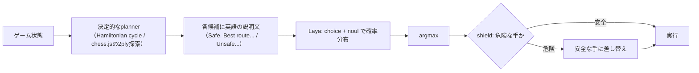

# laya-mlx｜選択肢にスコアを付けるだけの小型モデルを手元で1判断8msで回す

> **TL;DR**: Jev と同じ「文章を生成せず、渡した選択肢にスコアを付ける」型のオープンウェイトモデル Laya を Apple Silicon の MLX で動かすライブラリ。mizchi の実測では M5 で1判断（3問）8〜9ms、ブラウザ（onnxruntime-web + WebGPU）では約50msで、「ローカルなら60fps以上、ブラウザでは20fps」と mizchi がまとめている。

mizchi が出発点にしたのは、[[models/jev]] の API が1リクエスト500ms（日本からは遅延が乗って実質2fps）かかるのは主に地理の問題で、モデル自体は小さいはずだという予想である。Laya は Convai Innovations が公開した Jev 型のオープンウェイト実装で、質問の型も Jev とほぼ同じ3種（`choice`: 選択肢の確率分布／`score`: 順序付きルーブリックの期待値／`noul`: 命題が真である確率）を持つ。中身は ModernBERT（英語・421M）または mmBERT（多言語・322M）の encoder に2層の decision head を載せたもので、`[CLS] choice question: ... [SEP] [MASK] 選択肢1 [MASK] 選択肢2 ... [SEP] 状態 [SEP]` という系列の `[MASK]` 位置の hidden state をスコアにする。双方向 encoder なので1回の forward pass で全選択肢のスコアが出る、と mizchi は説明する。

laya-mlx はこれを PyTorch なしで MLX に移植したもので、`pip install laya-mlx` で入り、Hugging Face から重みを落として `laya.load(...)` → `agent.predict(テキスト, {質問名: {type, instructions, criteria}})` で使う。mizchi の手元（M5）ではロード0.7秒・初回1.6秒（warmup）・2回目以降は3問まとめて21msだった。

## 「ゲームを理解している」わけではない：planner が説明し、Laya が選ぶ

同梱の Snake デモの仕組みを mizchi は次のように分解している。決定的な planner が各方向を `Blocked. Collision.` / `Unsafe. Traps the snake.` / `Safe. Best route to food.` / `Safe. Slower route.` と分類し、それを `choice` の選択肢の説明文として渡す（加えて `noul` を2問）。Laya の出力の argmax を実行し、unsafe を選んだら shield が安全な方向に差し替える。つまり planner が状況を英語で説明し、Laya は「文を読んで一番良さそうなものを選ぶ」役である。

mizchi が作ったブラウザ版 Chess も同じ構造で、chess.js で合法手を出し、2 ply の駒得探索で候補を6手に絞って説明文（`Captures the queen. Gives check. Safe. Best.` など）を付ける。棋力は「初心者には勝てる」程度で、序盤は候補の評価が全部同点になるため `Best.` に意味がなく、Laya はおそらく説明文の語感で選んでいるだけだと mizchi 自身が限界を認めている。結論として mizchi は「判断の質は選択肢の説明文の質で決まる。これは Jev と同じ」と述べ、Jev の記事で書いた「選択肢の設計が大事」「Bloom filter のように使う」「ガードレール用途」がそのまま Laya にも当てはまるとする。賢さは Jev のほうが上だが、安くて速いぶん「雑に大量に投げて confidence でふるいにかける」使い方に向く、というのが mizchi の位置づけである。

この「合法手だけ渡せばルール違反しない」構造は、[[tools/jev-ultrafast]] がブラウザの操作可能要素だけを番号付き選択肢として渡す設計と同じ発想であり、[[concepts/intermediate-notation-pattern]] の「AIには生の画面でなく、選べる形に整えた記法を渡す」をゲームに適用した例と考えられる。

## 計測（mizchi の手元 M5・自己計測）

- **MLX**: 公式ベンチ（M3 Max）は1問13.4ms（英語421M）/ 7.4ms（多言語322M）、50問バッチで395 q/s。M5 で Snake を `--max-speed` で回すと1判断（3問）8〜9ms、87〜98判断/秒。描画が追いつかないので通常モードは12判断/秒に抑えている
- **ONNX 書き出し**: MLX に ONNX exporter が無いため upstream の PyTorch 実装を経由して `torch.onnx.export`（dynamo）で出力。63問の fixture で MLX（CPU）と全問 argmax 一致、確率誤差は fp32 で 1.3e-6、fp16 で 5.1e-4
- **ブラウザ（M5 の Chromium、onnxruntime-web）**:

| モデル | backend | 3 問 (65 tokens) | 20 問 (91 tokens) | 3 問 (1024 tokens) | 確率誤差 |
| --- | --- | --- | --- | --- | --- |
| fp32 (1.29 GB) | WebGPU | 61 ms | 369 ms | – | 1.1e-6 |
| fp16 (647 MB) | WebGPU | 48 ms | 270 ms | 1039 ms | 1.2e-2 |
| fp16 | wasm | 901 ms | – | – | 9.1e-4 |

wasm は20倍遅く WebGPU 一択、というのが mizchi の判断である。Snake のブラウザ版は1判断50ms前後（18〜20判断/秒）で MLX の約1/5。Chess は1手あたり Laya が50〜70ms、planner が50〜60msで、初回だけ shader compile で約200msかかる。モデルは Hugging Face から直接 fetch して Cache API に入れるので、2回目以降はオフラインで動く。

## サイズの本丸は embedding

fp16 で647MB、初回ロードに数分かかる。322M パラメータのうち61%（196.6M）が mmBERT の256k語彙の embedding table で、Transformer 本体は fp16 で251MBしかない、と mizchi は内訳を示す。MatMul の weight-only int4 量子化は872MBにしかならず確率誤差0.13で使い物にならなかった。縮めるなら embedding をグラフから外して JS 側で int8 のテーブルから gather するのが筋で、語彙50kの英語版421Mは embedding が小さく有利かもしれない（未検証）と mizchi は見立てている。道中で MLX・onnxruntime-web・tokenizers.js のバグを1つずつ踏んだとも書いている。

mizchi は、出て数日で Jev クローンが大量に作られており Laya はその1つに過ぎないとしつつ、Jev のコンセプト上ローカルで低遅延に動くことに価値があるのでこの路線を追うと述べる。一方で「BERT をチューニングすればできる」と言われがちな点には、Jev は学習抜きにこれを実現しているのが強みだと反論している。記事自体は mizchi のアイデアを Claude が実証し、そのレポートを mizchi が手で直したものだと冒頭で明かされている。

## 観察ログ（未検証）

- 2026-09-21: 「1判断8〜9ms（M5・MLX）/ ブラウザ WebGPU で約50ms」は mizchi の単一環境での自己計測。M5 以外の Apple Silicon やモバイルのブラウザ（メモリ上限がネックと mizchi 自身が指摘）での再現は未確認

## 問い

- 「決定的なロジックが候補と説明文を作り、小型モデルは選ぶだけ」という分業は、ゲーム以外（wiki ingest のカテゴリ判定・Tier 判定のような分類）でも速度とコストの両面で効くか。LLM に毎回生成させている判定のうち、選択肢に落とせるものはどれか
- 説明文の語感で選んでしまう問題（Chess 序盤の全同点）は、説明文の設計で潰せるのか、モデルの賢さの限界なのか
- embedding を外して int8 gather する縮め方で、ブラウザでの初回ロード数分を実用域まで下げられるか

## 関連

- [[models/jev]] — Laya が模倣する「選択肢にスコアを付けるだけ」の元祖モデル。mizchi によると1リクエスト500ms（日本から実質2fps）
- [[tools/jev-ultrafast]] — 同じ Jev 型の選択モデルをブラウザ操作に使う例。候補を番号付きで渡し選ばせる構造が Snake/Chess デモと共通
- [[concepts/intermediate-notation-pattern]] — 生の状態でなく整えた記法をAIに渡す設計パターン。planner の説明文はゲーム版の中間記法にあたる
- [[concepts/decision-layer-model]] — planner が説明しモデルは選ぶだけ、という分業をエージェント全体の設計（LLMが作り、判断モデルが決め、コードが実行する）に広げた概念ページ
- [[concepts/small-llm-fine-tuning]] — 小型モデルを狭いタスクに特化させる別経路。Laya は既製の選択モデル、こちらは自前データでの QLoRA 学習
