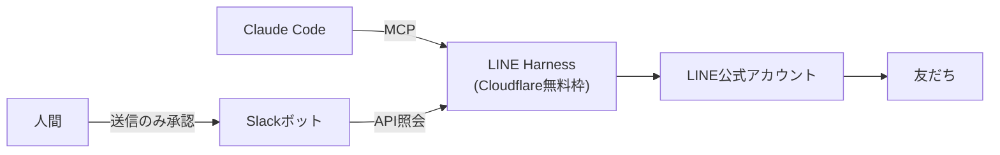

# LINE Harness

> **TL;DR**: LINE公式アカウントの月額配信ツールをOSSの「LINE Harness」（Cloudflare無料枠で稼働・MCPサーバー同梱）へ置き換え、運用をClaude Codeに委任して送信だけ人間承認に残す実践記録。

LINE公式アカウントを本気で運用すると配信ツールの月額1〜2万円が解約まで出続け、できることはツール仕様の内側に限られる——この構造をOSSを「持つ」ことで解消したと@yagiryuuuが述べる。LINE Harnessは有料ツールの機能をほぼ一通り備えるという: ステップ配信（分単位のタイミング制御・条件分岐）、タグ・セグメント配信、リッチメニューの自動切替、LINE内で完結するフォーム、行動ベースのスコアリング、IF-THEN自動化ルール、キーワード自動返信。[[companies/cloudflare]]の無料枠（D1データベース）で動くためサーバー代も月額も0円で、セットアップはコマンド1発・所要5分だったという。MITライセンス。

設計思想として、全機能がAPIで公開されClaude Codeから操作するMCPサーバーまで同梱されており（[[tools/claude-mcp]]）、「人間が管理画面をポチポチする」前提でなく「AIに運用させて人間は監視する」前提で作られていると@yagiryuuuが評する。

## 著者のカスタマイズ4例

- **日程調整の全自動化**: Googleカレンダーの空き枠から候補日を自動提示する。0秒で返ると機械感が出て相手の温度が下がるため、あえて遅延送信にする。「日程調整中」のまま7日動きがなければ自動で「未対応」へ差し戻して後追いメッセージを送り、「候補日を送ったまま返事がない人」に溜まる取りこぼしを仕組みで拾い続ける。
- **Slackボット「LINE友達通知くん」**: LINE管理画面を開きに行く運用は形骸化するとして、友だち照会・会話履歴の参照をSlack上の自然文で行えるようにした。送信だけは必ず人間の承認制。「普段いる場所（Slack）にCRMが来るのが正解」と述べる。[[business/dinii-ask-anything]]と同型の「照会はAI・実行は人間承認」設計。
- **トーク画面のアポ獲得ボタン**: 日程確定した瞬間のカレンダー登録（Meet付き）・Notion商談管理への追加・タグ付け・確定返信文面の生成・資料作成・相手企業調査をワンクリックで一括実行し、会話の温度が高いその場で事務処理を終える。モバイル対応済み。
- **運用そのものをClaude Codeへ**: MCP経由で配信の作成・友だち検索・未返信会話チェックまで日本語指示で実行できる。送信系操作だけは必ず人間の確認が挟まる設計のため、AIが勝手に一斉送信する事故は構造的に起きないという。

## 借りるか持つか

月額ツールを借りる限り「この機能が欲しい」は要望を送って待つしかないが、OSSを持つと「欲しいと思った日にClaude Codeに実装させて当日から動く」に逆転する、と@yagiryuuuは主張する。AI時代のツール選定基準は機能の多さでなく「AIに拡張させられるか」へ変わっており、ソースコードとAPIが開いているツールはClaude Codeを持った瞬間にカスタマイズできる資産になる——[[concepts/ai-native-cloud-selection]]が示す「AIが操作しきれるか」というクラウド選定軸のツール選定版と考えられる。

なお記事末尾は著者の受託開発サービスへの誘導で、LINE Harness自体の開発元は記事中に明記されていない（紹介リンクは著者名と符合するworkers.devサブドメイン配下）。

## 観察ログ（未検証）

- 2026-08-29: 月額1〜2万円の配信ツールを0円化・セットアップ5分は@yagiryuuuの単一報告。リポジトリ所在・スター数は未確認

## 問い

- LINE Harnessの開発元・リポジトリはどこか。紹介URLが著者ドメイン配下にあり自作ツールの宣伝である可能性を含めて確認したい
- 「照会はAIに開放・送信は人間承認」のSlack集約は、このvaultの自動実行系（launchdの実行結果通知など）に応用できるか

## 関連

- [[concepts/ai-native-cloud-selection]] — 「AIエージェントが操作しきれるか」を選定軸にする設計思想。本ページはその軸のツール選定への適用例
- [[business/dinii-ask-anything]] — 照会をAIに任せ実行を人間に残すSlack botの同型の承認設計（Claude Managed Agents実装）
- [[tools/claude-mcp]] — 同梱MCPサーバーが依拠する外部ツール連携仕様
