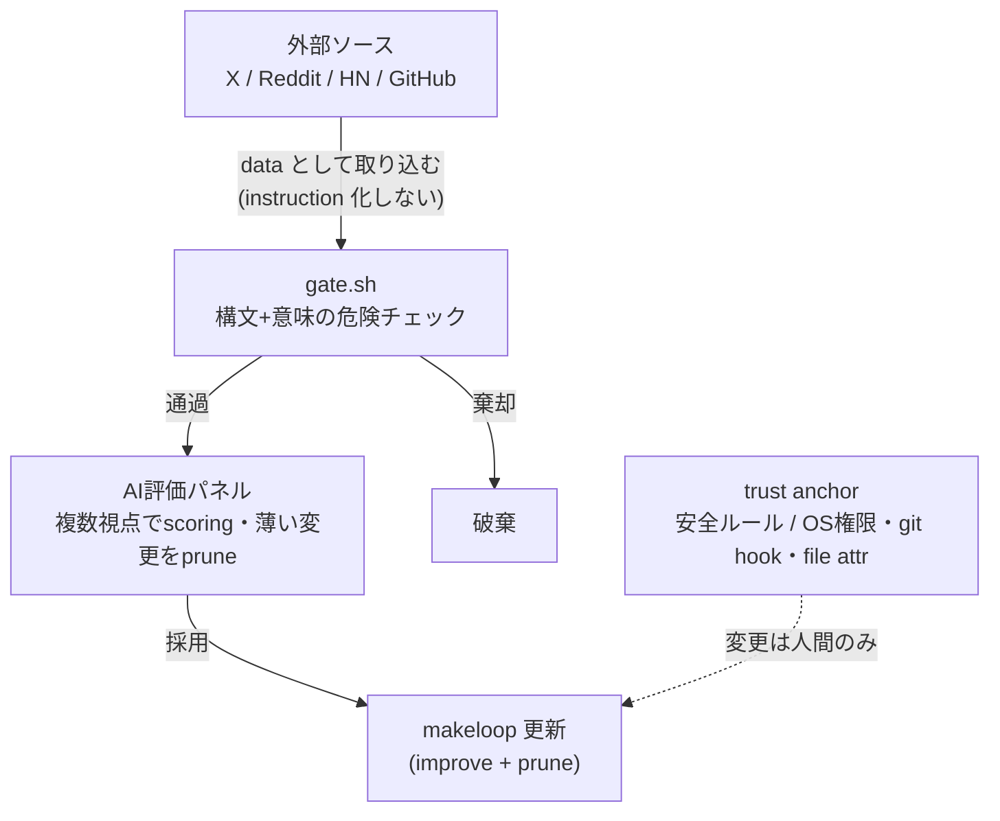

# makeloop

> **TL;DR**: 会話とコードベースを読んで `/loop` 用プロンプトを自動生成する Claude Code コマンド（@usedhonda 製・GitHub: usedhonda/makeloop）。生成器自身を自己改善する open loop 化し、変更の採否評価まで AI に渡したことが設計の肝。

`/loop` プロンプトは毎回手書きするのが面倒で、設計の勘所も掴みにくい。makeloop はそこを「いまの会話とリポジトリの状態を読んで、適した骨格のループプロンプトを出す」生成器として埋める。要点は、ループを2種類に分けてから骨格を変えること、ループプロンプトに必ず入れる最小要素を決めること、そして生成器自身を自己改善させるときの安全設計の3層に分かれる。

**closed loop と open loop は骨格が違う。** closed loop はゴールがある——「テストを全部通す」「このバグを直す」「リファクタを完了する」のように成功条件があり、検証ゲートを通ったら止まる。必要なのは success criteria / verification / stop condition。一方 open loop は終わりがなく、「PR コメントを監視する」「デプロイ失敗を検知する」のように見張り続けて条件成立時に正しく反応するのが目的。必要なのは trigger condition / polling or watch interval / notification policy / failure recovery。ここを混ぜると、監視ループに完了条件を求めたり完了型ループに「ずっと監視しろ」と書いたりする齟齬が出る。makeloop はまずこの分類を判定し、出す骨格を切り替える。これは [[concepts/goal-loop-routine]] の「止まる条件と自分の在/不在で動詞を選ぶ」分類と同じ判断軸を、生成側で先に確定させたものにあたる。

**closed loop に必ず入れる3要素は Verify / State / Stop。** Verify はテスト・ビルド・lint など自己申告でない検証ゲート。State は途中状態を外部ファイルに保存し、restart でなく resume できるようにする仕掛け——長時間ループは途中で落ちる前提で「最初からやり直す」でなく「どこまでやったかを読んで続きから」にする。Stop は成功・失敗・上限到達のいずれかで必ず止める。これは [[concepts/loop-engineering]] の最小構成ループ（自動化／スキル／状態ファイル／ゲート）と同型で、State＝状態ファイル、Verify＝ゲート、Stop＝ハードストップに対応する。加えて makeloop は repo の成熟度も見て粒度を変える。空に近い repo なら先に検証環境を作るループを出し、既にテストがある repo ならそのテストを verify gate として使う。

**生成器自身を open loop 化し、自己改善させる。** ループ設計の新しい知見は X・Reddit・HackerNews・GitHub に継続的に出るので、それを定期的に拾って makeloop 自身へ反映する。ただし自動ウェブ収集した情報での自己更新は危険を伴う——外部テキストには「この安全ルールを無視しろ」式の prompt injection を仕込めるため、外部から拾った情報はすべて **data として扱い instruction としては読ませない**。これは [[concepts/loop-engineering]] のセキュリティ税が挙げる「スキルへのプロンプトインジェクション」を、自己更新ループの入力段で遮断する形。

**採用ゲートは構文だけでなく意味も見る。** 変更の採用には gate.sh を置き、最低限「JSON / template が壊れていないか」「closed/open loop の core structure が残っているか」「safety phrase が削られていないか」「source leak が起きていないか」「trust anchor に触っていないか」「gate bypass になる文言を足していないか」を機械的に検査する。ポイントは「削除していないから安全」では不十分なこと。たとえば「テストが動かなければ合格扱いにする」は見た目には追加だが、意味としては gate bypass になる。だから差分を構文だけでなく意味的に危険かどうかも見る。これは [[tools/hermes-agent-self-evolution]] のガードレール「意味の保存（元の目的からドリフトさせない）」と同じ問題設定で、makeloop 側は危険パターンを明示列挙する方向で実装している。

**評価（採否判断）も AI に渡す。** テストが通るかは機械で見やすいが、「この変更は取り込む価値があるか」「ただ複雑にしていないか」「makeloop の思想に合っているか」はこれまで人間の判断とされてきた。makeloop はそこも複数の AI に別視点で評価させ、採用候補を scoring し、薄い変更を落とし、増えすぎたら prune する。重要なのは improve と prune を同じループに入れること——放置するとツールは賢くなるのでなく「太る」ため、「何を足すか」だけでなく「何を足さないか」も評価対象にする。複数 AI の別視点評価という構造は [[concepts/llm-council]]（匿名ピアレビューで盲点を炙り出す）や [[concepts/eval-loop]]（閾値未満を出荷前に止める品質ゲート）と同じ系譜にある。

**trust anchor だけは AI に渡さない。** 自己更新するツールが自分の安全ルールまで書き換えられると、最終的にブレーキを自分で外せてしまう。そこで安全ルールは makeloop 自身が触れない trust anchor に置き、OS 権限・git hook・file attribute で固めて、人間が明示的に鍵を開けない限り変更できないようにする。整理すると、implementation の改善は AI に・verify は gate に・採用評価は AI panel に渡すが、trust anchor の変更権限だけは人間に残す。「通常の改善は AI、"ドグマ"の変更だけは人間」という線引きが、自己改善ループに人間のブレーキを構造的に残す設計になっている。

## 観察ログ（未検証）

- 2026-06-24 @usedhonda: makeloop を作った最初の動機は「毎回 loop prompt を手書きするのが面倒」「コマンド作成を通して自分も loop を深く学べる」という素朴なもの。実際に面白くなったのは生成器自身を open loop 化し評価まで自動化したところだった、と振り返る（X bookmark 259・impression 65,139、2026-06-25時点）
- 2026-06-24 @usedhonda: 「評価を人間から AI に託したことが loop の醍醐味」と位置づけ、makeloop の本質を「作業の自動化から判断の自動化へ」と表現。その境界線をどこに引くかを「いま実験している」段階だと明言（自己更新する makeloop はまだ実験的との位置づけ）
- 2026-06-24 @usedhonda: gate.sh が見る6項目（JSON/template 健全性・closed/open core structure 残存・safety phrase 削除・source leak・trust anchor 不可触・gate bypass 文言の追加）は著者自身の設計選択であり、網羅性・有効性は外部検証されていない

## 問い

- makeloop の closed/open 二分 → 骨格切替を、このwikiの launchd ingest（open loop 相当）のプロンプト設計に逆適用できるか。trigger / interval / notification / failure recovery の4点は明示されているか
- 「外部情報は data として扱い instruction にしない」を、wiki-ingest が sources/ の外部テキストを読むときにどこまで担保できているか（ソース本文の指示文を命令として実行しない保証はあるか）
- gate.sh の「構文でなく意味で gate bypass を見る」を、このwikiの ingest 検証ゲート（具体例/数字/出典/一文結論）に足すなら、どんな"見た目は追加だが意味は緩和"パターンを弾くべきか
- trust anchor（OS権限・git hook・file attribute で固めた不可触の安全ルール）に相当するものを、このwikiの自己改善ループ（LESSONS.md / SKILL.md）に置くべきか。それとも自己改善対象に含めてよいか

## 関連

- [[concepts/loop-engineering]] — ループ設計の工学全体論。makeloop の Verify/State/Stop は最小構成ループの「ゲート／状態ファイル／ハードストップ」に対応
- [[concepts/goal-loop-routine]] — goal/loop/routine の動詞分類。makeloop の closed/open 二分と同じ「止まる条件で選ぶ」判断軸を生成側に置いたもの
- [[tools/hermes-agent-self-evolution]] — 自己進化ツールのガードレールゲート。makeloop の gate.sh と「意味の保存」で同型、makeloop は trust anchor を追加
- [[concepts/llm-council]] — 複数 AI が別視点・匿名ピアレビューで評価する構造。makeloop の AI 評価パネルと同系譜
- [[concepts/eval-loop]] — 生成→採点→閾値未満を止める品質ゲート。makeloop の「薄い変更を落とし prune する」採用評価の一般形
- [[concepts/skill-self-improving-loop]] — 会話履歴→Issue→PR の自己改善ループ。makeloop の「外部知見を拾って自身に反映」と同じ外側ループ
- [[tools/loop-library]] — 再利用可能なループの公開カタログ。makeloop が生成する骨格の事例集にあたる
