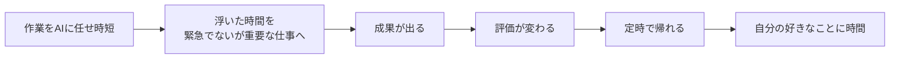

# NotebookLM 初心者オンボーディング（2ノート運用法）

> **TL;DR**: NotebookLMを「振り返りノート」と「攻略本ノート」の2つだけに絞って始める初心者向けの型。攻略本ノートはFast Researchを基礎/実践/事例の3切り口で回して自分専用の一冊に育て、使うほど問いを立てる力と言語化力が鍛えられる。

@ai_jitan（NotebookLMを1年ほぼ毎日使い倒した実践者・書籍『AI仕事最速大全 NotebookLM即戦力スキル』著者）は、初心者がつまずく原因を「機能を知らないから」ではなく「何のために使うのかが腹落ちしていないから」だと指摘する。だから機能一覧の網羅ではなく、目的→最初の一歩→自分専用の攻略本づくり→使い続けた先の変化、という一本道で案内するのがこの記事の立て方になっている。道具の正体は「渡した資料"だけ"を読み、全回答に引用元がつくAI」で、汎用LLMのように知らないことをそれっぽく補完しない——この一点がビジネス用途での信頼性を担保する（[[tools/notebooklm-business-workflows]] と同じ核心）。

@ai_jitan はこの連鎖を「時短の最初のドミノ」と呼ぶ。時短の目的は楽をすることではなく、勝負すべき場所で勝負するための"弾"（＝緊急ではないが重要な仕事に投資する時間）を作ることだと位置づける。

## ノート①：振り返りノート（会議・議事録ストック）

最初に作る一択。会議資料と議事録をドラッグ&ドロップで足していくだけで、「会議をぜんぶ覚えている専属アシスタント」が育つ。@ai_jitan は配属初日の新人Aさんの一週間で使いどころを描く——これは新規プロジェクト参加者・異動者にもそのまま効く。

- **月**：渡された数百ページを全部入れ、「動いているプロジェクトを目的・状況・関係者で整理して」と聞く。数百ページが初日午前中に引用元つきの「見取り図」になる。読まなくてよくなるのではなく、どこから読むべきかが分かった状態で読める。
- **火**：略語・専門用語など「先輩に聞くほどでもない質問」を全部ぶつける。辞書的な意味でなく「この部署での使われ方」を、何度聞いても嫌な顔をされずに得られる。小さな質問を潰しておくと、先輩には本当に価値のある質問だけを回せる。
- **水**：定例会議の前夜に「アジェンダに関係する過去の議論の経緯と決定事項を論点ごとに整理して」と聞き、会議の前提を事前インストールしておく。
- **金**：週報を「今週の記録をもとに学んだこと・理解したこと・来週確認したいことを下書きして」で骨子化。ゼロから書く1時間が仕上げる15分に変わる。

**守る約束**：会社資料をAIに入れる前に必ず上司・社内ルールを確認し、顧客名や個人情報は「A社」「Bさん」のように匿名化してから入れる。NotebookLMは学習に使われない設計とはいえ、情報の扱いに慎重であることはAI以前の社会人の基本、と @ai_jitan は釘を刺す。

## ノート②：攻略本ノート（Fast Researchを3回）

この記事の本命。@ai_jitan が初心者にこそ一番作ってほしいというノートで、「仕事にも攻略本があっていい」という発想が起点になっている。攻略情報は世に山ほどあるが散らばって自分用に編集されていないだけ——ならAIに集めさせて一冊にまとめればいい、という理屈。

作り方は、NotebookLMの「ソースを探す」機能（Fast Research）で自分の仕事のテーマを**切り口を変えて3回**検索し、出てきたソースを取り込むだけ。1回だと情報が一方向に偏るため、以下の3切り口テンプレを使う。

- **1回目：基礎** — （テーマ）の基本的な考え方と全体像を体系的に解説した記事を収集
- **2回目：実践** — （テーマ）の具体的な進め方・テンプレート・実務テクニックを解説した記事を収集
- **3回目：事例** — （テーマ）の成功事例とよくある失敗を具体的に紹介した記事を収集

使い方は「仕事で悩んだら、ネットを彷徨う前に**即**攻略本に聞く」の1習慣に集約される。答えは自分が集めたソースに基づき引用元つきなので、広告や信頼性の怪しいまとめ記事が混ざらない。そして作って終わりにせず、上司が共有した資料・評判だった企画書・研修テキストを足し続けると、「Webの一般論」から始まった攻略本が「自分の会社の実情＋自分の学び」を含む世界に一冊の本に育つ、というのが @ai_jitan の主張。攻略本は買うものでなく育てるもの、と表現している。

## 慣れたらStudio（初心者はまず2つ）

- **音声概要**：ノート内容をAI2人がラジオ番組のように対話解説する音声に変換。攻略本ノートと組み合わせると通勤中に耳から学べる。
- **マインドマップ**：ノート内容を構造化した一枚の図に。学び始めに「自分がいま全体のどこを学んでいるか」の現在地が分かり、不安が計画に変わる。

より深い機能別の指示は [[tools/notebooklm-studio-prompts]] に譲る。

## 「AIに頼ると考えなくなる」への反論

@ai_jitan は「正しく頼ると人は強くなる」と答える。攻略本の使い方——悩みを言葉にして問いとして投げ、返ってきた骨格を自分の状況に当てはめる——には考える工程が組み込まれており、AIが肩代わりするのは「探して整理する」部分だけで、「問う・当てはめる・決める」は人間に残るという整理。その結果、①課題解決力（漠然とした状況から解くべき問いを切り出す力）と②言語化能力（頭のモヤモヤを伝わる質問に変える力）が鍛えられると述べる。AI時代に価値が下がるのは答えを覚えている人で、上がるのは正しい問いを立てられる人——だからAIに聞くほどAI時代に必要な力が育つ、という逆説を核に置いている。「AIに伝わる言葉は人間にも伝わる言葉」なので、上司への報告や会議発言の要点化にも波及すると主張する。

## 観察ログ（未検証）

- 2026-07-05: @ai_jitan は「1年前まで残業まみれ→NotebookLM活用で残業ゼロ→毎日発信を続け書籍出版まで来た」と自身の連鎖を提示（個人の経験談であり再現性は未検証）。

## 問い

- 「攻略本ノート」の3切り口テンプレ（基礎/実践/事例）を、自分のwiki運用（ingest対象テーマの下調べ）に転用できるか
- 振り返りノートの「毎回入れる」習慣は、既に自動ingestパイプラインを持つ自分の環境では何に相当するか（sources/への投入がそれか）
- 「問いを立てる力・言語化力が育つ」という主張は、AIに委譲するほど能力が退化するという逆の懸念とどう両立するのか（[[concepts/output-first-learning]] の血肉化と接続できるか）

## 関連

- [[tools/notebooklm]] — NotebookLM全般の活用ガイド（カスタムプロンプト・隠し機能10選）
- [[tools/notebooklm-business-workflows]] — 経験者向け9業務ワークフロー（本ページが「初心者の入口2ノート」、あちらが「9業務への横展開」）
- [[tools/notebooklm-studio-prompts]] — Studio 9機能のカスタム指示プロンプト集（音声概要・マインドマップの深掘り）
- [[tools/notebooklm-employees]] — 「知識＋人格」でノートを自律的な専門従業員に変える発展形
- [[tools/notebooklm-book-mentors]] — 本の原本を入れ「答えでなく問いを返す」メンター化（同じ @ai_jitan の別運用）
- [[concepts/output-first-learning]] — 出力前提で学びを血肉化する方法論（「問いを立てる力・言語化」と地続き）
- [[concepts/ai-curriculum-builder]] — 本ページの「攻略本ノート」と同じNotebookLM活用を、体系的な専門分野習得のカリキュラム構築まで発展させた方法論
