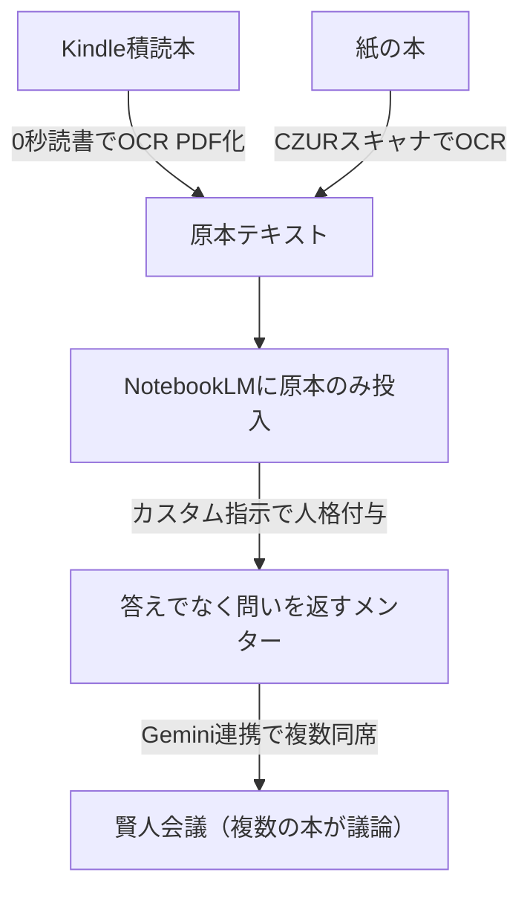

# NotebookLM「本をメンター化」メソッド

> **TL;DR**: 積読本の原本を丸ごとNotebookLMに入れ、カスタム指示で「答えでなく問いを返す人格」を与えて、いつでも相談できるメンターに変える読書術。複数の本を同席させれば「賢人会議」もできる。

読書が定着しない構造的な原因は、インプットしただけでは知識が血肉にならず、内容を「自分の言葉で言い換える・自分の状況に当てはめる・疑問をぶつける」壁打ちの相手がいないことにある。本をメンター化する狙いは、この壁打ち相手を本そのものに演じさせる点にある。「読み切ったか」でなく「必要なときに思想を引き出せるか」に本の価値を置き直すことで、積読を「未完了タスク」から「まだ面接していない候補者の列」に読み替える。これは[[tools/notebooklm-employees]]の「知識＋人格＝自律的に働く従業員」という等式を、部署の従業員でなく蔵書に適用した姉妹パターンにあたる。

作り方は3ステップに集約される。①本の**原本（全文）だけ**をNotebookLMに入れる。書評やまとめ記事を混ぜると本そのものの思想が薄まり壁打ち精度が落ちるため、原本一本を貫く。②原本が手に入らない絶版本などに限り、次善策として「ソースを探す（Fast Research）」で書評・講演・論争点・実践事例を3切り口で集めて擬似メンターを作る。③ノートの「カスタム指示」に人格プロンプトを貼り、本を「メンター」として降臨させる。

メンター人格の設計で肝になるのは**答えを教えさせないこと**。悩みに直接「こうすべき」と返させず、その本の具体的な概念名・章・エピソードをレンズにして「問い」を投げ返させる。答えをもらうだけならただの検索で、問いを返されるからこそ自分の中に気づきが生まれる、という設計思想になっている。優しく寄り添うモードと厳しく問い詰めるモードを、同じ1冊の中の別の思想を使ってテーマに応じて切り替えられる。

複数の本を降臨させれば「賢人会議」になる。Web版Geminiは複数のNotebookLMを同時接続できるため、別々に雇った本のメンターを1つの会議室に同席させ、各自が自分の本の思想だけを根拠に同じ悩みへ視点を述べ、進行役が対立点を浮かび上がらせて「次に考えるべき問い」を1つに絞る。これはNotebookLM単体では不可能で、複数視点で意思決定を支える[[concepts/llm-council]]をノーコードで実装する形になる。Geminiと連携する場合、人格プロンプトはカスタム指示だけでなく**ソースにも入れて二重化**しないと連携時に反映されない（[[tools/notebooklm-employees]]と同じ二重化の要点）。

## 取り込みツール（積読本を原本化する経路）

- **0秒読書**（Kindleなど電子書籍向け）: 画面を1ページずつ自動キャプチャし、文字情報つきPDFに変換する有料ソフト。1冊2〜3分でPDF化。DRM（コピーガード）で画面キャプチャ自体ができない本には使えない。
- **CZURブックスキャナ**（紙の本向け）: ページをめくるだけで自動スキャン＋OCR。約300ページ10分で全文データ化。
- 手持ちの形（電子か紙か）に合わせて選ぶ。

## 著作権の線引き（この用途固有の必須ルール）

自分で買った本を自分が使うためにPDF化・スキャンして自分のNotebookLMに入れるのは私的複製の範囲で問題ない。**絶対にやってはいけないのは、そのPDF・スキャンデータ・本を入れたNotebookLMを他人に共有・配布すること**（著作権侵害）。0秒読書で作ったPDFには作成者を特定できる情報が全ページに埋め込まれ、ネットに上げれば追跡される。社内マニュアルや自社資料の共有は問題ないが、書籍を入れたノートだけは共有しない、と明確に線を引く。

## 観察ログ（未検証）

- 2026-06-30 @ai_jitan: Kindleで眠っていた47冊の本をメンターとして雇っていると主張。以前の「NotebookLMに26人の従業員を雇う」記事（[[tools/notebooklm-employees]]）のメンター版と位置づける（X bookmark 3,041・impression 約80万・2026-07-01時点）
- 2026-06-30 @ai_jitan: 実演例として『嫌われる勇気』をメンター化し「課題の分離」の概念で問いを返す対話、『7つの習慣』『嫌われる勇気』『イシューからはじめよ』の3冊で賢人会議を開く例を提示（プロンプト全文を記事で公開）
- 2026-06-30 @ai_jitan: 毎回ノートを選ぶ手間を省く上級技として、GeminiのGem（カスタムAI）に本のNotebookLMを紐づけ「専属読書メンター」を常駐させる方法を提示
- 2026-06-30 @ai_jitan: 記事末尾で書籍『AI仕事最速大全 NotebookLM即戦力スキル』（2026-07-16発売）の予約特典セミナー・無料オプチャでのプロンプト集配布を告知（＝販促文脈）

## 問い

- 「答えでなく問いを返す」メンター人格は、[[concepts/output-first-learning]]の「読書をその場でエッセイに昇華して血肉化する」手法と組み合わせて、問い→自分の言語化→出力まで一気通貫できるか
- 原本全文を入れる方式は、書評ベースの[[tools/notebooklm-employees]]の職種knowledge注入より壁打ち精度が本当に高いか。原本一本の原則はどの本でも効くか
- 賢人会議での複数の本の同席は、単一AIに複数の思想を演じ分けさせるより本当に立体的な気づきが出るか（[[concepts/ai-persona-interview]]の独立収束と同型か）
- 自分のwiki運用に置き換えると、蔵書でなく`sources/`の蓄積を「問いを返すメンター」化して活用できるか

## 関連

- [[tools/notebooklm-employees]] — 同じ@ai_jitanによる「知識＋人格＝自律エージェント」の従業員版。本ページは同じ機構を蔵書（読書術）に適用した姉妹ページ。Gemini降臨・会議・人格の二重化は共通
- [[tools/notebooklm]] — NotebookLM全般の活用ガイド
- [[tools/notebooklm-studio-prompts]] — 同@ai_jitanのStudio 9機能の指示集。用途別に分かれた姉妹ページ群の一つ
- [[tools/notebooklm-business-workflows]] — NotebookLM業務時短9ワークフロー（どの業務に当てるか）
- [[concepts/llm-council]] — 複数AIが意思決定を支援するパターン（賢人会議の親概念）
- [[concepts/output-first-learning]] — 出力前提で読書を血肉化する学習法（読書術としての接続先）
- [[concepts/ai-persona-interview]] — 複数ペルソナの独立収束を実装シグナルにする手法（賢人会議の質を測る観点）
- [[concepts/ai-curriculum-builder]] — 本ページの書籍取り込みを、体系的カリキュラム＋学習者プロファイルへ発展させた方法論
