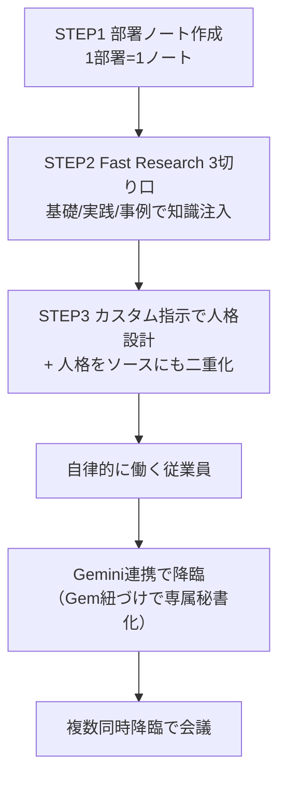

# NotebookLM「従業員」化メソッド

> **TL;DR**: NotebookLMに「知識＋人格」を仕込んで受け身の物知りを自律的に働く専門従業員に変え、Gemini連携でどこからでも呼び出し（降臨）、複数を同席させて会議までさせる運用法。

核心は「知識（何を知っているか）＋人格（何者として働くか）＝自律的に働く従業員」という等式にある。資料を入れただけのNotebookLMは聞かれたことに一般論で答える「物知りの倉庫」で止まる。そこに役割・口調・行動指針を与えると、同じ資料・同じAIでも「リスクを指摘し、対策を出し、次の一手を提案する部下」に変わる。差を生むのは知識の量ではなく人格を設計したかどうか、という点が出発点になる。

作り方は3ステップに集約される。①従業員1人につきノートを1つ作る（マーケと法務を混ぜると関連性が薄まり精度が落ちるため「1部署＝1ノート」を守る）。②NotebookLMの「ソースを探す」から使えるFast Researchを「基礎・原理／実践・手法／事例・最新動向」の3切り口で回し、分野を立体的にカバーする知識を注入する。③ノートごとの「カスタム指示」に役割・専門領域・口調・思考プロセス・行動指針・出力形式・逆質問のルールを書き込み、人格を設計する。

運用上の要点が2つある。1つ目は、カスタム指示はNotebookLM内でしか効かないため、同じ人格定義をテキストにして「ソース」にも入れて二重化すること。これで外部から呼び出しても人格が「ノートの中身そのもの」として残り、性格がブレない。2つ目は、自分（依頼者）の目標・価値観・判断基準・NG事項を全ノートに同じ内容でストックすること。方針を知った従業員は一般論でなく「この人ならこう判断するはず」という前提で先回りする。

NotebookLM単体はノートをまたげない弱点があるが、同じGoogleアカウントのGeminiと連携すると好きな従業員をどこからでも呼び出せる（降臨）。連携時はより高性能な最新モデルで処理され、NotebookLMの「正確にまとめる脳」とGeminiの「ゼロから作る脳」が掛け合わさる。さらにGeminiのGem（カスタムAI）にNotebookLMを紐づければ、開くだけで特定の従業員が待機する「専属秘書」になる。複数のノートブックを同時接続すれば、立場の違う担当者を1つの会議室に同席させ、各自が自分のノートの知識と人格で発言する「会議」を1回のプロンプトで開ける。これはNotebookLM単体では不可能で、複数視点で意思決定を支える[[concepts/llm-council]]や[[concepts/multi-agent-patterns]]をノーコードで実装する形になる。

## 観察ログ（未検証）

- 2026-06-26 @ai_jitan: NotebookLMの中に26人の従業員（経営戦略・マーケ・法務・カウンセラー等）を雇い、人件費ゼロで24時間働かせていると主張。全26人ぶんのFast Research 3切り口・人格カスタム指示・指示文例を記事で公開（X bookmark 7,532・impression 約165万・2026-06-28時点。記事末尾でプロンプト集を配る無料オプチャ誘導あり＝販促文脈）
- 2026-06-26 @ai_jitan: 「超優秀な従業員マスター指示」テンプレート（役割・専門領域の2か所穴埋め）、どのノートを繋いでも発動する「汎用Gemプロンプト」、5人を同席させる司会進行プロンプトを公開
- 2026-06-26 @ai_jitan: 社内規定・マニュアルをストックした「社内ヘルプデスク担当」で問い合わせ対応の月10時間削減例があると記述（伝聞・単一ソースの主張）
- 2026-06-26 @ai_jitan: 以前の「20人の専門家を雇う方法」記事の進化版で、当時の「5つのプロンプト」を「3切り口で十分」に更新したとしている

## 問い

- 「知識＋人格＝従業員」は[[concepts/claude-projects-blueprint]]の6パート設計図や[[concepts/llm-personality-injection]]と同型か。NotebookLM固有の効きは「ソース限定＋引用付き」の土台にあるか
- Gemini連携で人格がソース経由で保持される設計は、[[tools/notebooklm-py]]のCLI自動化と束ねて従業員の量産・更新を回せるか
- 「会議」での複数ペルソナ同席は、単一AIに多視点を演じさせるより本当に議論が深くなるか（[[concepts/ai-persona-interview]]の独立収束と比較）

## 関連

- [[tools/notebooklm-book-mentors]] — 同じ@ai_jitanによる「知識＋人格」の**メンター版**。同じ機構（Gemini降臨・会議・人格の二重化）を部署の従業員でなく蔵書（積読本）に適用した姉妹ページ
- [[tools/notebooklm]] — NotebookLM全般の活用ガイド。本ページは「従業員化」運用に特化した姉妹ページ
- [[tools/notebooklm-studio-prompts]] — 同じ@ai_jitanによるStudio 9機能の指示集。あちらが「生成機能をどう指示するか」、本ページが「ノート自体を人格化して働かせるか」
- [[tools/notebooklm-business-workflows]] — NotebookLM業務時短9ワークフロー（どの業務に当てるか）
- [[concepts/claude-projects-blueprint]] — Claude Projectsを「AI社員化」する6パート設計図。プラットフォーム違いの同型パターン
- [[concepts/llm-personality-injection]] — 性格モデルをプロンプトに組み込み振る舞いを変える手法（人格設計の一般形）
- [[concepts/llm-council]] — 複数AIが匿名ピアレビューで意思決定を支援するパターン（「会議」の親概念）
