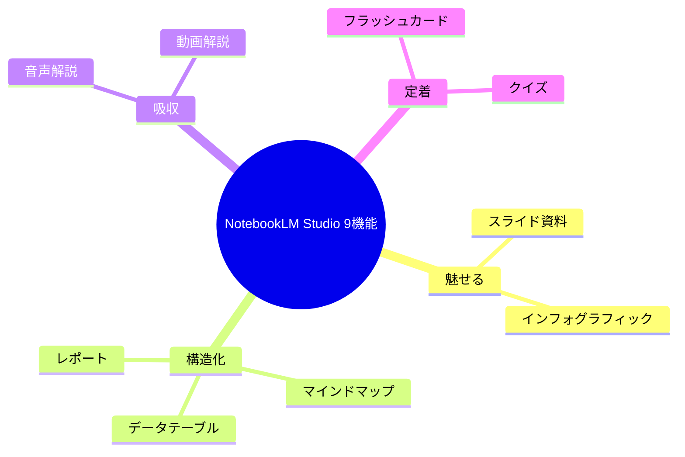

# NotebookLM Studio カスタム指示プロンプト集

> **TL;DR**: NotebookLM Studio の9生成機能すべてに「カスタム指示」が実装され、「誰向け・何のため・どんな構成・何を禁止」の4点を生成前に渡すと、誰が押しても同じ平均点出力が用途特化の成果物に変わる——効きの鍵は盛りグセを締める「禁則」の明示。

デフォルト生成の弱点は「誰がボタンを押してもほぼ同じものが出てくる」点にある。当たり障りのない平均点の出力は便利だが自分の仕事の文脈にハマらず、経営会議に出したいのに新人研修のような丁寧すぎるレポートが出る、といった微妙なズレが残る。このズレを手で直す作業を消すのがカスタム指示で、「誰向けに・何のために・どんな構成で・何を禁止するか」を生成前に渡しておくことで、AIは平均点ではなく意図した成果物を一発で出す。2026年のアップデートで最後まで残っていたマインドマップにもカスタム指示が乗り、全9機能で「情報の整理の仕方そのもの」までプロンプトで制御できるようになった。

## 全機能共通の設計：4点指定と禁則

すべての機能に共通する指示の骨格は次の4点を先に渡すこと。

1. **誰向けに**（想定読者：経営層／新人／SNS読者など）
2. **何のために**（意思決定を引き出す／学習させる／拡散させる）
3. **どんな構成で**（結論ファースト／Before→After／章立て）
4. **何を禁止するか**（禁則：曖昧表現・装飾過多・1スライド2メッセージなど）

最も効きが大きいのは4番目の**禁則**。AIは情報を盛りがちなので、禁止事項を1行入れるだけで出力が一気に締まる（例「1スライド1メッセージを厳守」「機能の羅列だけのスライドは禁止」）。

加えて、業務利用では2つのガードレールを習慣化する。

- **数値は元ソースと目視照合**: ビジュアルの見やすさと数値の正確性は別物で、図解生成の過程で数字がズレることがある。対外資料や提案書に使うなら表示数値を必ず自分の目で照合する。
- **機密情報の匿名化**: 業務資料を投入する前に社名は「A社」、金額は「数千万円規模」、個人名は「担当者X」のようにサンプル化する。カスタム指示で精度を上げても土台のセキュリティが崩れれば台無しになる。

## 機能別の指示パターン

### 魅せる：スライド資料・インフォグラフィック

- **スライド資料**は用途で型を切り替える。①意思決定スライド（結論→根拠データ→想定リスクと対策→推奨アクションの構成・断定トーン）②セミナー向け（背景は白・文字大きめ・章頭に「この章で分かること」）③ストーリー型（現状の課題→なぜ解決しないか→解決策→Before/After数値対比→次の一歩）。完成後は .pptx でダウンロードして自社テンプレへ流し込める。
- **インフォグラフィック**は①比較図（左右2分割・比較軸を縦・優劣を色分け・結論1行）②プロセスフロー図（左→右・ステップ5〜7に集約・つまずく所を赤枠）③SNS縦型（上部にビッグナンバー・根拠3点・最大3階層）。Nano Banana Pro 搭載で日本語表記精度が上がり、横型16:9と縦型9:16を選べる。

### 構造化：マインドマップ・データテーブル・レポート

- **マインドマップ**が今回の目玉。同じソースから目的別に違う構造を出せる。①論点俯瞰（中心に「問い」・第1階層は論点5つ以内・第2階層で事実と課題を分離）②意思決定の分岐ツリー（選択肢ごとにメリット/デメリット/前提・情報不足は「要確認」と明記させる）③学習ロードマップ（基礎→応用→実践の順序）。
- **データテーブル**は複数ソースを横断して指定列を抜き出す。①横断比較表（資料名・作成年・対象規模・結論・数値根拠の列＋矛盾には「※要確認」＋各セルに出典）②議事録からのタスク抽出（タスク・担当・期限・優先度・関連決定事項＋読み取れない情報は空欄で推測禁止）。Google Sheets に直接エクスポートできる。
- **レポート**は60点のドラフトを磨く前提。①経営会議用ブリーフィング（結論1段落→根拠3点→推奨アクション→想定反論と回答・1ページ）②社内FAQ（規定に無い事項は「資料内に見当たりません」と答えさせ推測禁止）③研修用学習ガイド（学ぶこと→前提補足→本編→理解度チェック→次に学ぶこと）。

### 吸収：音声解説・動画解説

- **音声解説**は2人のAIホストが対話形式で解説するポッドキャストを生成し、長いレポートを通勤時間で消化できる。①初心者向け（専門用語を避け業務に置き換えた例え話）②**批評モード**（提案資料の弱点・前提の甘さ・反論されそうな箇所を辛口で洗い出し、本番で突っ込まれる前に想定問答を作る）。批評モードはAIに敵対的視点を演じさせる用途で、自社の穴を事前に潰す手法と同型。
- **動画解説**はナレーション付きスライド動画を自動生成し、図表や数値が自動でビジュアル化される。①経営層向けエグゼクティブブリーフ（5分で意思決定）②社内研修用解説動画（手順を図解中心で）。

### 定着：フラッシュカード・クイズ

- **フラッシュカード**は①用語暗記（表＝用語・裏＝定義＋具体例・中核概念を優先）②試験/面接対策（表＝想定質問・裏＝30秒回答の骨子）。「説明」ボタンで根拠のソース原文まで表示される。
- **クイズ**は①理解度チェック（暗記でなく「理解していないと解けない」応用問題＋各選択肢の正誤解説）②研修の効果測定（実務で判断を誤りやすい点を問い、弱い分野をスコアで可視化）。共有リンクでチーム全体に配布できる。

## 観察ログ（未検証）

- 2026-06-21 @ai_jitan: 全機能（最後まで残っていたマインドマップ含む）にカスタム指示が乗ったことを「今回最大のニュース」とし、NotebookLM が「平均点を量産するツール」から「意図通りに動く実行マシン」へ進化したと評価。9機能を「音声解説・動画解説・マインドマップ・レポート・フラッシュカード・クイズ・インフォグラフィック・スライド資料・データテーブル」と列挙し、各機能2〜3型の実務プロンプトを全20種公開（X bookmark 472、2026-06-22時点。記事末尾でプロンプト600選を配る無料オプチャへの誘導あり＝販促文脈）
- 2026-06-21 @ai_jitan: カスタム指示を「思考のインストール」と呼称。自分の思想・上司の思考・社長の理念をストックした上で4点指定を渡すと、頭の中で描いていたアウトプットが一発で出ると主張（個人の実践知であり効果は未検証）

## 問い

- 4点指定（誰向け/何のため/構成/禁則）は [[concepts/chatgpt-custom-instructions]] や [[concepts/prompt-engineering]] の構成要素と同型か。NotebookLM 固有で効くのは「ソース限定＋引用付き」という土台があるからか
- 「批評モードで提案の穴を探す」音声解説は [[concepts/ai-red-teaming]] の敵対ペルソナと同じ効果を、生成ボタン1つで得られるか
- これらのカスタム指示を [[tools/notebooklm-py]] の CLI や [[tools/notebooklm-business-workflows]] の9ワークフローと束ねて、定型業務の生成を完全自動化できるか

## 関連

- [[tools/notebooklm]] — NotebookLM全般の活用ガイド（カスタムプロンプト・隠し機能10選）。本ページは Studio 9機能の指示パターンに特化した姉妹ページ
- [[tools/notebooklm-business-workflows]] — 同じ @ai_jitan による業務時短9ワークフロー。本ページが「各機能をどう指示するか」、あちらが「どの業務に当てるか」
- [[tools/notebooklm-employees]] — 同じ @ai_jitan による「従業員化」運用。本ページが生成機能の指示、あちらがノート自体を人格化して働かせる方法
- [[tools/notebooklm-py]] — NotebookLM非公式Python API/CLI（バッチ操作で投入を自動化）
- [[concepts/chatgpt-custom-instructions]] — カスタム指示の親概念（全チャット共通ルール・職種別テンプレート）
- [[concepts/prompt-engineering]] — 4点指定・禁則の指示設計の一般形
- [[concepts/ai-red-teaming]] — 「批評モード」で提案の穴を先に潰す手法の一般形
