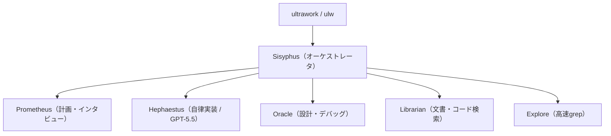

# oh-my-openagent

> **TL;DR**: OpenCode（と Codex CLI）に載せるオピニオネイテッドなエージェント基盤プラグイン。`ultrawork` 一語で複数エージェントと Team Mode が起動し「終わるまで止まらない」。作者 code-yeongyu（Sisyphus Labs）はマルチモデル前提で設計している。

このツールの主張の核心は「単一プロバイダに賭けない」という設計思想にある。作者 code-yeongyu は README 冒頭で「Claude Code は快適な牢獄だが牢獄だ（a nice prison, but still a prison）」「未来は勝者を1つ選ぶことでなく全部をオーケストレートすることだ」と述べ、Anthropic が自分たちのせいで OpenCode をブロックしたと主張する（[[tools/openclaw]] 開発者らの thdxr のポストを引用）。oh-my-openagent はその思想を、OpenCode 本体の上に「テスト済みで実際に出荷できたものだけを残した」配合物として実装したものだと位置づけている。ユーザーは設定を覚える必要はなく `ultrawork`（または `ulw`）と打つだけ、というのが売り文句。

## 2つのエディション

作者は同一プロダクトを2エディションで配布している。

- **Ultimate Edition（OpenCode 向け）** — フル版。11エージェント・54+ライフサイクルフック・5つの内蔵MCP・全スラッシュコマンド・Team Mode・ulw-loop・Hashline編集を含む。`bunx oh-my-openagent install` でインストール。
- **Light Edition（Codex CLI 向け）** — Codex のプラグインシステムに収まる可搬コンポーネント（`rules`・`comment-checker`・`git-bash`・`lsp`・`ultrawork`・`ulw-loop`・`start-work-continuation`・`telemetry`）とプラグインスコープのMCP。エージェントオーケストレーションと `team_*` ツールは含まず、そこは Codex CLI 自身の機構に任せる。`npx lazycodex-ai install` でインストール。

なお npm 公開パッケージ名は移行期のため `oh-my-opencode` と `oh-my-openagent` の二重公開で、`bunx omo` は**別人の無関係パッケージに解決されうる**ため使うなと作者が注意している。

## Discipline Agents とカテゴリルーティング

Ultimate 版のエージェントは各モデルの強みに合わせてチューニングされている、と作者は説明する。

- **Sisyphus**（`claude-opus-4-7` / `kimi-k2.6` / `glm-5.1`）— 主オーケストレータ。計画・委任・完遂を担い「途中で止まらない」。
- **Hephaestus**（`gpt-5.5`）— 自律的な深掘りワーカー。レシピでなくゴールを渡すと自分でコードベースを探索し end-to-end で実行する。
- **Prometheus**（`claude-opus-4-7` / `kimi-k2.6` / `glm-5.1`）— 戦略プランナー。インタビュー方式で1行もコードを書く前に詳細計画を作る。

Sisyphus がサブエージェントへ委任するときは**モデルでなくカテゴリ**（`visual-engineering` / `deep` / `quick` / `ultrabrain`）を指定し、ハーネスがカテゴリを適切なモデルへ自動マッピングする。作者いわく `ultrabrain` はデフォルトで GPT-5.5 xhigh にルーティングされる。この「エージェントは必要な仕事の種類を宣言し、ハーネスがモデルを選ぶ」構造は、[[concepts/llm-model-selection-strategy]] の工程別モデル選択を委任層に内蔵した形と言える。

## Team Mode（v4.0・opt-in）

「1体のエージェントは速い。協調したチームは壊滅的（devastating）」というのが Team Mode の主張。リードエージェントがカテゴリ特化したメンバーを最大8並列で走らせ、専用ツール（`team_create` / `team_send_message` / `team_task_create` / `team_status` …）でピアツーピア通信させ、tmux レイアウトで全メンバーの作業を同時に可視化する。これは [[concepts/multi-agent-patterns]] の Specialist Team / Orchestrator-Worker をプロダクトに実装した例にあたる。上に乗る2スキルが象徴的:

- **hyperplan** — 5体の敵対的エージェントが計画を直交する角度から引き裂く（[[concepts/ai-red-teaming]] の内製版）。
- **security-research** — 3体の脆弱性ハンター＋2体のPoCエンジニアが並列監査し、深刻度を「実際の悪用可能性」で較正する。

## Hashline（Hash-Anchored Edit）

作者は「エージェント失敗の多くはモデルのせいでなく編集ツールのせい」という Can Bölük「The Harness Problem」の主張を引き、oh-my-pi にインスパイアされて **Hashline** を実装したと述べる。エージェントが読む各行には `LINE#ID` 形式の内容ハッシュが付き（例: `22#XJ|   return "world";`）、編集はそのタグを参照して行う。前回読んだ後にファイルが変わっていればハッシュが一致せず、破損する前に編集が拒否される。空白の再現も stale-line エラーも起きない、というのが売り。これは [[concepts/harness-engineering]]（モデル＋ハーネス、編集ツールの信頼性）の具体的な打ち手にあたる。

## ポジショニングとメンテナンス体制

- **アンチ・ウォールドガーデン**: 「$200 払って2時間分の仕事をする必要はない。モデルは毎月安く・賢くなる。単一プロバイダが支配することはない」——開かれた市場に賭ける、と繰り返し主張する。
- **Ralph Loop / `ulw-loop`**: 100% 完了まで止まらない自己参照ループ（[[concepts/loop-engineering]] の実装）。Todo Enforcer がアイドルになったエージェントを引き戻す。
- **Building in Public**: メンテナは Jobdori という AI アシスタント（[[tools/openclaw]] の heavily customized fork 上で動く）でリポジトリをリアルタイム運用し、Discord で公開している。Sisyphus Labs は個人向け版 Dori を waitlist 提供中。
- **Claude Code 互換**: 既存の hook・command・skill・MCP・plugin がそのまま動くと謳う（[[tools/claude-code]]）。AmpCode と Claude Code から強く影響を受け「機能を移植し、しばしば改善した」とする。

## 観察ログ（未検証）

- 2026-07-09: 作者主張——Hashline 導入だけで Grok Code Fast 1 の編集成功率が **6.7% → 68.3%** に向上（単一ソースの数字、ベンチ詳細は README 非開示）。
- 2026-07-09: 作者主張——「Kimi K2.6 + GPT-5.5 だけで vanilla Claude Code を上回る。ゼロ設定」。比較根拠は未開示。
- 2026-07-09: 作者は「個人プロジェクトで LLM トークンに $24K 燃やして全ツールを試した末に OpenCode を選んだ」と述べ、本プラグインをその蒸留と位置づける（自己申告）。

## 問い

- `ultrawork` 一語で全エージェント起動という「オピニオネイテッドさ」は、[[concepts/skills-over-memory]] が説く「効くものだけ残す」設計と両立するか、それとも足しすぎの方向か。
- カテゴリルーティング（エージェントが種類を宣言→ハーネスがモデル選択）は自分の wiki ハーネスに移植価値があるか。[[concepts/llm-model-selection-strategy]] との差分は何か。
- 「マルチモデルで vanilla Claude Code を超える」は再現可能な主張か、宣伝か——検証するなら同一タスクで何を測るか。

## 関連

- [[tools/openclaw]] — メンテナAI Jobdori/Dori が OpenClaw の fork 上で動作。作者 Sisyphus Labs の運用基盤
- [[concepts/harness-engineering]] — Hashline / The Harness Problem（編集ツールの信頼性）の具体実装
- [[concepts/multi-agent-patterns]] — Team Mode（lead＋最大8並列member・ピアツーピア通信）＝Specialist Team の実装例
- [[concepts/loop-engineering]] — Ralph Loop / ulw-loop（完了まで止まらないループ）
- [[concepts/ai-red-teaming]] — hyperplan（5敵対エージェントが計画を攻撃）の思想
- [[concepts/llm-model-selection-strategy]] — カテゴリ→モデル自動マッピングの委任層内蔵版
- [[tools/openai-codex]] — Light Edition（lazycodex-ai）の載る先
- [[tools/claude-code]] — 互換対象かつ作者が「牢獄」と評する比較対象
- [[models/gpt-5-5]] — Hephaestus / ultrabrain のモデル
