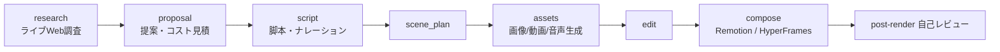

# OpenMontage

> **TL;DR**: AIコーディングアシスタント（Claude Code/Cursor/Codex等）をそのまま「動画制作スタジオ」に変える、オープンソースのエージェント型動画制作システム。リサーチ→脚本→素材生成→編集→合成までを複数のパイプラインで自動化する（AGPLv3）。

OpenMontageの設計思想は「コードのオーケストレーターを置かず、AIコーディングアシスタント自身をオーケストレーターにする」点にある。動画リクエストは常に「どのパイプラインを選ぶか」という選択問題として扱われ、エージェントはYAMLのパイプライン・マニフェスト（ステージ・ツール・レビュー基準・成功ゲート）を読み、各ステージのディレクター・スキル（Markdownの手順書）に従ってPythonツールを呼び、自己レビューと状態チェックポイントを挟みながら、創造的判断のたびに人間の承認を取る。Pythonは「ツールと永続化」だけを担い、創造的判断・レビュー基準・品質基準はすべて可読なYAML/Markdownに置かれて検査・改変できる。

知識は3層に分かれる。Layer 1（tools/＋pipeline_defs/）が「何が存在するか」、Layer 2（skills/）が「OpenMontage流のどう使うか」、Layer 3（.agents/skills/）が「各技術がどう動くか」の外部知識パックで、各ツールが依存するLayer 3スキルを宣言する。これは特定ベンダーに縛られない設計と組み合わさり、各能力がローカル/OSSとクラウドAPIの両方を持つため「手元にある鍵の分だけ動く」。

特徴的なのは「本物の映像（real footage）」を扱える点だ。多くの「無料AI動画」は静止画を動かすだけだが、OpenMontageはArchive.org・NASA・Wikimedia Commons等のフリー素材からCLIP検索可能なコーパスを構築し、実際のモーション素材を取得して意図的に編集する。APIキーゼロでもPiper TTS（オフライン音声）＋フリー素材＋Remotionで完結する。レンダリングは[[tools/remotion]]（React/データ駆動の説明動画向け・既定）と[[tools/hyperframes]]（HTML+GSAP/モーショングラフィックス向け）を提案時に選んで固定し（`render_runtime`）、無断のランタイム切替はガバナンス違反とされる。

品質はエンジニアリングとして強制される。プロバイダー選定は7次元（タスク適合・出力品質・制御・信頼性・コスト効率・レイテンシ・継続性）でスコアリングして監査可能な決定ログに残し、レンダー前のバリデーションでスライドショー化（静止画が大半の「動くPowerPoint」）を弾き、レンダー後はffprobe・フレーム抽出・音声レベル解析による自己レビューが通った場合のみ動画を提示する。予算もestimate→reserve→reconcileで管理され、デフォルト上限$10・1アクション$0.50超で承認を挟む。

## 検証済み事実

- 2026-06-28（公式README）: 12本の制作パイプライン（Animated Explainer / Cinematic / Documentary Montage / Clip Factory / Talking Head / Localization & Dub 等）を備え、動画生成14・画像生成10・TTS 4プロバイダーを横断する。ライセンスはGNU AGPLv3
- 2026-06-28（公式README）: 全パイプライン共通フローは `research -> proposal -> script -> scene_plan -> assets -> edit -> compose`。各ステージにディレクター・スキル（Markdown）が紐づく
- 2026-06-28（公式README）: Claude Code/Cursor/Copilot/Windsurf/Codex向けの指示ファイルを同梱し、いずれも共有の AGENT_GUIDE.md / PROJECT_CONTEXT.md を指す

## 観察ログ（未検証）

- 2026-06-27 @sharbel: 「今週もっとも急成長したGitHubリポジトリ」ランキング1位としてOpenMontageを紹介（+17.2K stars/週）。「世界初のオープンソース・エージェント型動画制作システム。12パイプライン・52ツール・500+スキル」と要約（二次まとめ、X bookmark 4,938・2026-06-28時点）
- 2026-06-28（公式README）: 「#1 Repository of the Day on GitHub Trending」を掲げる。ツール数は紹介文で「52」、Architecture節で「48 Python tools」と記述が揺れ、スキル数も「500+」「400+」と表記揺れがある
- 2026-06-28（公式README）: 制作例の自己申告コスト——「The Last Banana」（Pixar風60秒）$1.33、「The Library at Alexandria」（70秒）$0.02、「VOID」（製品広告）$0.69、「Candyland」（ジブリ風）$0.15（いずれも公開者の自己申告）

## 問い

- 「コードのオーケストレーター無し・AIアシスタント自身が司令塔」というagent-first設計は、自前のスキル/パイプライン運用にどこまで転用できるか
- レンダー層の[[tools/remotion]]/[[tools/hyperframes]]選択ロジック（render_runtime固定・無断切替禁止）は実運用でどの程度効くか
- real-footageコーパス（Archive.org/NASA/Wikimedia）のCLIP検索編集は、静止画アニメ化に対して品質でどれだけ優位か

## 関連

- [[tools/remotion]] — OpenMontageの既定レンダリングエンジン（React/データ駆動向け）
- [[tools/hyperframes]] — OpenMontageのもう一方のレンダラ（HTML+GSAP/モーショングラフィックス向け）
- [[business/youtube-shorts-jidouka-marketing]] — 動画量産マーケの文脈（OpenMontageはClip Factory等で同領域をカバー）
- [[concepts/agentic-coding]] — AIエージェントが自律実行する開発スタイル（agent-firstアーキの前提）
- [[tools/video-use]] — Claude Codeと会話して手持ち素材を編集するOSS（制作全工程を持つOpenMontageに対し編集特化）
