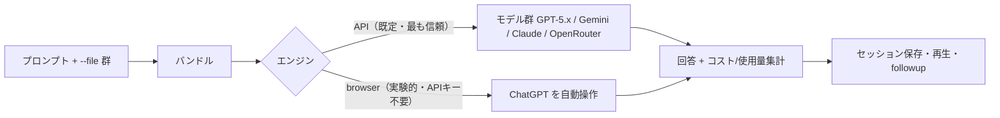

# oracle

> **TL;DR**: プロンプトと関連ファイルを一括りにして「別のAI」に文脈ごと渡し、セカンドオピニオンを得るCLI／MCPツール（steipete製）。既定はGPT-5.5 Pro、1回の実行で複数モデルへ同時に問うこともできる。

詰まったとき・バグ調査・レビュー時に、いま使っているエージェント（Codex / Claude Code / Cursor 等）から*別の上位AIに相談*するためのバンドラー。手元のプロンプトに `--file`（glob・`!`除外対応）で指定したファイル群を畳み込み、API かブラウザ自動操作で対象モデルへ送って回答を持ち帰る。単一モデルにも、複数モデルの諮問パネル（multi-model panel）にも投げられる。当初は「Codex から GPT-5.5 Pro を呼ぶツール」として紹介されたが、実体は呼び出し元を選ばない汎用の「別AI相談」レイヤーで、CLI・Codex skill・MCP の3経路で使える。

工程ごとにモデルを使い分ける [[concepts/llm-model-selection-strategy]]（上流＝大きいモデル／下流＝小さいモデルのサンドイッチ戦略）を、エージェントのワークフローに差し込む実装にあたる。日常の実装は手元のモデルで回し、「重い判断」だけ最上位モデルに投げる発想。複数モデルへ同時に問うパネルは、役割分担と匿名レビューで盲点を炙り出す [[concepts/llm-council]] を機械的な土台として支える（oracle はモデルを並べて回答を集約するところまでを担い、役割設計・匿名化はプロンプト側の設計に委ねる）。

## 検証済み事実

- 2026-06-23: 既定モデルは **GPT-5.5 Pro**。対応モデルは GPT-5.x 系（5.5 / 5.4 / 5.2 / 5.1 と各 Pro、5.1 Codex 等）・Gemini 3.1 Pro / 3.5 Flash / 3.1 Flash-Lite・[[models/gpt-5-5|Claude Sonnet 4.6]] ではなく Claude Sonnet 4.6 / Opus 4.1、加えて OpenRouter の任意 ID。`--models` で複数を並べ1回の実行で同時に問える（README）
- 2026-06-23: 2エンジン構成。**API**（最も信頼できる経路。`OPENAI_API_KEY` / `GEMINI_API_KEY` / `ANTHROPIC_API_KEY` を環境変数で要求）と **browser**（API キー不要で Chrome の ChatGPT を自動操作、experimental。macOS で安定、Linux/Windows も対応）。自動化が塞がれた場合は `--render` / `--copy` で組み立てたバンドルを手動ペーストできる（README）
- 2026-06-23: 連携は3系統 ——（1）CLI（`npm i -g @steipete/oracle` または Homebrew、Node 24+）、（2）Codex skill（同梱の `skills/oracle` を `~/.codex/skills/` へコピー）、（3）MCP サーバ（`oracle-mcp` stdio、Cursor や Claude Code から接続。`oracle bridge claude-config` で `.mcp.json` を生成可）（README）
- 2026-06-23: セッションは保存・再生でき（`oracle status` / `oracle session <id> --render`）、`--followup <sessionId|responseId>` で保存済み ChatGPT 会話や OpenAI/Azure の Responses API 実行を継続、親子系統をツリー表示する。高額な API 実行前に `oracle doctor --providers` / `--preflight` で到達性を確認、長時間の Pro 実行には `--browser-auto-reattach-*` の自動再接続を備える（README）

## 観察ログ（未検証）

- 2026-06-21: @ceo_tommy1 が「Codex から GPT-5.5 Pro に仕事させる方法が便利すぎて仕事が無限に捗る」「クオリティが上がりすぎてヤバい」と紹介（X bookmark 2,792 / 2026-06-23 時点）。容量カウントが別枠＝実質2倍という主張は伝聞で、README には明記がなく一次未確認（browser モードが API キーでなく ChatGPT サブスクの枠を使う点を指している可能性がある）

## 問い

- 「容量別枠で実質2倍」の正体は browser モード（ChatGPT サブスク枠を消費）か。API モードの消費枠とどう分離されるか一次確認したい
- multi-model パネルに [[concepts/llm-council]] の役割分担＋匿名レビューを重ねると、単純な複数回答集約より盲点検出が上がるか
- MCP 経由で Claude Code から oracle を常用すると、サブエージェントによるセカンドオピニオンと比べてコスト・質はどうか

## 関連

- [[tools/openai-codex]] — oracle の主要な呼び出し元のひとつ（Codex CLI・同梱 skill あり）
- [[models/gpt-5-5]] — oracle の既定モデル GPT-5.5 Pro の系列
- [[concepts/llm-model-selection-strategy]] — 工程分解型モデル選択（oracle はこれをエージェントに統合した実装）
- [[concepts/llm-council]] — 複数モデルへの諮問パネルに役割分担＋匿名レビューを与える意思決定パターン（oracle はその機械的土台）
- [[tools/claude-mcp]] — oracle は `oracle-mcp` で MCP サーバとして公開され、Cursor / Claude Code から接続できる
- [[tools/skill-cleaner]] — 同じ steipete 製の Codex/OpenClaw 向けツール
