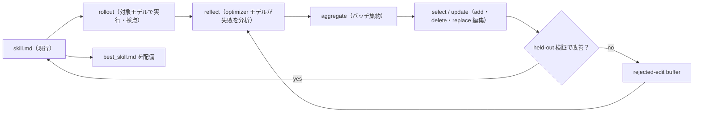

# SkillOpt（Microsoft）

> **TL;DR**: スキル文書（SKILL.md 相当）を「凍結したエージェントの学習可能パラメータ」とみなし、エポック・バッチ・学習率・検証ゲートというニューラルネット訓練の規律で、モデルの重みに触れずにスキルを最適化する Microsoft 製 OSS（MIT・`pip install skillopt`）。

Microsoft の開発チーム（論文筆頭は Yifan Yang ら）は README で、既存のスキルは手書き・強いLLMによる一発生成・緩く管理された自己改訂のいずれかで作られ、どれもフィードバックを受けて開始点より確実に良くなる性質を持たないと問題設定する。SkillOpt はここに最適化器の規律を持ち込む。対象モデルとは別の **optimizer モデル** が採点済みの実行結果（rollout）を読み、1つのスキル文書に対する上限付きの add / delete / replace 編集を提案する。論文準拠のデフォルト経路では、候補編集は **held-out 検証スコアを厳密に改善したときだけ採用** される。テキスト版の「学習率」（1回の編集量の予算）、却下した編集を覚えておくバッファ、エポック単位の slow / meta 更新が訓練を安定させる、とチームは説明する。

配備される成果物は `best_skill.md`（通常 300〜2,000 トークン）1枚だけで、変更していない対象モデルにそのまま読ませる。したがって推論時の追加モデル呼び出しはゼロ。これは [[tools/dspy]] や [[tools/hermes-agent-self-evolution]] の GEPA と同じ「プロンプトを最適化問題として解く」系譜にあり、最適化の単位をエージェントのスキルファイルに置いた点が特徴と考えられる。

## 訓練ループと構成要素

- **訓練ループ**: v0.1.0（2026-06-02）の時点で rollout → reflect → aggregate → select → update → evaluate の全工程を収録（README の記述順を図にした）
- **バックエンド**: チャット系（`openai_chat`・`claude_chat`・`qwen_chat`・`minimax_chat`・`copilot_chat`・`openai_compatible`）と実行系（`codex_exec`・`claude_code_exec`・`cursor_exec`・`copilot_exec`）。OpenAI Chat Completions 互換のプロバイダはまず `openai_compatible` を試すよう README が案内している
- **ベンチマーク**: `skillopt/envs/<name>/` パッケージ（アダプタ・データローダ・採点付き rollout・YAML 設定・任意の初期スキル）として追加する。最小の参考実装は `skillopt/envs/searchqa/`。組み込みは6種
- **WebUI**: Gradio 製の監視ダッシュボード（`python -m skillopt_webui.app`、既定ポート 7860）。既定のバインドが `0.0.0.0` で全インターフェースに公開されるため、手元専用なら `--host 127.0.0.1` を付けるよう README が注意している

## SkillOpt-Sleep（夜間のオフライン自己進化）

v0.2.0（2026-07-02）の目玉機能で、`skillopt-sleep` CLI として提供される。Claude Code / Codex / Copilot などローカルのコーディングエージェントの過去セッションを振り返り、繰り返し現れるタスクを再実行し、検証ゲートを通ったスキルだけを統合する。工程は harvest（収集）→ mine（採掘）→ replay（再実行）→ consolidate（統合）。同リリースのリポジトリ側には Claude Code・Codex・Copilot・Devin 向けの統合シェルと OpenClaw 向けの参考実装が入っている（プラグイン／MCP ファイルは PyPI の wheel に含まれずリポジトリにだけある）。

人の睡眠中の記憶整理になぞらえた設計は、[[tools/claude-managed-agents]] の Dreaming と同じ発想と考えられる。違いは、採用可否を held-out 検証スコアという機械的なゲートで決める点にある。

## 評価結果（チームの自己申告）

チームは README で次を主張している（詳細は arXiv 2605.23904）。

- 6ベンチマーク × 7対象モデル × 3実行ハーネス（直接チャット・Codex CLI・Claude Code CLI）の評価した全52セルで最良または同率最良
- GPT-5.5 のスキルなし平均正答率を、直接チャットで +23.5 ポイント、Codex のエージェントループ内で +24.8、Claude Code 内で +19.1 押し上げた
- 最適化済みスキルは追加の最適化なしで、モデル規模をまたいで、Codex と Claude Code のハーネス間で、近いベンチマークへ転移する

この「転移する」という主張は、GUI 軌跡から採掘したスキルは転移しなかったとする [[papers/2026-hao-skill-mining]] の負の結果と対照的である。違いは、採掘がデータの頻度に依存するのに対し、SkillOpt は検証スコアで編集を選別する点にあると考えられる。

## 採用状況

- 2026-06-03 に gbrain・gbrain-evals・darwin-skill が SkillOpt を統合したと README が告知
- 2026-07-24 に Microsoft Research の公式記事が公開され、VentureBeat・機械之心（Synced）・The Decoder などが報じた（README のニュース欄より）
- X では @RoundtableSpace が「性能を評価し、自分の指示を書き換え、ベンチマークに落ちた変更を捨て、最適化したスキルをモデル間で持ち運べる」と紹介した

## 観察ログ（未検証）

- 2026-09-28: 「全52セルで最良または同率最良」「GPT-5.5 で +19.1〜+24.8 ポイント」は開発チームの自己申告。第三者の再現は未収集

## 問い

- このvaultの `wiki-ingest` スキルは LESSONS.md 追記型の自己改善（[[concepts/self-refining-skills]]）で回しているが、採点可能な評価セットを作れば SkillOpt の検証ゲート型に載せ替えられるか。そもそも ingest の「良さ」を held-out スコアに落とせるか
- 検証ゲートを厳密改善に限ると、評価セットに現れない振る舞い（文体・安全側の配慮）を削る編集が通ってしまわないか
- [[papers/2026-li-skillsbench]] の「自己生成Skillは逆効果」という結果と、SkillOpt の「最適化スキルが大きく効く」という結果は、検証ゲートの有無で説明がつくのか

## 関連

- [[papers/2026-li-skillsbench]] — スキルあり/なしの対試験で効果を測るベンチマーク。「自己生成Skillは逆効果・compactが勝つ」に対し、SkillOpt は検証ゲート付きの自動改訂と 300〜2,000 トークンの compact な成果物で答えた形
- [[concepts/self-refining-skills]] — LESSONS.md 追記型の自己改善ループ。SkillOpt は同じ「スキルを育てる」目的を、採点と検証ゲートで機械化した版
- [[concepts/improver-skill-pattern]] — Warp の inner/outer スキル型。改善提案を人間が PR でレビューする点が、検証スコアで自動採否する SkillOpt との違い
- [[tools/dspy]] — プロンプトを最適化問題として扱う先行フレームワーク（COPRO/GEPA）。SkillOpt は最適化対象をスキル文書1枚に絞った
- [[tools/hermes-agent-self-evolution]] — DSPy+GEPA でスキルを自動進化させるリポ。同じ目的の別実装
- [[tools/claude-managed-agents]] — Dreaming（睡眠中の記憶整理）という同じ比喩を持つ機能。SkillOpt-Sleep と比較できる
- [[papers/2026-hao-skill-mining]] — 軌跡からのスキル採掘は転移しなかったという負の結果。SkillOpt の転移の主張と対照
