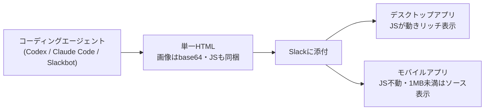

# SlackHTML（Slackに1枚のHTMLを添付してアプリ内で開く）

> **TL;DR**: Slackのメッセージに自己完結した1枚のHTMLファイルを添付すると、Slackアプリの中でそのまま展開されダッシュボード・プレゼン・ゲームまで見せられる。「SlackHTML」はこの使い方に@geeorgeyが付けた造語で、モバイルアプリで開くには「1MB超」「JavaScriptに依存しない」の2条件が要る。

Slackが機能として宣伝したものではなく、HTML添付の展開が「いつの間にか進化していた」ことに@geeorgey（リバネスナレッジ、Slack Community: Tokyo運営）が気づいて名付けたもの。HTMLを手で書くのではなくコーディングエージェントに書かせる前提で、@geeorgey自身はCodex派だがClaude Codeでも、さらにSlackbotでも作れると述べる。Slackbotに作らせる場合は調査からレポート生成まで全データがSlackの中に留まるため、@geeorgeyはセキュリティ面の安心を利点として挙げる。

## 作り方の制約（@geeorgeyのまとめ）

- **1枚のHTMLであること**が大前提。複数ファイルを含むzipやフォルダを添付しても展開されない
- 画像は外部URLでなく**base64にエンコードして埋め込む**
- JavaScriptも外部ファイルにせず**HTML内に埋め込む**
- **モバイルで開くには1MB以上**にする。1MB未満だとモバイルアプリではソースコードがそのまま表示される（2026年8月時点のSlackの仕様だと@geeorgeyは注記）。画像埋め込みで容量を超えさせる
- **モバイルではJavaScriptが動かない**。デスクトップアプリは動くのでリッチな表示ができるが、モバイルも対象なら「JSなしで全文と画像が読める」設計にする

## コピペ用プロンプトの骨子

@geeorgeyが記事に載せたプロンプトは、目的の記述に続けて次の4群の条件を並べる構成になっている。@geeorgey本人は「僕はそこまでやってないけど、もっと適当に書いても大丈夫」と付け加えている。

- **実装条件**: UTF-8の完全な単一HTML・スマホ優先レスポンシブ・コードスニペット扱いを避けるため最終サイズ1.2MB以上・容量調整はキービジュアル画像で・画像はdata URIを最初からsrc属性に直接書く（JSで後から設定しない）
- **JS非依存の設計**: 初期表示をJSに依存させない・fetch/localStorage/AudioContext/Canvas/Blob URL/外部ライブラリに依存しない・開閉はdetails/summary要素で・通常の縦スクロールで全文が読める・height:100%とoverflow:hiddenでページを固定しない
- **デザイン要件**: iPhone縦画面で読める文字サイズと余白・横スクロールを出さない・ダーク/ライト両対応・タップ領域44px以上・alt属性・外部フォント/CSS/画像を使わない
- **完成時の検証**: HTML単体で開ける・JS無効でも全文と画像が出る・base64が壊れていない・最終サイズが1,048,576バイトを超える・元ファイルを上書きせず別名で保存・保存先とサイズと画像数とJSなしで使える機能を報告

Slackbotに任せるときの指示は短く、@geeorgeyの例は「調査を行い、一枚のHTMLファイルでレポートを作ってください。画像が必要な場合はbase64エンコードしてHTMLに直接埋め込むこと。ファイルサイズは必ず1MB以上にすること」という一文で済ませている。Slackbotに提供が始まったDeep Researchと組み合わせれば、リサーチ業務からのレポート共有に効くだろうと@geeorgeyは見ている。

## 表現の事例（@geeorgeyが挙げたもの）

- ゲーム・ダッシュボード・プレゼンテーション形式の表示
- ファミコン風の音を出すHTML（デスクトップのみ、JSが必要）
- ChatGPT Work（Slack接続済み）で作ってそのままSlackへ投稿させたレポート。Claude Codeを使う人ならCoworkで同じことができる「はず」と@geeorgeyは推測している

## 観察ログ（未検証）

- 2026-09-03: 「モバイルアプリは1MB未満のHTMLをソースコード表示する」は@geeorgeyの2026年8月時点の単一観察。Slack側の仕様変更で解消・変化しうるので、使う前に手元で再確認する

## 問い

- このvaultのHTML出力（CSS/JSインライン・CDN参照なし）は既にSlackHTMLの単一ファイル条件を満たすが、たいてい1MB未満で収まる。Slackで見せるならbase64画像で嵩上げするか、デスクトップ限定で割り切るか
- 配布経路として[[tools/html-share]]（自前AWSの共有URL・承認導線つき）とSlack添付のどちらが自分の用途に合うか。チームがSlackに常駐しているなら添付の方が摩擦が小さいと考えられる
- [[tools/slack-bolt]]で組んだボットが生成HTMLを自動添付する経路（files.upload系API）は同じ制約で展開されるか

## 関連

- [[tools/html-share]] — 同じ「LLMの出力をHTMLで見せる」課題に、自前AWS上の一覧と期限付き共有URLで答えるツール。SlackHTMLはSlackへの添付そのものを配布経路にする
- [[concepts/html-output-format]] — HTMLをLLMの出力フォーマットにするAnthropicの設計思想。SlackHTMLはその出力の置き場所としてSlackを使う実践
- [[tools/claude-tag]] — Slackに常駐するClaude。「Slackbotに作らせる」発想と同型で、Claude TagにSlackHTMLを作らせられるかは未確認
