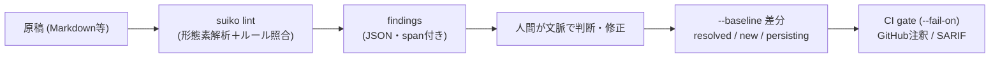

# suiko（推敲）

> **TL;DR**: 生成AIの日本語に出る翻訳調・均一なリズム・定型的な対比を、事前の指示でなく事後の機械検査で再現可能に指さすRust製CLI（nwiizo製・MIT）。検出は機械が担い、直すかどうかの判断は人間が文脈で行う分業設計。

作者のnwiizoは開発動機を「『この語を使うな』とrulesやSkillで縛っても、生成AIの出力は揺れるし、禁止語の回避と自然な日本語は別物だ。事前の指示ではなく事後の検査で弾きたい」と述べる。[[concepts/llm-japanese-style-hooks]]の@yugen_matuniが「書く前の注意」から「書いた後の機械検査」へ軸を移したのと同じ転換で、suikoはそれを正規表現＋Hookでなく、形態素解析（sudachi.rs）ベースのスタンドアローンCLIとして実装した。辞書はビルド時にSHA-256検証してバイナリへ埋め込むため、実行時のダウンロードやファイル参照が発生しない（バイナリは200MB台になる）。

主な機能は3サブコマンドに分かれる。

- **`lint`** — 禁止語・翻訳調・定型的な対比・リズム・段落構造・語彙・英語統語の疑いを検出。`essay` / `tech` / `business` のジャンル別閾値を持つ
- **`outline`** — 見出し・段落の先頭文・箇条書きを抽出して論旨を俯瞰
- **`terms`** — 略語・カタカナ複合語・固有名詞候補と初出時の説明手掛かりを抽出。`--audit` で複数ファイルの表記揺れ（サーバー/サーバ等）をSudachiDictの正規化表記でクラスタする

運用面ではCI組み込みが厚い。前回の `lint --json` 出力を `--baseline` に渡すと findings を `resolved` / `new` / `persisting` に分類し、`--fail-on warn` で終了コード2を返すseverity gate、GitHub ActionsのPR行注釈（`--format github`）、SARIF 2.1.0出力（`--format sarif`）に対応する。個々のfindingはUnicode scalar単位の `span` で対象箇所を一意に指す。

設計の線引きが抑制的な点も特徴で、READMEには「判断しないこと」が明記されている。機械的に安全と確認した縮約（「〜することができる」→「〜できる」等の2系統）だけに `suggestion` を付け、それも `preimage` が原文と一致する場合に限って適用できる契約で、suiko自身はファイルを書き換えない。読者別の難易度スコアは「正解ラベル付きコーパスで校正できるまで実装しません」とし観測値のみ提供する。比喩検出（`abstract_metaphor`）は比喩かどうかを断定せず `info` で指さすに留め、必要な用例は `.suiko.toml` の `allow` へ理由付きで記録させる。文末分類（断定/推量/疑問/体言止め）の連続数も「文章の良否を決める値ではなく、局所的なリズムを確認するための観測値」と位置付ける。単語照合でなく文書全体の集計で単調さを検出する発想は、@yugen_matuniの文末連続チェックと同型である。

執筆から収束までを扱うAgent Skillを同梱しており、バイナリ・crate・Skill名を `suiko` に統一している。

## 観察ログ（未検証）

- 2026-08-25: 形態素解析のsudachi.rsはcrates.io未公開のため、非公式再配布crate `suiko-sudachi`（v0.6.11そのまま・Apache-2.0）に依存。上流が公式公開した時点で乗り換えるとREADMEに明記（v0.3.3時点の状態で、後で変わりうる）

## 問い

- このvaultの出力（wikiページ・weekly・note原稿）の品質ゲートに組めるか。[[concepts/llm-japanese-style-hooks]]型のPostToolUse Hook常時検査とCI/セッション終了時ゲートのどちらに置くのが合うか
- @yugen_matuniの正規表現500本超（グッドパターン対付き）とsuikoの形態素解析ベース検出は、どこが重なりどこが補完か。suikoは検出のみで書き直し例を返さない分、エージェントに直させる用途では弱いか
- `abstract_metaphor` のような「断定せず指さすだけ」のfindingを、エージェントは適切に無視/採用できるか（全部直そうとして過剰修正しないか）

## 関連

- [[concepts/llm-japanese-style-hooks]] — 同じ「事前指示→事後検査」転換のHook運用版（正規表現500本超・グッドパターン対・止めずに直させる）。suikoは決定論的CLIとしてCI・エディタ側に置く実装
- [[tools/japanese-tech-writing]] — 規範を指示側（SKILL.md）に置くアプローチ。suikoは同種の規範を検査側に置き、判断を人間の文脈に残す
- [[tools/no-ai-slop]] — 英語圏の同種パターン検出。LLMスキルによる推敲に対し、suikoは形態素解析ベースの再現可能な診断
