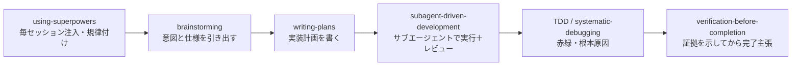

# Superpowers（obra）

> **TL;DR**: Jesse Vincent（obra）製のコーディングエージェント向け「開発方法論をスキル化した」コアスキルライブラリ。毎セッション注入される小さなブートストラップ（using-superpowers）が「作業前に必ず該当スキルを呼べ」と規律を課し、14スキルが説明文（description）で自動トリガーする。

Superpowersは単なるスキル詰め合わせではなく、**合成可能なスキル群＋それを必ず使わせる初期指示**で「完全なソフトウェア開発方法論」をエージェントに与える設計になっている（README の自己説明）。作者は Jesse Vincent（GitHubハンドル obra、jesse@fsck.com）、ライセンスはMIT、リポジトリは github.com/obra/superpowers。商用サポートやマネージド支出は Prime Radiant（primeradiant.com）が提供しており、コミュニティ運営の専任採用も出している——OSSだが背後に事業体がある。**このvaultも Superpowers を導入済みで、SessionStart で using-superpowers ブートストラップが注入されて動いている**（本ページ執筆時点のセッションがまさにその状態）。

このリポは既存 [[concepts/claude-skills]] が扱う「スキルとは何か（永続的職務定義・自動ロード）」の具体・大規模な実装例にあたり、[[tools/matt-pocock-skills]] や [[tools/gstack]] と並ぶ「学ぶ価値のあるOSSスキルライブラリ」の筆頭格として外部でも名指しされる（後述）。

## 仕組み：ブートストラップ＋自動トリガー

コアは `using-superpowers` スキルで、これが**毎セッションの冒頭に注入される**。「作業（質問への回答・コードベース探索・ファイル確認を含む）の前に、1%でも関連しうるスキルがあれば必ず呼べ」という規律を課し、rationalization（「これは単純な質問だから」等）を封じる赤旗テーブルを持つ。他の13スキルは各自の description（例：brainstorming＝「創作の前に必ず使え」）で**自動的にトリガー**するため、ユーザーが明示的に呼ばなくても発火する。

毎セッション注入される性質上そのトークン費用は常時発生するため、直近のv6.1.0では using-superpowers ブートストラップと参照ファイルを「振る舞いを変える内容を落とさずに」圧縮する作業が入っている（graphvizのスキルフロー図を散文に置換、プラットフォーム別解説の削除など）。挙動でなくコストを削るリリースで、方針として [[concepts/skills-over-memory]]（短く保ち決定を変える行だけ残す）と同じ思想が読み取れる。

Superpowersはマルチハーネス対応で、Claude Code・Antigravity・Codex（App/CLI）・Cursor・Factory Droid・GitHub Copilot CLI・Kimi Code・OpenCode・Pi それぞれに別々にインストールする。v6.1.xのリリースノートはCodexのSessionStackフック二重登録の修正など、ハーネスごとのフック挙動の作り込みに紙幅を割いている。

## 収録スキル（v6.1.1・14本）

- **規律・完了基準**: `using-superpowers`（毎セッション注入の入口・スキル呼び出しを強制）／`verification-before-completion`（完了・修正・合格を主張する前に検証コマンドを実行し出力で裏を取る＝主張の前に必ず証拠）
- **設計・計画**: `brainstorming`（実装前に意図・要件・設計を探る）／`writing-plans`（仕様から多段タスクの実装計画を書く）／`writing-skills`（スキルの作成・編集・検証）
- **実行**: `executing-plans`（レビューチェックポイント付きで別セッションの計画を実行）／`subagent-driven-development`（独立タスクをサブエージェントで回す）／`dispatching-parallel-agents`（2つ以上の独立タスクを並列化）／`using-git-worktrees`（作業を隔離するworktree確保）
- **品質・統合**: `test-driven-development`（実装前にテスト＝赤緑）／`systematic-debugging`（バグ・失敗の原因を修正提案前に体系的に特定）／`requesting-code-review`／`receiving-code-review`（レビューを鵜呑みにせず技術的に検証してから取り込む）／`finishing-a-development-branch`（merge/PR/整理の完了判断）

方法論としての流れは、brainstorming で仕様を引き出す → 読める粒度に区切って設計を承認させる → 「判断力のない junior engineer でも follow できる」実装計画を書く → subagent-driven-development でタスクを回しレビューしながら前進、という一本道（README）。TDD・YAGNI・DRYを強調し、計画が固まれば数時間の自律作業も珍しくない、と作者は説明する。

## 外部からの評価（裏付け）

@LinearUncle（2026-07-06）は「ソフトウェア開発はskill時代に入った」とし、Matt Pocock skills・superpowers・oh-my-opencode・gstack・lazycodex を「天才たちのskills＝深く学ぶ価値のあるライブラリ」と名指しした。要点は、これらを読んで**改造して自分用にする**のが学びであり、"ppt skills"（体裁だけのスキル）に注意を浪費するな、という選別の姿勢。superpowersはその筆頭格として挙げられている（個人ポスト・tier 3・詳細は語られていないため名指しの事実のみ記録）。

## 問い

- 毎セッション注入のブートストラップ方式は、このwikiのCLAUDE.md役割ルーター（必要な役割だけ参照させる）と設計思想が競合しないか——「常時注入」と「オンデマンド参照」の使い分けの境界はどこか
- 14スキルの自動トリガー（description依存）は、スキル数が増えたときの誤発火・トークン費用とどうトレードオフするか（[[concepts/agent-skill-management-system]] の管理問題と接続）
- oh-my-opencode / lazycodex（未文書化）は superpowers と何が違い、取り込む価値があるか

## 関連

- [[concepts/claude-skills]] — スキルの概念（永続的職務定義・自動ロード）。本ページはその大規模な実装例
- [[concepts/skill-building-best-practices]] — スキルの作り方の指針（description＝トリガー定義・progressive disclosure）。writing-skills が体現する側
- [[concepts/skills-over-memory]] — 短く保ち決定を変える行だけ残す。using-superpowers圧縮リリースと同じ思想
- [[tools/matt-pocock-skills]] — @LinearUncleが並べて挙げた実践的スキルコレクション
- [[tools/gstack]] — 同じく並べて挙げられたAIソフトウェアファクトリー（Garry Tan製）
- [[tools/claude-code-plugins]] — Claude Code公式マーケットプレイス（Superpowersもここから配信）
- [[concepts/self-refining-skills]] — スキルに自己改善ループを組み込む発展パターン
