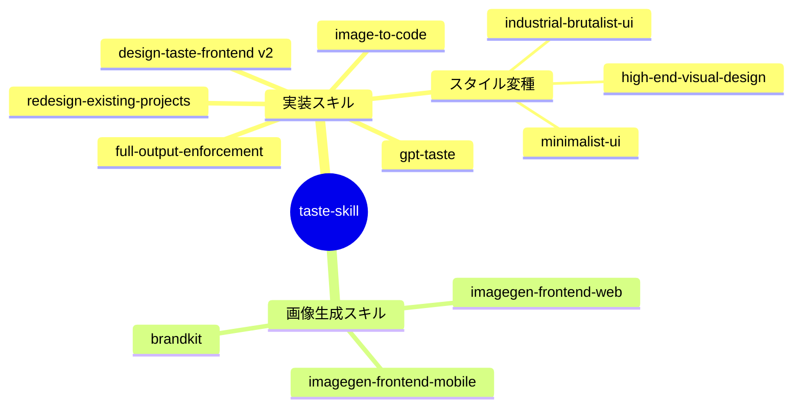

# Taste Skill（anti-slop フロントエンドスキル集）

> **TL;DR**: AIエージェントが作るフロントエンドの「slop」（ボイラープレート的な没個性UI）を、レイアウト・タイポグラフィ・モーション・余白の強化で防ぐことに特化したAgent Skills集。コードを出す実装スキルと、参照画像だけを出す画像生成スキルの二系統を持つ（Leonxlnx製・MIT）。

作者 Leonxlnx が公開し、`npx skills add https://github.com/Leonxlnx/taste-skill` で Codex・Cursor・Claude Code に導入する（vercel-labs の agent-skills CLI 仕様互換をREADMEが明記）。デフォルトの taste-skill（インストール名 `design-taste-frontend`）は v2（experimental）で、READMEによれば、ブリーフを読んでデザイン言語を推論し、ファイル冒頭に置かれた3つのダイヤル——**DESIGN_VARIANCE**（レイアウトの実験度）・**MOTION_INTENSITY**（アニメーション深度）・**VISUAL_DENSITY**（1ビューポートの情報密度）——を1〜10で調整して出力を振る設計。em-dashの使用禁止（hard ban）・GSAPの正準コードスケルトン・redesign-audit プロトコル・出荷前チェックを含む。v1は挙動依存プロジェクト向けに `design-taste-frontend-v1` として温存されている。

スキルは「1スキル1ジョブ」で分割される。コードを出力する実装スキル側には、GPT/Codex向けに規律を強めた `gpt-taste`、既存プロジェクトのUIを監査してから直す `redesign-existing-projects`、視覚方向が決まっているときに足すスタイル変種（`high-end-visual-design`＝静かで上質・`minimalist-ui`＝Notion/Linear風・`industrial-brutalist-ui`＝Swiss type の機械的言語）、途中で出力を切り上げるモデルに完全出力を強制する `full-output-enforcement` がある。`image-to-code` は「参照画像を生成→分析→フロントエンド実装」のパイプラインを1スキルで通す。画像生成スキル系統（web comps・モバイルフロー・ブランドキットボード）はコードを出さず参照画像のみを作り、ChatGPT Images 等で生成したフレームを Codex・Cursor・Claude Code に渡す前段として使う。

問題意識は [[tools/emil-kowalski-skills]] の「Agents don't have taste」と同型だが、あちらが著者の原則の蒸留（WWDC 17原則等）を渡すのに対し、taste-skill はダイヤルによる調整幅とスタイル別・モデル別の変種分割で対応する点が異なると考えられる。Kimi（Moonshot AI）ほか複数スポンサーが付き、専用サイト tasteskill.dev と changelog を持つ商業運営色のある個人OSS。

## 問い

- 3ダイヤルの数値調整と、[[design/claude-premium-website-build]] のような品質チェックリスト型では、どちらが出力の安定に効くか
- v2はexperimentalで積極的に書き換え中と作者が明記。v1固定とv2追従のどちらで運用すべきか
- [[tools/emil-kowalski-skills]]（原則蒸留）との併用は衝突しないか

## 関連

- [[tools/agent-skills-by-role]] — PRODUCT DESIGNER枠で本リポを含む役割別6選
- [[tools/emil-kowalski-skills]] — 同じ「agents don't have taste」問題意識のデザインエンジニア版スキル集
- [[tools/ui-skills]] — 同ジャンルのUI品質スキルカタログ（[[tools/ui-ux-pro-max]] / impeccable 掲載）
- [[tools/ui-ux-pro-max]] — 同じ6選のPRODUCT DESIGNER枠・構造化データベース内蔵型の対照アプローチ
