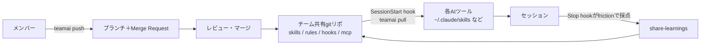

# TeamAI CLI

> **TL;DR**: チームのスキル・ルール・hooks・MCP・知識を1つのgitリポジトリに集め、push→Merge Requestレビュー→pullの流れで Claude Code / Codex / Cursor など10種のエージェントへ配る Tencent 製OSS CLI（MIT・npm `teamai-cli`）。

個人が各自のAIツールにスキルやルールを溜めても、隣の人のツールには何も届かない。TeamAIはその配送をgitのレビューフローに載せ、さらに「セッションで起きた学びを同じリポジトリへ書き戻す」ところまでを1つのCLIに束ねる。リポジトリのREADMEは製品を **Team Execution（全エージェントをチームのやり方で動かす）／ Team Context（全エージェントにチームを理解させる）／ Team Improvement（全実行がチームを賢くする）** の3層で説明している。

## 導入とスコープ

管理者（または個人利用者）が共有リポジトリをgitホスト上に作ってメンバーに書き込み権限を与え、`teamai init <リポジトリURL>` を実行する。メンバー側は**プロジェクトスコープ**（既定・リソースはプロジェクト配下に入る）と**ユーザースコープ**（`--scope user`・`~/` 配下に入る）を選べる。初期化後は各AIセッションが自動で最新のスキル／ルールを取りに行く。gitホストは GitHub・GitLab・GitCode・CNB・TGit・プライベートGitサービスに対応し、チームリポジトリがない場合は teamai-hub org のテンプレートから始める導線が用意されている。

## Team Execution — 設定の配送層

`teamai push` はローカルのリソースをブランチに載せてMerge Requestを開き、レビューを経てマージされる。同じリソースについて未マージのPRが残っている場合、再度pushしても新しいPRを作らずそのPRを更新する。マージ後は `teamai pull`（SessionStart hookで自動起動）が `~/.claude/skills/`・`~/.codex/skills/`・`~/.cursor/skills/`・`~/.codebuddy/skills/` などへ同期する。プロジェクトスコープではSessionStartがそのツールのプロジェクトルート（例: `<project>/.claude`）を必要なら先に作ってから取り込む一方、単体の `teamai pull` はディレクトリを勝手に作らない、とREADMEは明記している。

配布側の絞り込みは3つある。**roles**（役割→namespaceの対応を定義し、各メンバーは自分の役割のスキルだけ同期する）、**tags**（スキル／ルールにタグを付けメンバーが必要なタグだけ購読する）、**sources**（他チームの公開リポや自組織の共有リポを追加購読し、pull時に一緒に同期する）。

hooks と MCP は宣言ファイルで持つ。`hooks/hooks.yaml` にイベント（例: PreToolUse）・matcher・コマンド・対象ツールを書けば、pullが各AIツールへ配送する（READMEの例はコミット前にシークレットを走査する `block-secret`）。`mcp/mcp.yaml` に一度サーバーを宣言すれば、pullが各ツールのネイティブ設定を書き出し、秘密情報は `${VAR}` で参照する。npmパッケージと Claude Code プラグインも宣言・復元の対象で、`teamai packages` で一括インストールできる。

対応エージェントはREADMEの表で13機能×10ツールとして示されている。Claude Code・Codex・Cursor・CodeBuddy・Qoder は全機能に対応、WorkBuddy は agents のみ非対応、OpenCode は Team Improvement の3機能（usage/sessions/dashboard）が非対応、OpenClaw・Hermes・DeepSeek Harness は配送側が skills 中心で Improvement 側を持たない。

## Team Context — frictionで拾い、グラフで引く

**経験の自動共有**が特徴的である。セッション終了時にStop hookがそのセッションを **friction**（AIを中断した・訂正した・ツール呼び出しを拒否した・AIがツールの失敗をリトライした）で採点する。ツール呼び出しが多いだけの平穏なセッションは発火せず、実際に問題と格闘したセッションだけが閾値を超える。超えると「このセッションは記録に値する問題を含むかもしれない」というヒントが出て、`/teamai-share-learnings` スキルがセッションを要約してチームリポジトリへ学習ドキュメントを push する。ヒントはトリガーとなった非ゼロのfriction信号を名指しし、取得できれば最初のタスクの1行要約（伏字処理済み）を添える。1セッションにつき最多1回。`sharing.contributeHint.enabled: false` でヒントだけ切れる。

**Team Knowledge Recall** は既定オフで、`teamai recall enable` で有効化するとpullが `teamai-recall` サブエージェントを各ツールの `agents/` に配備する。タスク前にAIがこれを呼び、サブエージェントがキーワード抽出→検索→該当ソースファイル読み込み→構造化サマリ返却を行う。呼び出しの前に関連性のプレチェック（`teamai recall --check`）が走り、チーム知識と無関係なタスクでは検索自体を飛ばす。検索は BM25 とグラフブーストの併用で、`teamai recall "port conflict"` のように手動でも叩ける。

グラフ側は `teamai import` がソースリポジトリを解析して `teamwiki/` 配下に構造化グラフ（コンポーネント・インターフェース・設定・リポジトリ横断のimportエッジ）を作る。エッジの抽出は2トラックが同時に走り、重なった箇所はAST側が優先される。**ASTトラック**は WASM 版 tree-sitter で TypeScript/JavaScript・Python・Go の `import`／`require`・呼び出し箇所・TSの `implements` を解決して `DEPENDS_ON` / `REFERENCES` / `IMPLEMENTS` エッジを confidence 付きで引き、**ヒューリスティックトラック**は正規表現でJava/Rustを含む全言語を拾う。WASMパーサは純JavaScript依存で追加のネイティブツールチェーンを要求せず、読み込みに失敗すればヒューリスティックのみへフォールバックして `AST_UNAVAILABLE` のギャップを記録する（`TEAMAI_SKIP_AST=1` で強制)。recallの結果がコードベース由来のページから来た場合は `Sources:` 行に該当ソースファイルのパスが並び、エージェントはリポジトリを探索し直さずに着手できる。

検索の単位をチャンクからエンティティと関係へ移す方向は [[concepts/context-graph-retrieval]] の9ステップと重なるが、TeamAIはトリプル抽出をLLMに任せず構文解析と正規表現で作る点が違う。

## Team Improvement — 使われ方を測る

`teamai digest` が週次のチームダイジェスト（トークン使用量・会話量・介入率）を出し、`teamai session save` がプライバシー除去済みのセッション要約（ツール列・プロンプトのターン数・介入回数）を残してダイジェストのSession Highlightsを支える。`teamai dashboard` はメンバーのコーディングセッションの状況・介入回数・トークン使用量をWebで表示し、その中の **KB Health** ページが知識ベースの健康状態（種類別カバレッジ・よく引かれた項目・一度も引かれない「沈黙した」項目・recallの推移・著者別の貢献・保守コンソール）を報告する。

知識ベースの手入れにもコマンドがある。`teamai recall promote` は確信度の高いlearningを正式な知識（skills/rules/docs）へ昇格させ、`teamai recall maintenance` は確信度の低いlearningの剪定・確信度の書き戻し・陳腐化した項目のフラグ付けを行う。CI側では `teamai ci extract-mr --url <url>` がMRから知識を抽出してコメントし、マージ後に書き込む。

「訂正や学びを個人のチャットに閉じ込めず共有知へ書き戻す」という発想は [[concepts/correction-routing]] の6分類と同じ問題を扱っているが、TeamAIは分類を人に選ばせる代わりに **friction スコアで書き戻す機会を検出し、昇格と剪定をコマンド化した**形になっていると読める。

なお日本語圏では @voidwarriorchan が2026-09-07に「これは絶対掘る」とリンクだけを添えてこのリポジトリを紹介している。

## 問い

- frictionスコア（中断・訂正・拒否・リトライ）は「学びが起きたセッション」の代理指標として妥当か。このvaultがLESSONS.mdへの追記条件にしている「カテゴリ判定に迷った／粒度判定をした」とどちらが取りこぼしを減らせるか
- recallを既定オフにしてタスク前にプレチェックを挟む設計は、常時読み込みでコンテキストを埋めない代わりに取りこぼしを許す。プレチェックの誤判定率を測る手段はあるか
- KB Healthの「沈黙した項目」（一度も引かれない知識）はこのwikiの孤立ページ検出と同じ指標である。`validate_wiki.py` に「参照されたことがない」の軸を足す価値はあるか
- 1人運用でpush→MR→pullの配送層はどこから割に合うか。共有相手が自分だけなら、リポジトリ直参照とsymlink配布との差はレビュー工程の有無だけになる

## 関連

- [[tools/cloudflare-os]] — 共有スキルと組織の文脈を全社に配る社内AIプラットフォーム。あちらは実行環境（ワークスペース・ランタイム・認可）ごと配る、こちらは既存の各AIツールへ設定を配る層に徹する
- [[concepts/correction-routing]] — 訂正・学びを共有知へ書き戻すループの設計論。TeamAIのfriction採点＋share-learnings＋recall promote／maintenanceはその機械化にあたる
- [[concepts/context-graph-retrieval]] — 検索をチャンクからグラフの経路へ移す9ステップ。`teamai import` のASTエッジ＋graph-boostリランキングは同じ方向を構文解析で実装している
