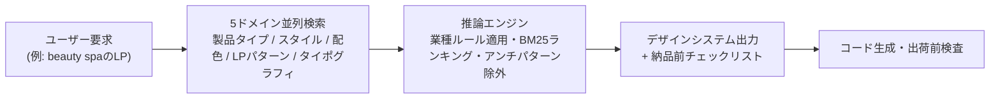

# UI UX Pro Max（デザイン知能Agent Skill）

> **TL;DR**: 79の検索可能UIスタイル・192配色・74フォントペア・192業種別推論ルールを内蔵データベースとして持ち、「beauty spaのLPを作って」という要求から完全なデザインシステム（構成パターン+配色+タイポグラフィ+アンチパターン+納品前チェックリスト）を生成するAgent Skill（nextlevelbuilder製・MIT・AIアシスタント20種超対応）。

AI製UIの凡庸さ対策として、[[tools/taste-skill]] のように原則や調整ダイヤルをプロンプトで渡すのではなく、業種×スタイル×配色の対応関係を構造化データ（CSVデータベース）として持たせ、都度検索させる型のアプローチ。READMEによれば、v2.0の中核は **Design System Generator** で、要求文から5ドメイン（192製品タイプ・79 UIスタイル・192配色・34ランディングページパターン・74フォントペア）を並列検索し、推論エンジンが業種別ルールとアンチパターンを適用して完全なデザインシステムを出力する。アンチパターンは業種に紐づく点が特徴で、たとえば銀行・金融には「AI紫/ピンクグラデーション」を禁止項目として返す（凡庸なAI生成UIの象徴とされる配色）。ランキングにはBM25（キーワード検索のスコアリングアルゴリズム）を使い、検索スクリプトはPython 3標準ライブラリのみで動きネットワーク呼び出しをしない。

生成結果には納品前チェックリストが付く（絵文字をアイコンに使わずSVGを使う・クリック要素にcursor-pointer・テキストコントラスト4.5:1以上・キーボードフォーカス可視・prefers-reduced-motion尊重・375/768/1024/1440pxのレスポンシブ確認など）。スタイル分類は79件のうち50がactive・29が補足・9が非推奨という状態管理を持ち、READMEは各スタイルの出自メタデータを `styles.csv` で公開している。

## データ資産と対応範囲

READMEが列挙する内蔵データ（転記）: 79 UIスタイル（Glassmorphism・Claymorphism・Brutalism・Bento Grid等）・192配色（192製品タイプと1:1対応）・74フォントペア（Google Fontsインポート付き）・25チャートタイプ・119 UXガイドライン・192業種別推論ルール。対応スタックは22種で、Web（React/Next.js/Vue/Svelte/Astro/HTML+Tailwind/shadcn-ui等）からデスクトップ（WPF/JavaFX等）・モバイル（SwiftUI/Jetpack Compose/React Native/Flutter）まで、スタック名を伝えるとスタック固有ガイドラインを返す。

## 導入と運用

- Claude Codeへは `/plugin marketplace add nextlevelbuilder/ui-ux-pro-max-skill` からの2コマンドで導入。他アシスタントへはnpmパッケージ `ui-ux-pro-max-cli` の `uipro init --ai <platform>` で、Cursor・Windsurf・Codex CLI・Gemini CLI・Copilot等20種超に同一データを配布する（プラットフォーム別ファイルはテンプレートからCLIが動的生成）
- **Master + Overridesパターン**: `--design-system --persist` で `design-system/MASTER.md`（全体の正）とページ別上書きファイル `pages/*.md` に保存し、セッションを跨いで「ページ別ファイルがあれば優先・なければMASTER」の階層参照をさせる
- OSS版（MIT）に対しPremium版はブランドアイデンティティ・ロゴ・画像生成統合・エンタープライズ設計トークンを担う、とnextlevelbuilderが説明している（自社サイトへの誘導含み）

[[design/claude-premium-website-build]] のワークフローのステップ2でAnthropic製frontend-designスキルと併用される「コミュニティ製 UI/UX Pro Max」は、名称と機能記述（多数のUIスタイル・配色・フォントペアのオンデマンド呼び出し）が本リポジトリのREADMEと一致するため、同一のものと考えられる。[[tools/agent-skills-by-role]] の役割別6選ではPRODUCT DESIGNER枠として [[tools/taste-skill]] と並んで挙げられている。

## 問い

- 大規模データ内蔵型（本スキル）・ダイヤル調整型（[[tools/taste-skill]]）・仕様md参照型（[[design/design-md]]）のどれがAI製UIの凡庸さ回避に効くか、同一ブリーフで比較できるか
- frontend-designとの併用（[[design/claude-premium-website-build]]の前提）で両者の推奨が衝突したとき、どちらが勝つのか

## 関連

- [[tools/agent-skills-by-role]] — PRODUCT DESIGNER枠で本リポを挙げる役割別6選
- [[design/claude-premium-website-build]] — frontend-designと本スキルを併用する制作ワークフロー
- [[tools/taste-skill]] — 同じ6選に並ぶanti-slopスキル集（ダイヤル調整型の対照アプローチ）
- [[tools/ui-skills]] — 本スキルを掲載するUI品質スキルカタログ
