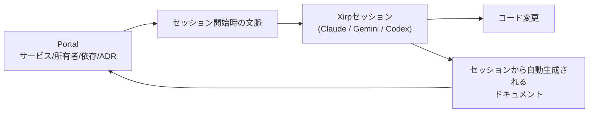

# Xirp（Spotify）

> **TL;DR**: Spotifyが社内で使い込んだうえで外部ベータを開いたエージェント開発環境。開発者ポータルPortalと接続し、サービスの所有者・依存関係・アーキテクチャ決定を毎セッションのコンテキストに載せることで、エージェントに「今いじっているコードが属するシステム」を知らせる。

Spotifyがこの製品サイトで立てる問題設定は「AIコーディングツールは生成の問題を解いた」という前提から始まる。コードの出荷は速くなりサービスの数も増えたが、その副作用として新しいエンジニアの立ち上がりに数ヶ月かかるようになり、AIエージェントは**技術的には正しいが運用上は誤った判断**を高速かつ自信満々に下すようになった、と同社は述べる。原因は知識の欠落ではなく**検索可能性**にある——直すのに必要な知識は、誰も見つけられないSlackスレッドと、2021年にそのサービスを作った3人の頭の中に既にあった。Spotifyはこれを「ドキュメンテーションの問題ではなく取り出し（retrieval）の問題」と呼び、README・Confluence・アーキテクチャ図は実務が動き続ける横で陳腐化していくだけだと切り捨てる。

Xirpが打ち出す差分は3点で、いずれもSpotify自身の説明である。

- **組織的記憶を持つ開発環境** — 他のエージェントは編集中のファイルを見るが、Xirpはそのファイルが属するシステムを見る。上流サービスの所有者は誰か、何がそれに依存しているか、なぜこの作り方になったか。毎セッションが接地された状態で始まり、セッションを重ねるほど次が賢くなる、と主張する。
- **自動で書かれ続けるドキュメント** — コーディングセッションごとに生まれた知識をXirpが回収してドキュメント化し、それを後続のセッションへ戻す。エンジニアに手を止めてドキュメントを書かせるのではなく、作業の進行と同時に生成される、という設計。
- **モデル非依存のハーネス** — Claude・Gemini・Codexを文脈を失わずに切り替えられ、セッションはローカルでもリモートでも走る。モデル側にロックインされずに、コンテキスト層だけがセッションのたびに複利で積み上がる形を狙う（[[concepts/harness-engineering]] が言うモデル＋ハーネスの分離を、社内文脈の側に賭けた実装と読める）。

利用にはPortal（Spotifyの開発者ポータル製品）との接続が前提になり、ベータ参加者には自分のPortalインスタンスが付く。2026-08時点ではベータ登録とオフィスアワーへの導線のみで、外部の検証結果は公開されていない。「Battle-tested at Spotify（Spotifyで実戦検証済み）」という表現もSpotify自身による主張で、本ソースの範囲では第三者による裏付けはない。

Spotifyは社内のバックグラウンドエージェント運用でPRを大量にマージしてきた当事者であり（[[business/end-of-task-assignment]]）、そこで得た「エージェントを安全に走らせ続けるには基盤側の整備が要る」という経験を製品化したのがXirpだと考えられる。

## 問い

- Portalのようなサービスカタログを持たない組織でも、同じ「所有者・依存・決定」の層は再現できるか。個人のvault（このwiki）では何がPortalの代わりになるか
- セッションから自動生成したドキュメントを次のセッションに戻すループは、品質ゲートなしに回して劣化しないか（[[concepts/eval-loop]] の観点で、生成物が次の入力になる構造は誤りも複利になる）
- [[tools/glean]] のような全社横断検索とXirpの違いは「検索できること」ではなく「セッション開始時点で既に載っていること」にあるのか。両者は競合か補完か

## 関連

- [[concepts/company-brain]] — 分断された企業データをprovenance・permissions付きの単一状態層に統合しontologyで読み出す設計思想。Xirpはその読み手をエージェントの開発セッションに限定した実装と読める
- [[tools/glean]] — 権限継承付きKnowledge Graphで全社文脈を引ける製品。Xirpはコーディングセッションの内側に文脈を注入する点で入口が異なる
- [[business/end-of-task-assignment]] — Spotifyの大規模エージェント運用（1,500件超のAI生成PRマージ・65万件の自動PR処理）を扱ったページ。Xirpはその基盤側の投資が製品として外に出たもの
- [[concepts/context-engineering]] — 「ルールを足す」から「文脈をどう届けるか」への転換。Xirpの賭けはコンテキストの調達元を組織のシステムに置いたこと
